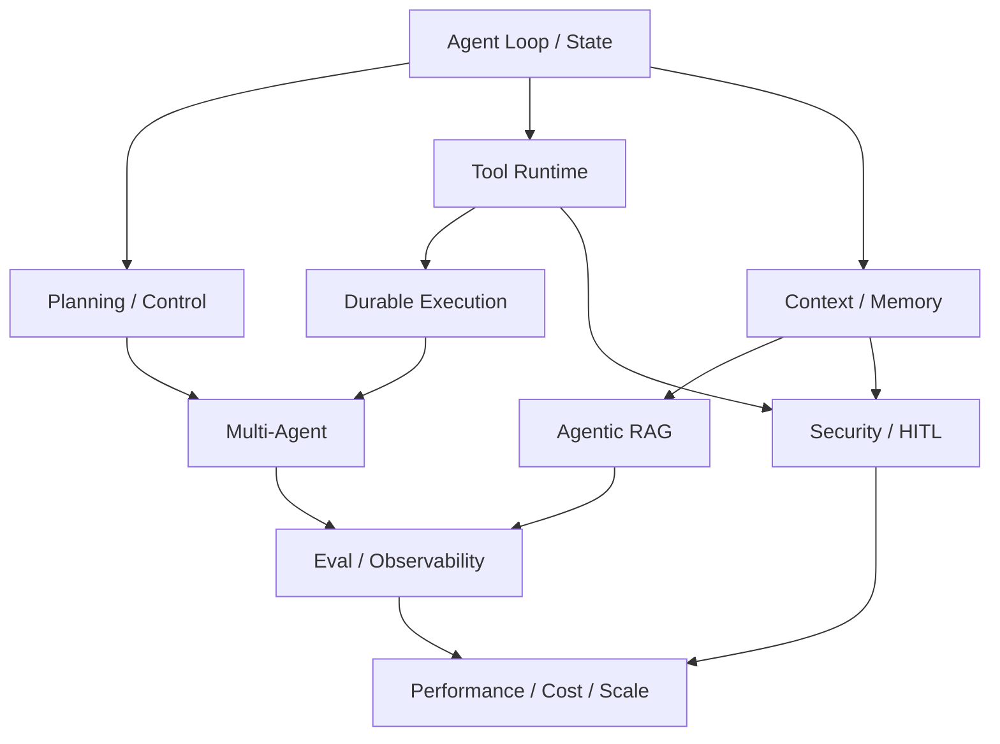

# Agent Engineer 能力地图

> 面试真正考察的不是框架熟练度，而是能否把 **概率式决策器** 放进一个可控、可恢复、可评估的生产系统。

## 10 条能力轴

| # | 能力轴 | 主要问题 | 核心 Invariant | 常见失败 |
|---:|---|---|---|---|
| 01 | Agent Loop / Architecture | 控制流与状态如何组织 | transition 显式、完成可验证 | 无限循环、隐式状态 |
| 02 | Planning / Control | 计划、重规划、跑偏 | 每步推动目标进度 | 漂移、无效 reflection |
| 03 | Tools / MCP | 外部动作如何可信执行 | 副作用可鉴权、幂等、审计 | timeout 重试、重复动作 |
| 04 | Multi-Agent | Agent 间如何协作 | task ownership 与协议明确 | 重复/乱序、甩锅循环 |
| 05 | Context / Memory | 长任务如何保持信息质量 | 关键状态 lossless | context pollution、陈旧记忆 |
| 06 | Agentic RAG | 如何获得可信证据 | relevance + ACL + freshness | 错检索驱动错动作 |
| 07 | Durable Execution | crash 后如何继续 | 可恢复且不重复副作用 | checkpoint crash window |
| 08 | Eval / Observability | 如何知道哪里错 | 能定位 first bad transition | 只看最终答案 |
| 09 | Security / HITL | 如何限制 blast radius | 模型不是授权边界 | injection、越权、凭证泄漏 |
| 10 | Performance / Cost | 如何规模化上线 | SLO 下优化 cost/success | 过载、尾延迟、成本失控 |

## 能力之间不是并列关系



这张图表达一个重要事实：**越往后越依赖前面的基础抽象**。如果 AgentState、Tool semantics、checkpoint 都不清楚，直接谈 Multi-Agent 或百万 QPS 通常会变成组件堆砌。

## 三个面试层级

### Level 1：会用

典型表现：

- 能解释 ReAct、RAG、MCP、Handoff。
- 能使用一个 Agent 框架搭 demo。
- 遇到失败时主要依赖 prompt 调整和 retry。

这通常对应基础/中级要求。

### Level 2：会做 Production

典型表现：

- 能定义 state、error taxonomy、timeout、idempotency、checkpoint。
- 能设计 trace、eval、SLO 和 regression。
- 会问“这个 Tool 是否有副作用”“这个状态是谁的 source of truth”。

这是本仓库大多数题目的目标层级。

### Level 3：会设计 Agent Runtime

典型表现：

- 先定义 invariant，再选框架。
- 能把 Agent 问题映射到分布式系统、工作流引擎、权限系统和可观测性。
- 能解释 blast radius、故障传播、版本迁移、容量模型。
- 知道什么时候 **不应该** 用 Agent / Multi-Agent / Memory / 自动重试。

20 道必刷和 Q100 重点训练这一层。

## 一套统一思考模型

遇到任何题先画：

```text
Goal
  ↓
Policy / Constraints
  ↓
Plan / Decision
  ↓
Action / Tool / Agent
  ↓
Observation
  ↓
State Transition
  ↓
Verifier / Eval
  ├─ continue
  ├─ replan
  ├─ clarify / HITL
  └─ complete / fail
```

然后追问：

1. 哪一步由概率模型决定？
2. 哪一步必须 deterministic？
3. 状态保存在哪里？
4. 如果这一步重复执行会怎样？
5. 如果进程在这里 crash 会怎样？
6. 如何从 trace 证明发生了什么？

## 学习建议

- 第一轮：每章读 README + 10 道题的 30 秒回答。
- 第二轮：按 [20 道必刷](05-priority-20.md) 练 3 分钟回答。
- 第三轮：只看 Failure Modes 和追问，训练故障推演。
- 第四轮：用 [系统设计白板模板](06-whiteboard-system-design.md) 完成 Q100。

---

## Expanded Edition 使用提示

阅读任何章节时，优先寻找三个东西：**Invariant、Failure Window、Verification Signal**。如果一个方案只有组件名而没有这三项，它通常还停留在 demo 级。完整方法见 [Expanded Edition 内容设计规范](12-expanded-edition-methodology.md)。
