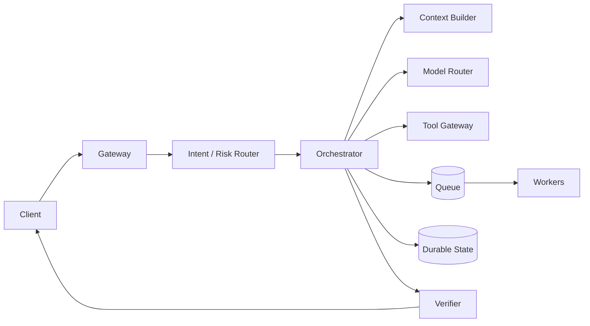

# Agent 系统设计白板模板

> 目标：把“LLM + Vector DB + Tools”升级成真正可上线的 Agent Runtime 设计。

## 推荐白板顺序

```text
1. Requirements / SLO
2. Request path
3. State model
4. Trust boundaries
5. Failure & recovery
6. Context / RAG
7. Observability / Eval
8. Capacity / Cost
```

不要一上来画框架 Logo。

## Step 1：先锁需求

至少问清：

- QPS / DAU / 峰值倍率。
- 同步还是长任务。
- P95 / P99 latency。
- 是否有真实副作用：付款、退款、写 DB、发邮件。
- 是否多租户。
- 数据敏感等级。
- 是否需要 HITL。
- task success 的业务定义。

### 输出

```text
SLO:
- task success >= ...
- P95 <= ...
- unauthorized action = 0 target
- duplicate side effect = 0 target
- cost per success <= ...
```

## Step 2：画请求路径



解释每条箭头是同步、异步还是 durable message。

## Step 3：画 State

至少包括：

```text
Run
├── identity: run/task/tenant/user
├── goal + constraints
├── deadline / budget
├── plan_version
├── steps[]
├── operation_ids[]
├── approvals[]
├── artifact_refs[]
├── checkpoint_version
└── trace_id
```

**关键追问**：进程在任意两步之间 crash，靠什么恢复？

## Step 4：画 Trust Boundary

建议用红线思维描述：

```text
Untrusted Content
     ↓
Agent Proposal
     ↓
Policy Engine
     ↓
[Human Approval]
     ↓
Tool Gateway
     ↓
Resource API Authorization
```

Prompt 不属于安全边界。

## Step 5：逐个注入故障

至少主动讲三个：

### Tool timeout

- 结果 UNKNOWN。
- same operation_id。
- query / reconcile。

### Worker crash

- load checkpoint。
- reconcile in-flight effects。
- resume remaining steps。

### Duplicate / late message

- dedup by message_id。
- task attempt/version check。
- reject stale transition。

## Step 6：Context / RAG

回答四件事：

1. lossless state 在哪里？
2. tool 大输出如何 artifact 化？
3. retrieval 如何做 ACL/freshness？
4. context 爆了如何 compaction/reset？

## Step 7：Trace / Eval

一个 Production Agent 最少应有：

```text
trace
├── model span
├── retrieval span
├── tool span
├── handoff span
├── guardrail / approval span
└── state diff / final eval
```

评估分三层：

- Component。
- Trajectory。
- End-to-End task success。

## Step 8：容量和成本

不要只报 GPU/模型价格。画 critical path：

```text
latency = queue_wait
        + context_build
        + model
        + tool/retrieval
        + verification
        + response
```

并跟踪：

- tokens/task。
- model escalation rate。
- cache hit rate。
- tool cost/task。
- `cost_per_success`。

## 白板收尾检查

- [ ] 有 SLO，不只有组件。
- [ ] 有结构化 State。
- [ ] 有 Tool trust boundary。
- [ ] 有 crash/retry/idempotency。
- [ ] 有 Context/RAG 策略。
- [ ] 有 Trace/Eval。
- [ ] 有容量、背压、降级。
- [ ] 有至少 3 个 failure scenarios。

Q100 可直接用这套模板练习：[企业级 Customer Support Agent](../questions/10-performance-system-design/q100.md)。

---

## Expanded Edition 使用提示

阅读任何章节时，优先寻找三个东西：**Invariant、Failure Window、Verification Signal**。如果一个方案只有组件名而没有这三项，它通常还停留在 demo 级。完整方法见 [Expanded Edition 内容设计规范](12-expanded-edition-methodology.md)。
