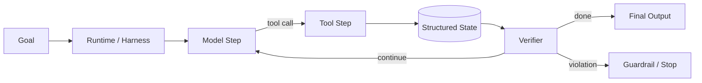

# CHAPTER 01 · Agent 架构与 Agent Loop

> **系统层**：Runtime / Control Plane  
> **本章 Invariant**：控制流可解释、状态可重放、完成条件可验证

## 为什么这一章重要

这一章训练的是 **Runtime / Control Plane** 的工程能力。面试里不要把问题回答成“某个框架怎么配置”，而要把 Agent 当作有概率决策、有外部副作用、会跨轮运行的生产系统。

### 三条主线

- 把 LLM 当作概率式决策器，而不是可信控制器
- 把状态迁移显式化，避免“所有状态都藏在 messages”
- 完成条件、权限、预算、重试上限等 invariant 由确定性代码守住

## 本章概念图

## 本章答题框架

任何题都可以先问四个问题：

1. 谁拥有控制流？
1. 哪些状态必须 durable？
1. 终止条件是否可独立验证？
1. 哪些 invariant 必须由代码强制？

然后用统一可靠性框架收口：`Detect → Classify → Contain → Recover → Preserve → Verify`。

## 关键指标

- `task_success_rate`
- `invalid_transition_rate`
- `mean_steps_per_run`
- `completion_verification_fail_rate`

指标要区分模型质量与 runtime 正确性；例如模型选错工具与状态机非法迁移是不同 owner。

## 推荐学习顺序

1. [Q002 · 不使用任何 Agent 框架，如何从零实现一个最小 Agent Loop？](q002.md) ⭐
2. [Q004 · 生产 Agent 中，哪些逻辑交给 LLM，哪些逻辑必须写死在代码里？](q004.md) ⭐
3. [Q010 · 请构建一个 Agent Failure Taxonomy。](q010.md) ⭐
4. [Q001 · LLM、Workflow 和 Agent 有什么区别？什么时候不应该使用 Agent？](q001.md)
5. [Q003 · 为什么说 Agent Loop 本质上可以看成状态机？State 里应该保存什么？](q003.md)
6. [Q005 · Graph Engineer 和 Loop Engineer 的核心区别是什么？](q005.md)
7. [Q006 · Agent 的最终完成条件如何定义？为什么不能相信模型说‘完成了’？](q006.md)
8. [Q007 · Agent 的 Structured Output 校验失败怎么办？](q007.md)
9. [Q008 · 一个 Agent 系统应该有几层状态？](q008.md)
10. [Q009 · 什么是 Agent Harness？它和 Prompt、Agent Framework 的区别是什么？](q009.md)

## 题目索引

| 题号 | 问题 | 频率 | 难度 | 风险 |
|---|---|---|---|---|
| [Q001](q001.md) | LLM、Workflow 和 Agent 有什么区别？什么时候不应该使用 Agent？ | 必考 | 中 | 中 |
| [Q002](q002.md) | 不使用任何 Agent 框架，如何从零实现一个最小 Agent Loop？ | 必考 | 中 | 中高 |
| [Q003](q003.md) | 为什么说 Agent Loop 本质上可以看成状态机？State 里应该保存什么？ | 高频 | 中 | 中 |
| [Q004](q004.md) | 生产 Agent 中，哪些逻辑交给 LLM，哪些逻辑必须写死在代码里？ | 必考 | 中 | 高 |
| [Q005](q005.md) | Graph Engineer 和 Loop Engineer 的核心区别是什么？ | 高频 | 中 | 中 |
| [Q006](q006.md) | Agent 的最终完成条件如何定义？为什么不能相信模型说‘完成了’？ | 高频 | 中 | 高 |
| [Q007](q007.md) | Agent 的 Structured Output 校验失败怎么办？ | 高频 | 中 | 中高 |
| [Q008](q008.md) | 一个 Agent 系统应该有几层状态？ | 中频 | 中 | 中 |
| [Q009](q009.md) | 什么是 Agent Harness？它和 Prompt、Agent Framework 的区别是什么？ | 必考 | 难 | 中 |
| [Q010](q010.md) | 请构建一个 Agent Failure Taxonomy。 | 必考 | 难 | 中 |

> ⭐ 表示属于 [20 道必刷题](../../docs/05-priority-20.md)。

## 本章完成标准

- [ ] 能在白板上画出本章控制流和 trust boundary。
- [ ] 能说出至少 3 个 failure mode 及其观测信号。
- [ ] 能把一个框架能力还原成 state / protocol / policy / runtime 原语。
- [ ] 能解释主要 trade-off，而不是给出绝对化“最佳实践”。
- [ ] 能为关键设计给出 metric / eval / SLO。

[← 返回总题库](../README.md)
