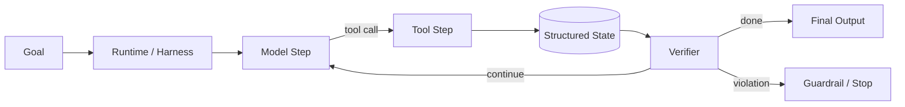

# Q002 · 不使用任何 Agent 框架，如何从零实现一个最小 Agent Loop？

> **能力轴**：Agent 架构与 Agent Loop  
> **GitHub Edition**：Expanded Professional Version  
> **训练目标**：能给出 30 秒结论、3 分钟工程展开，并承受连续系统追问。

## 题目定位

| 维度 | 定位 |
|---|---|
| 面试层级 | Senior / Staff 倾向 |
| 失败类别 | Control / State |
| 风险等级 | 中高 |
| 核心 Invariant | 每个 transition 都显式读写 AgentState，并拥有终止、预算、错误和权限约束。 |
| 面试频率 | 必考 |
| 难度 | 中 |

## 面试官在考什么

框架最终都会落到循环与状态迁移。能手写最小 Loop，才能真正理解 LangGraph、OpenAI Agents SDK 等框架在替你处理什么。

这道题表面在问一个局部技术点，实际上通常同时检查以下三层能力：

- messages 只是状态的一部分，任务状态、工具结果、预算和错误状态应结构化保存。
- 终止不只看模型 stop_reason，还要验证业务完成条件。
- 工具执行与模型调用要以 span 形式可追踪。
- 把 LLM 当作概率式决策器，而不是可信控制器
- 把状态迁移显式化，避免“所有状态都藏在 messages”

> **判断高级答案的标志**：不仅告诉面试官“用什么机制”，还能说明 **为什么需要它、它保护哪个 invariant、失败时怎么恢复、怎么证明方案有效**。

## 30 秒回答

最小闭环是：模型读取目标与状态 -> 产生工具调用或最终答案 -> 执行工具 -> 将 observation 写回状态 -> 再次调用模型，直到满足终止条件。生产版还必须加入 step budget、timeout、schema 校验、权限、trace 和 checkpoint。

## 深挖解析

> 下面先逐条展开 PDF 原始深挖点；这些是本题最应该讲清的技术机制。

### 1. messages 只是状态的一部分，任务状态、工具结果、预算和错误状态应结构化保存。

消息适合承载对话叙事，不适合作为唯一数据库。业务游标、预算、operation id、权限与任务状态应结构化保存，否则无法做可靠恢复、并发控制和版本迁移。

### 2. 终止不只看模型 stop_reason，还要验证业务完成条件。

完成语义要拆成三层：调用返回、Agent 声明完成、业务条件满足。只有最后一层能作为真正终止依据，通常由结构化 artifact、外部资源状态或独立 verifier 判断。

### 3. 工具执行与模型调用要以 span 形式可追踪。

Trace 的目的不是“日志更多”，而是可因果定位。每个 span 应记录输入/输出引用、版本、时延、状态差异与错误码，并用同一 `trace_id` 串起模型、工具、检索和 handoff。

### 从机制到系统

把上面几点合起来，本题不能只用一个局部 API 或 Prompt 技巧解决。需要把 **`定义 AgentState 数据结构和 transition 函数；将 model_step、tool_step、verify_step 解耦，并为每个 transition 写可重放日志。`** 变成 runtime 中可测试的状态迁移，并给关键 transition 设计失败分支。
## 3 分钟专业展开

先把问题抽象成一个工程约束：**每个 transition 都显式读写 AgentState，并拥有终止、预算、错误和权限约束。**。然后按下面四层回答：

1. **语义层**：先定义“成功 / 失败 / 完成 / 重试 / 授权”等词在这个场景中的准确含义，避免把 HTTP、LLM 或消息状态误当业务状态。
2. **状态层**：指出哪些事实必须结构化、持久化、带版本或 operation identity；不要只依赖聊天历史或自然语言总结。
3. **控制层**：明确模型可以提出什么、runtime/策略引擎必须强制什么，以及异常时走 retry、replan、fallback、HITL 还是 fail-safe。
4. **验证层**：给出 trace / metric / eval，证明机制既能挡住已知 failure mode，又不会产生不可接受的延迟、成本或误拦截。

### 核心机制

- **messages 只是状态的一部分，任务状态、工具结果、预算和错误状态应结构化保存。**
- **终止不只看模型 stop_reason，还要验证业务完成条件。**
- **工具执行与模型调用要以 span 形式可追踪。**
- 把 LLM 当作概率式决策器，而不是可信控制器
- 把状态迁移显式化，避免“所有状态都藏在 messages”
- 完成条件、权限、预算、重试上限等 invariant 由确定性代码守住

### 关键设计决策

- 谁拥有控制流？
- 哪些状态必须 durable？
- 终止条件是否可独立验证？
- 哪些 invariant 必须由代码强制？

## 参考架构 / 控制流



这张图强调本章的可信边界：控制流可解释、状态可重放、完成条件可验证。面试时先讲数据/控制流，再讲每个边界上的校验与恢复。

## 状态与接口设计

面试中建议显式说出“**哪些字段需要存在**”，这样比只说框架名更有工程可信度。一个最小设计通常包括：

- `run_id / task_id / step_id`：把一次执行和子任务串起来。
- `attempt / version / deadline`：区分重试、版本与剩余时间。
- `status`：使用有限状态机，而不是自由文本表示执行状态。
- `input_ref / output_ref / artifact_ref`：大对象保存为引用，避免在 context/消息中复制。
- `trace_id / correlation_id`：跨模型、工具、Agent 和异步任务关联。
- 对副作用步骤再加入 `operation_id / idempotency_key / approval_id`；对知识步骤加入 `source / provenance / freshness`。

## 实现骨架 / 伪代码

```python
while run.step < MAX_STEPS:
    decision = model_step(build_context(state))
    if decision.type == "final":
        assert verify_completion(state, decision)
        return decision.output
    call = validate_and_authorize(decision.tool_call, state)
    result = execute_tool(call, operation_id=state.operation_id(call))
    state = reduce(state, result)
    checkpoint(state)
raise StepBudgetExceeded()
```

## 典型生产场景

客服 Agent 处理“查询物流 + 必要时创建工单”：查询路径可由模型选择，但创建工单前必须经过确定性 schema、权限、幂等和完成验证。

## Failure Modes：方案最容易坏在哪里

- **while tool_call 无限循环**
- **工具异常直接拼成文本导致错误语义丢失**
- **只持久化 messages，crash 后无法准确恢复任务状态**

遇到异常时，不要立即跳到“重试”。建议统一使用：

`Detect → Classify → Contain → Recover → Preserve → Verify`

本题最重要的 Preserve 对象是：**每个 transition 都显式读写 AgentState，并拥有终止、预算、错误和权限约束。**。

## Trade-off：为什么不能只有一个标准答案

- **自由度 vs 可控性**：模型自治越高，适应性越强，但状态空间、审计和失败面同步扩大。
- **抽象便利 vs 可调试性**：高层框架降低开发成本，但必须保留对状态迁移、重试和 trace 的可见性。

面试时最好给出一个“默认选择 + 改变选择的条件”，而不是绝对化表达。例如：默认用更简单的单 Agent/同步/低并发方案，只有当评估数据证明瓶颈来自专业化、并行或长任务时再增加复杂度。

## 可观测性与关键指标

指标要区分模型质量与 runtime 正确性；例如模型选错工具与状态机非法迁移是不同 owner。 建议至少记录：

- `task_success_rate`
- `invalid_transition_rate`
- `mean_steps_per_run`
- `completion_verification_fail_rate`

此外所有指标都应该按 `workflow_version / model / tool / tenant / task_type / failure_class` 等维度切片，否则总体平均值很容易掩盖局部事故。

## 连续追问

### 1. stop_reason 谁负责判断？

**回答方向**：模型 stop_reason 只是模型输出协议状态，不是业务完成。Runtime 应把它映射为候选 transition，再由 completion verifier 检查目标、artifact、外部系统状态和 policy。

### 2. tool result 应怎样进入下一轮 context？

**回答方向**：Tool result 先规范化成结构化 observation，保存原始 artifact/reference，再由 Context Builder挑选需要进入下一轮的字段。不要把任意 JSON/100K 文本直接拼回 messages。

## ⭐ 必刷题：深水区

### 框架剥离测试

面试官可能要求你不用任何 SDK 手写 loop。最低要求：state reducer、tool registry、permission hook、step budget、checkpoint、trace。若只能写 `while tool_call`，说明还停留在 demo。

### 面试评分点

- **60 分**：知道核心术语和基本方案。
- **75 分**：能说明状态、失败窗口与恢复动作。
- **90 分**：能主动提出 invariant、故障注入、指标和 trade-off。
- **95+ 分**：能把方案抽象为与具体框架无关的 runtime / protocol / trust-boundary 设计，并指出何时不值得增加复杂度。

## 易错回答

> 只写 while tool_call 循环，却没有最大步数、错误处理和完成验证。

为什么这是低质量答案：它通常只描述 happy path，没有说明失败语义、状态所有权或可信边界，也没有给出验证手段。高级回答要把“模型可能错、网络可能断、进程可能崩、消息可能重复、知识可能过期”当作设计前提。

## Know-Why

框架最终都会落到循环与状态迁移。能手写最小 Loop，才能真正理解 LangGraph、OpenAI Agents SDK 等框架在替你处理什么。

更深一层看，本题的本质是保护这个系统 invariant：**每个 transition 都显式读写 AgentState，并拥有终止、预算、错误和权限约束。**。Agent 引入的是概率决策，因此工程层需要把不可违反的规则外置为 deterministic guardrails/state machines，并给非确定路径准备恢复机制。

## Know-How

定义 AgentState 数据结构和 transition 函数；将 model_step、tool_step、verify_step 解耦，并为每个 transition 写可重放日志。

### 落地步骤

1. 先写出业务 invariant 和明确的完成/失败定义。
2. 建立结构化 state，给每个关键字段确定 owner、版本与持久化周期。
3. 在可信 runtime / gateway 中实现校验、权限、预算和异常策略，不只依赖 prompt。
4. 为关键 transition 添加 trace、state diff 和可聚合 error code。
5. 构造至少 3 个故障注入案例：超时/重复/崩溃（或本题等价异常）。
6. 用 regression eval + 线上指标确认修复没有把问题转移到成本、时延或误拦截。

## Production Checklist

- [ ] 核心 invariant 已写成可验证条件：每个 transition 都显式读写 AgentState，并拥有终止、预算、错误和权限约束。
- [ ] 关键状态不只存在于 prompt/messages 中。
- [ ] 存在明确 timeout / retry / stop / fallback / HITL 策略。
- [ ] 所有高风险副作用经过资源侧授权与审计。
- [ ] Trace 能定位到发生错误的具体 transition。
- [ ] 变更有离线 regression，关键路径有线上 SLO/告警。

## 面试自测

- [ ] 我能在 **30 秒**内讲清核心结论，不报框架名堆术语。
- [ ] 我能在 **3 分钟**内说明状态、控制边界、失败恢复和指标。
- [ ] 我能画出上面的控制流，并解释每个箭头的失败语义。
- [ ] 面试官换成“网络断了 / Worker crash / 重复消息 / 权限不足”时，我仍能沿 invariant 推导方案。

## 关联题目

- [Q001 · LLM、Workflow 和 Agent 有什么区别？什么时候不应该使用 Agent？](q001.md)
- [Q003 · 为什么说 Agent Loop 本质上可以看成状态机？State 里应该保存什么？](q003.md)
- [Q004 · 生产 Agent 中，哪些逻辑交给 LLM，哪些逻辑必须写死在代码里？](q004.md)
- [Q005 · Graph Engineer 和 Loop Engineer 的核心区别是什么？](q005.md)
- [Q006 · Agent 的最终完成条件如何定义？为什么不能相信模型说‘完成了’？](q006.md)

## 延伸阅读

### 对应官方工程资料

- [OpenAI Agents SDK · Running agents](https://openai.github.io/openai-agents-python/running_agents/)
- [LangGraph · Thinking in LangGraph](https://docs.langchain.com/oss/python/langgraph/thinking-in-langgraph)

> 外部资料用于 GitHub Expanded Edition 的工程深化；PDF 原始题目与核心字段仍按仓库结构化源数据保留。

- [Reliability First：六步故障回答框架](../../docs/04-reliability-first.md)
- [系统设计白板模板](../../docs/06-whiteboard-system-design.md)
- [参考资料与官方工程资料](../../docs/09-references.md)

---

[← Q001](q001.md) · [本章目录](README.md) · [Q003 →](q003.md)
