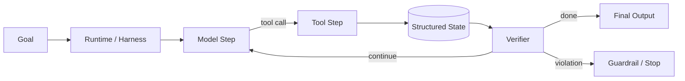

# Q006 · Agent 的最终完成条件如何定义？为什么不能相信模型说‘完成了’？

> **能力轴**：Agent 架构与 Agent Loop  
> **GitHub Edition**：Expanded Professional Version  
> **训练目标**：能给出 30 秒结论、3 分钟工程展开，并承受连续系统追问。

## 题目定位

| 维度 | 定位 |
|---|---|
| 面试层级 | Mid / Senior |
| 失败类别 | Control / State |
| 风险等级 | 高 |
| 核心 Invariant | “完成”由外部可验证条件定义，不由自然语言自报。 |
| 面试频率 | 高频 |
| 难度 | 中 |

## 面试官在考什么

Agent 最危险的幻觉之一是‘完成幻觉’：它认为动作成功，但外部世界并未改变。

这道题表面在问一个局部技术点，实际上通常同时检查以下三层能力：

- 区分 transport complete、agent complete、business complete。
- 为任务定义 machine-checkable acceptance criteria。
- 无法完全自动验证时再引入 HITL。
- 把 LLM 当作概率式决策器，而不是可信控制器
- 把状态迁移显式化，避免“所有状态都藏在 messages”

> **判断高级答案的标志**：不仅告诉面试官“用什么机制”，还能说明 **为什么需要它、它保护哪个 invariant、失败时怎么恢复、怎么证明方案有效**。

## 30 秒回答

模型的‘done’只是声明，不是证据。完成条件应由外部可验证事实定义，例如目标文件存在且测试通过、工单状态已更新、订单已创建且 ID 可查询。最终由 verifier 或业务 API 验证。

## 深挖解析

> 下面先逐条展开 PDF 原始深挖点；这些是本题最应该讲清的技术机制。

### 1. 区分 transport complete、agent complete、business complete。

把这个点落到状态机：明确输入状态、允许的 transition、产生的 side effect、失败后的合法下一状态。这样才能从概念讨论进入可测试实现。

### 2. 为任务定义 machine-checkable acceptance criteria。

把这个点落到状态机：明确输入状态、允许的 transition、产生的 side effect、失败后的合法下一状态。这样才能从概念讨论进入可测试实现。

### 3. 无法完全自动验证时再引入 HITL。

把这个点落到状态机：明确输入状态、允许的 transition、产生的 side effect、失败后的合法下一状态。这样才能从概念讨论进入可测试实现。

### 从机制到系统

把上面几点合起来，本题不能只用一个局部 API 或 Prompt 技巧解决。需要把 **`在任务创建时同步生成 acceptance criteria；结束前执行 verify_step，失败则 replan 或升级人工。`** 变成 runtime 中可测试的状态迁移，并给关键 transition 设计失败分支。
## 3 分钟专业展开

先把问题抽象成一个工程约束：**“完成”由外部可验证条件定义，不由自然语言自报。**。然后按下面四层回答：

1. **语义层**：先定义“成功 / 失败 / 完成 / 重试 / 授权”等词在这个场景中的准确含义，避免把 HTTP、LLM 或消息状态误当业务状态。
2. **状态层**：指出哪些事实必须结构化、持久化、带版本或 operation identity；不要只依赖聊天历史或自然语言总结。
3. **控制层**：明确模型可以提出什么、runtime/策略引擎必须强制什么，以及异常时走 retry、replan、fallback、HITL 还是 fail-safe。
4. **验证层**：给出 trace / metric / eval，证明机制既能挡住已知 failure mode，又不会产生不可接受的延迟、成本或误拦截。

### 核心机制

- **区分 transport complete、agent complete、business complete。**
- **为任务定义 machine-checkable acceptance criteria。**
- **无法完全自动验证时再引入 HITL。**
- 把 LLM 当作概率式决策器，而不是可信控制器
- 把状态迁移显式化，避免“所有状态都藏在 messages”
- 完成条件、权限、预算、重试上限等 invariant 由确定性代码守住

### 关键设计决策

- 谁拥有控制流？
- 哪些状态必须 durable？
- 终止条件是否可独立验证？
- 哪些 invariant 必须由代码强制？

## 参考架构 / 控制流



这张图强调本章的可信边界：控制流可解释、状态可重放、完成条件可验证。面试时先讲数据/控制流，再讲每个边界上的校验与恢复。

## 状态与接口设计

面试中建议显式说出“**哪些字段需要存在**”，这样比只说框架名更有工程可信度。一个最小设计通常包括：

- `run_id / task_id / step_id`：把一次执行和子任务串起来。
- `attempt / version / deadline`：区分重试、版本与剩余时间。
- `status`：使用有限状态机，而不是自由文本表示执行状态。
- `input_ref / output_ref / artifact_ref`：大对象保存为引用，避免在 context/消息中复制。
- `trace_id / correlation_id`：跨模型、工具、Agent 和异步任务关联。
- 对副作用步骤再加入 `operation_id / idempotency_key / approval_id`；对知识步骤加入 `source / provenance / freshness`。

## 实现骨架 / 伪代码

```python
state = load_or_create(run_id)
while not state.terminal:
    proposal = model_step(context_builder(state))
    transition = policy.validate(proposal, state)
    state = runtime.apply(transition)
    trace.append(transition)
    checkpoint(state)
```

## 典型生产场景

客服 Agent 处理“查询物流 + 必要时创建工单”：查询路径可由模型选择，但创建工单前必须经过确定性 schema、权限、幂等和完成验证。

## Failure Modes：方案最容易坏在哪里

- **模型说 done 就结束，但订单/文件/测试并未满足条件**
- **只检查最终文本，不检查外部系统状态**
- **验收标准不可计算，导致 evaluator 只能凭感觉**

遇到异常时，不要立即跳到“重试”。建议统一使用：

`Detect → Classify → Contain → Recover → Preserve → Verify`

本题最重要的 Preserve 对象是：**“完成”由外部可验证条件定义，不由自然语言自报。**。

## Trade-off：为什么不能只有一个标准答案

- **自由度 vs 可控性**：模型自治越高，适应性越强，但状态空间、审计和失败面同步扩大。
- **抽象便利 vs 可调试性**：高层框架降低开发成本，但必须保留对状态迁移、重试和 trace 的可见性。

面试时最好给出一个“默认选择 + 改变选择的条件”，而不是绝对化表达。例如：默认用更简单的单 Agent/同步/低并发方案，只有当评估数据证明瓶颈来自专业化、并行或长任务时再增加复杂度。

## 可观测性与关键指标

指标要区分模型质量与 runtime 正确性；例如模型选错工具与状态机非法迁移是不同 owner。 建议至少记录：

- `task_success_rate`
- `invalid_transition_rate`
- `mean_steps_per_run`
- `completion_verification_fail_rate`

此外所有指标都应该按 `workflow_version / model / tool / tenant / task_type / failure_class` 等维度切片，否则总体平均值很容易掩盖局部事故。

## 连续追问

### 1. 创意任务没有确定答案怎么验证？

**回答方向**：先以“区分 transport complete、agent complete、business complete。”为主结论，再补充状态所有权、失败窗口和验证指标。回答必须给出一个明确边界：什么情况下采用该方案，什么情况下应 fail-safe / clarify / HITL。

### 2. 验证器本身是 LLM 怎么办？

**回答方向**：先以“区分 transport complete、agent complete、business complete。”为主结论，再补充状态所有权、失败窗口和验证指标。回答必须给出一个明确边界：什么情况下采用该方案，什么情况下应 fail-safe / clarify / HITL。

## 易错回答

> 仅看自然语言里的‘任务已完成’。

为什么这是低质量答案：它通常只描述 happy path，没有说明失败语义、状态所有权或可信边界，也没有给出验证手段。高级回答要把“模型可能错、网络可能断、进程可能崩、消息可能重复、知识可能过期”当作设计前提。

## Know-Why

Agent 最危险的幻觉之一是‘完成幻觉’：它认为动作成功，但外部世界并未改变。

更深一层看，本题的本质是保护这个系统 invariant：**“完成”由外部可验证条件定义，不由自然语言自报。**。Agent 引入的是概率决策，因此工程层需要把不可违反的规则外置为 deterministic guardrails/state machines，并给非确定路径准备恢复机制。

## Know-How

在任务创建时同步生成 acceptance criteria；结束前执行 verify_step，失败则 replan 或升级人工。

### 落地步骤

1. 先写出业务 invariant 和明确的完成/失败定义。
2. 建立结构化 state，给每个关键字段确定 owner、版本与持久化周期。
3. 在可信 runtime / gateway 中实现校验、权限、预算和异常策略，不只依赖 prompt。
4. 为关键 transition 添加 trace、state diff 和可聚合 error code。
5. 构造至少 3 个故障注入案例：超时/重复/崩溃（或本题等价异常）。
6. 用 regression eval + 线上指标确认修复没有把问题转移到成本、时延或误拦截。

## Production Checklist

- [ ] 核心 invariant 已写成可验证条件：“完成”由外部可验证条件定义，不由自然语言自报。
- [ ] 关键状态不只存在于 prompt/messages 中。
- [ ] 存在明确 timeout / retry / stop / fallback / HITL 策略。
- [ ] 所有高风险副作用经过资源侧授权与审计。
- [ ] Trace 能定位到发生错误的具体 transition。
- [ ] 变更有离线 regression，关键路径有线上 SLO/告警。

## 面试自测

- [ ] 我能在 **30 秒**内讲清核心结论，不报框架名堆术语。
- [ ] 我能在 **3 分钟**内说明状态、控制边界、失败恢复和指标。
- [ ] 我能画出上面的控制流，并解释每个箭头的失败语义。
- [ ] 面试官换成“网络断了 / Worker crash / 重复消息 / 权限不足”时，我仍能沿 invariant 推导方案。

## 关联题目

- [Q001 · LLM、Workflow 和 Agent 有什么区别？什么时候不应该使用 Agent？](q001.md)
- [Q002 · 不使用任何 Agent 框架，如何从零实现一个最小 Agent Loop？](q002.md)
- [Q003 · 为什么说 Agent Loop 本质上可以看成状态机？State 里应该保存什么？](q003.md)
- [Q004 · 生产 Agent 中，哪些逻辑交给 LLM，哪些逻辑必须写死在代码里？](q004.md)
- [Q005 · Graph Engineer 和 Loop Engineer 的核心区别是什么？](q005.md)

## 延伸阅读

### 对应官方工程资料

- [OpenAI Agents SDK · Running agents](https://openai.github.io/openai-agents-python/running_agents/)
- [LangGraph · Thinking in LangGraph](https://docs.langchain.com/oss/python/langgraph/thinking-in-langgraph)

> 外部资料用于 GitHub Expanded Edition 的工程深化；PDF 原始题目与核心字段仍按仓库结构化源数据保留。

- [Reliability First：六步故障回答框架](../../docs/04-reliability-first.md)
- [系统设计白板模板](../../docs/06-whiteboard-system-design.md)
- [参考资料与官方工程资料](../../docs/09-references.md)

---

[← Q005](q005.md) · [本章目录](README.md) · [Q007 →](q007.md)
