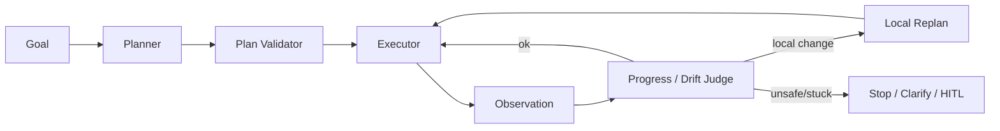

# CHAPTER 02 · Planning、Reflection 与任务控制

> **系统层**：Planner / Control Loop  
> **本章 Invariant**：每一步都推动目标进度，偏离可检测，计划可局部修复

## 为什么这一章重要

这一章训练的是 **Planner / Control Loop** 的工程能力。面试里不要把问题回答成“某个框架怎么配置”，而要把 Agent 当作有概率决策、有外部副作用、会跨轮运行的生产系统。

### 三条主线

- 计划是候选执行方案，不是授权
- 用 milestone / invariant / verifier 监控 trajectory，而非只评最终结果
- 控制 budget、cycle、stagnation，把“不会停”变成可检测状态

## 本章概念图

## 本章答题框架

任何题都可以先问四个问题：

1. 当前步骤是否推进 milestone？
1. 失败需要 retry、replan 还是 clarify？
1. 何时必须 stop？
1. 计划变更影响局部还是全局？

然后用统一可靠性框架收口：`Detect → Classify → Contain → Recover → Preserve → Verify`。

## 关键指标

- `plan_validity_rate`
- `replan_rate`
- `loop_rate`
- `progress_per_step`
- `clarification_precision`

除了最终成功率，更重要的是每步 progress、replan 质量、循环率和 clarification 的 precision/recall。

## 推荐学习顺序

1. [Q012 · Planner 输出的计划为什么不能直接执行？](q012.md) ⭐
2. [Q013 · Agent 执行一半跑偏了，如何在中间发现？](q013.md) ⭐
3. [Q015 · ReAct Agent 为什么经常死循环？怎么识别？](q015.md) ⭐
4. [Q011 · ReAct、Plan-and-Execute、Reflection 分别适合什么任务？](q011.md)
5. [Q014 · 计划执行到第三步发现环境变化，全部重规划还是局部重规划？](q014.md)
6. [Q016 · max_steps 设置 10 还是 100？依据是什么？](q016.md)
7. [Q017 · 什么时候 Agent 应该向用户澄清，而不是继续猜？](q017.md)
8. [Q018 · Reflection 为什么不是简单让模型‘再想一次’？](q018.md)
9. [Q019 · 一个需要运行 2 小时的任务如何拆分，避免后期越来越跑偏？](q019.md)
10. [Q020 · 用户在 Agent 执行第 18 步时点击取消，系统如何正确停止？](q020.md)

## 题目索引

| 题号 | 问题 | 频率 | 难度 | 风险 |
|---|---|---|---|---|
| [Q011](q011.md) | ReAct、Plan-and-Execute、Reflection 分别适合什么任务？ | 高频 | 中 | 中 |
| [Q012](q012.md) | Planner 输出的计划为什么不能直接执行？ | 必考 | 中 | 中高 |
| [Q013](q013.md) | Agent 执行一半跑偏了，如何在中间发现？ | 必考 | 难 | 中高 |
| [Q014](q014.md) | 计划执行到第三步发现环境变化，全部重规划还是局部重规划？ | 中频 | 难 | 中 |
| [Q015](q015.md) | ReAct Agent 为什么经常死循环？怎么识别？ | 必考 | 中 | 中高 |
| [Q016](q016.md) | max_steps 设置 10 还是 100？依据是什么？ | 中频 | 中 | 中 |
| [Q017](q017.md) | 什么时候 Agent 应该向用户澄清，而不是继续猜？ | 高频 | 中 | 中 |
| [Q018](q018.md) | Reflection 为什么不是简单让模型‘再想一次’？ | 高频 | 中 | 中 |
| [Q019](q019.md) | 一个需要运行 2 小时的任务如何拆分，避免后期越来越跑偏？ | 必考 | 难 | 中高 |
| [Q020](q020.md) | 用户在 Agent 执行第 18 步时点击取消，系统如何正确停止？ | 高频 | 难 | 高 |

> ⭐ 表示属于 [20 道必刷题](../../docs/05-priority-20.md)。

## 本章完成标准

- [ ] 能在白板上画出本章控制流和 trust boundary。
- [ ] 能说出至少 3 个 failure mode 及其观测信号。
- [ ] 能把一个框架能力还原成 state / protocol / policy / runtime 原语。
- [ ] 能解释主要 trade-off，而不是给出绝对化“最佳实践”。
- [ ] 能为关键设计给出 metric / eval / SLO。

[← 返回总题库](../README.md)
