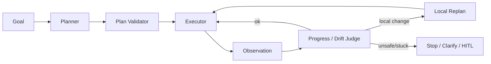

# Q017 · 什么时候 Agent 应该向用户澄清，而不是继续猜？

> **能力轴**：Planning、Reflection 与任务控制  
> **GitHub Edition**：Expanded Professional Version  
> **训练目标**：能给出 30 秒结论、3 分钟工程展开，并承受连续系统追问。

## 题目定位

| 维度 | 定位 |
|---|---|
| 面试层级 | Mid / Senior |
| 失败类别 | Planning / Trajectory |
| 风险等级 | 中 |
| 核心 Invariant | 当信息缺失导致错误代价超过澄清成本时，系统应请求用户输入而非猜测。 |
| 面试频率 | 高频 |
| 难度 | 中 |

## 面试官在考什么

澄清是一种成本控制策略，不只是对话礼貌。

这道题表面在问一个局部技术点，实际上通常同时检查以下三层能力：

- 低风险信息型任务可先做合理假设并声明。
- 高风险写操作缺关键字段时必须阻断。
- 澄清问题应最小化，一次询问解决最大信息缺口。
- 计划是候选执行方案，不是授权
- 用 milestone / invariant / verifier 监控 trajectory，而非只评最终结果

> **判断高级答案的标志**：不仅告诉面试官“用什么机制”，还能说明 **为什么需要它、它保护哪个 invariant、失败时怎么恢复、怎么证明方案有效**。

## 30 秒回答

当关键参数缺失且错误代价高、多个解释会导致不同副作用、或继续探索成本高于一次澄清时应询问。可以用 uncertainty × impact × irreversibility 作为澄清阈值。

## 深挖解析

> 下面先逐条展开 PDF 原始深挖点；这些是本题最应该讲清的技术机制。

### 1. 低风险信息型任务可先做合理假设并声明。

把这个点落到 trajectory 控制：定义 progress signal、触发阈值和后续动作。只有“发现异常”而没有 replan/stop/clarify 策略仍不完整。

### 2. 高风险写操作缺关键字段时必须阻断。

把这个点落到 trajectory 控制：定义 progress signal、触发阈值和后续动作。只有“发现异常”而没有 replan/stop/clarify 策略仍不完整。

### 3. 澄清问题应最小化，一次询问解决最大信息缺口。

把这个点落到 trajectory 控制：定义 progress signal、触发阈值和后续动作。只有“发现异常”而没有 replan/stop/clarify 策略仍不完整。

### 从机制到系统

把上面几点合起来，本题不能只用一个局部 API 或 Prompt 技巧解决。需要把 **`把关键字段标注 required/optional/risk；对 required+high-impact 缺失直接 ask，其他按 confidence policy 处理。`** 变成 runtime 中可测试的状态迁移，并给关键 transition 设计失败分支。
## 3 分钟专业展开

先把问题抽象成一个工程约束：**当信息缺失导致错误代价超过澄清成本时，系统应请求用户输入而非猜测。**。然后按下面四层回答：

1. **语义层**：先定义“成功 / 失败 / 完成 / 重试 / 授权”等词在这个场景中的准确含义，避免把 HTTP、LLM 或消息状态误当业务状态。
2. **状态层**：指出哪些事实必须结构化、持久化、带版本或 operation identity；不要只依赖聊天历史或自然语言总结。
3. **控制层**：明确模型可以提出什么、runtime/策略引擎必须强制什么，以及异常时走 retry、replan、fallback、HITL 还是 fail-safe。
4. **验证层**：给出 trace / metric / eval，证明机制既能挡住已知 failure mode，又不会产生不可接受的延迟、成本或误拦截。

### 核心机制

- **低风险信息型任务可先做合理假设并声明。**
- **高风险写操作缺关键字段时必须阻断。**
- **澄清问题应最小化，一次询问解决最大信息缺口。**
- 计划是候选执行方案，不是授权
- 用 milestone / invariant / verifier 监控 trajectory，而非只评最终结果
- 控制 budget、cycle、stagnation，把“不会停”变成可检测状态

### 关键设计决策

- 当前步骤是否推进 milestone？
- 失败需要 retry、replan 还是 clarify？
- 何时必须 stop？
- 计划变更影响局部还是全局？

## 参考架构 / 控制流



这张图强调本章的可信边界：每一步都推动目标进度，偏离可检测，计划可局部修复。面试时先讲数据/控制流，再讲每个边界上的校验与恢复。

## 状态与接口设计

面试中建议显式说出“**哪些字段需要存在**”，这样比只说框架名更有工程可信度。一个最小设计通常包括：

- `run_id / task_id / step_id`：把一次执行和子任务串起来。
- `attempt / version / deadline`：区分重试、版本与剩余时间。
- `status`：使用有限状态机，而不是自由文本表示执行状态。
- `input_ref / output_ref / artifact_ref`：大对象保存为引用，避免在 context/消息中复制。
- `trace_id / correlation_id`：跨模型、工具、Agent 和异步任务关联。
- 对副作用步骤再加入 `operation_id / idempotency_key / approval_id`；对知识步骤加入 `source / provenance / freshness`。

## 实现骨架 / 伪代码

```python
progress = evaluator.compare(goal, state_before, state_after)
if progress.violation:
    stop_or_escalate(progress.reason)
elif progress.stagnant_for >= STAGNATION_LIMIT:
    replan_or_clarify()
elif environment_changed():
    local_replan(affected_subgraph())
```

## 典型生产场景

研究 Agent 在第 6 步连续两次检索同一关键词且 evidence set 未增加，stagnation detector 触发 query rewrite；若仍无进展则向用户澄清。

## Failure Modes：方案最容易坏在哪里

- **计划不合法却直接执行**
- **trajectory 偏移直到最终才发现**
- **重试/反思没有进展判据形成循环**

遇到异常时，不要立即跳到“重试”。建议统一使用：

`Detect → Classify → Contain → Recover → Preserve → Verify`

本题最重要的 Preserve 对象是：**当信息缺失导致错误代价超过澄清成本时，系统应请求用户输入而非猜测。**。

## Trade-off：为什么不能只有一个标准答案

- **提前规划 vs 边执行边规划**：稳定环境适合 plan-first；高动态环境更适合局部规划与快速反馈。
- **自动恢复 vs 人工澄清**：低代价错误可以自动探索，高代价不确定性应更早澄清或 HITL。

面试时最好给出一个“默认选择 + 改变选择的条件”，而不是绝对化表达。例如：默认用更简单的单 Agent/同步/低并发方案，只有当评估数据证明瓶颈来自专业化、并行或长任务时再增加复杂度。

## 可观测性与关键指标

除了最终成功率，更重要的是每步 progress、replan 质量、循环率和 clarification 的 precision/recall。 建议至少记录：

- `plan_validity_rate`
- `replan_rate`
- `loop_rate`
- `progress_per_step`
- `clarification_precision`

此外所有指标都应该按 `workflow_version / model / tool / tenant / task_type / failure_class` 等维度切片，否则总体平均值很容易掩盖局部事故。

## 连续追问

### 1. 怎么避免 Agent 过度提问？

**回答方向**：先以“低风险信息型任务可先做合理假设并声明。”为主结论，再补充状态所有权、失败窗口和验证指标。回答必须给出一个明确边界：什么情况下采用该方案，什么情况下应 fail-safe / clarify / HITL。

### 2. 如何量化 uncertainty？

**回答方向**：先以“低风险信息型任务可先做合理假设并声明。”为主结论，再补充状态所有权、失败窗口和验证指标。回答必须给出一个明确边界：什么情况下采用该方案，什么情况下应 fail-safe / clarify / HITL。

## 易错回答

> 任何不确定都问，导致体验差；或什么都不问，直接猜。

为什么这是低质量答案：它通常只描述 happy path，没有说明失败语义、状态所有权或可信边界，也没有给出验证手段。高级回答要把“模型可能错、网络可能断、进程可能崩、消息可能重复、知识可能过期”当作设计前提。

## Know-Why

澄清是一种成本控制策略，不只是对话礼貌。

更深一层看，本题的本质是保护这个系统 invariant：**当信息缺失导致错误代价超过澄清成本时，系统应请求用户输入而非猜测。**。Agent 引入的是概率决策，因此工程层需要把不可违反的规则外置为 deterministic guardrails/state machines，并给非确定路径准备恢复机制。

## Know-How

把关键字段标注 required/optional/risk；对 required+high-impact 缺失直接 ask，其他按 confidence policy 处理。

### 落地步骤

1. 先写出业务 invariant 和明确的完成/失败定义。
2. 建立结构化 state，给每个关键字段确定 owner、版本与持久化周期。
3. 在可信 runtime / gateway 中实现校验、权限、预算和异常策略，不只依赖 prompt。
4. 为关键 transition 添加 trace、state diff 和可聚合 error code。
5. 构造至少 3 个故障注入案例：超时/重复/崩溃（或本题等价异常）。
6. 用 regression eval + 线上指标确认修复没有把问题转移到成本、时延或误拦截。

## Production Checklist

- [ ] 核心 invariant 已写成可验证条件：当信息缺失导致错误代价超过澄清成本时，系统应请求用户输入而非猜测。
- [ ] 关键状态不只存在于 prompt/messages 中。
- [ ] 存在明确 timeout / retry / stop / fallback / HITL 策略。
- [ ] 所有高风险副作用经过资源侧授权与审计。
- [ ] Trace 能定位到发生错误的具体 transition。
- [ ] 变更有离线 regression，关键路径有线上 SLO/告警。

## 面试自测

- [ ] 我能在 **30 秒**内讲清核心结论，不报框架名堆术语。
- [ ] 我能在 **3 分钟**内说明状态、控制边界、失败恢复和指标。
- [ ] 我能画出上面的控制流，并解释每个箭头的失败语义。
- [ ] 面试官换成“网络断了 / Worker crash / 重复消息 / 权限不足”时，我仍能沿 invariant 推导方案。

## 关联题目

- [Q011 · ReAct、Plan-and-Execute、Reflection 分别适合什么任务？](q011.md)
- [Q012 · Planner 输出的计划为什么不能直接执行？](q012.md)
- [Q013 · Agent 执行一半跑偏了，如何在中间发现？](q013.md)
- [Q014 · 计划执行到第三步发现环境变化，全部重规划还是局部重规划？](q014.md)
- [Q015 · ReAct Agent 为什么经常死循环？怎么识别？](q015.md)

## 延伸阅读

### 对应官方工程资料

- [Anthropic · Harness design for long-running apps](https://www.anthropic.com/engineering/harness-design-long-running-apps)
- [Anthropic · Demystifying evals for AI agents](https://www.anthropic.com/engineering/demystifying-evals-for-ai-agents)

> 外部资料用于 GitHub Expanded Edition 的工程深化；PDF 原始题目与核心字段仍按仓库结构化源数据保留。

- [Reliability First：六步故障回答框架](../../docs/04-reliability-first.md)
- [系统设计白板模板](../../docs/06-whiteboard-system-design.md)
- [参考资料与官方工程资料](../../docs/09-references.md)

---

[← Q016](q016.md) · [本章目录](README.md) · [Q018 →](q018.md)
