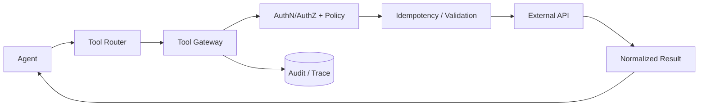

# CHAPTER 03 · Tool Calling、MCP 与外部动作

> **系统层**：Tool Runtime / Trust Boundary  
> **本章 Invariant**：所有副作用可鉴权、可幂等、可审计、可恢复

## 为什么这一章重要

这一章训练的是 **Tool Runtime / Trust Boundary** 的工程能力。面试里不要把问题回答成“某个框架怎么配置”，而要把 Agent 当作有概率决策、有外部副作用、会跨轮运行的生产系统。

### 三条主线

- Tool description 影响选择，但 Tool Gateway 决定能否执行
- 网络超时不等于业务失败；先识别调用语义，再决定 retry
- 副作用要有 operation_id / idempotency / audit / approval 机制

## 本章概念图

## 本章答题框架

任何题都可以先问四个问题：

1. 调用是 read-only 还是产生 side effect？
1. 是否幂等/可查询/可补偿？
1. 谁授权这个动作？
1. 错误是否可重试且仍在 deadline 内？

然后用统一可靠性框架收口：`Detect → Classify → Contain → Recover → Preserve → Verify`。

## 关键指标

- `tool_success_rate`
- `tool_selection_accuracy`
- `timeout_rate`
- `duplicate_side_effect_rate`
- `tool_p95_latency`

工具指标要按 tool_name、operation_type、side_effect_class 切片，不能只看总成功率。

## 推荐学习顺序

1. [Q021 · Function Calling 背后模型如何决定调用哪个工具？](q021.md) ⭐
2. [Q023 · 工具调用 timeout 了，你会直接 retry 吗？](q023.md) ⭐
3. [Q024 · 支付 API 成功但响应丢失，Agent 认为失败并重试，如何避免重复执行？](q024.md) ⭐
4. [Q030 · 设计一个 Production Tool Gateway。](q030.md) ⭐
5. [Q022 · Agent 总在两个类似工具之间选错，怎么解决？](q022.md)
6. [Q025 · Tool 返回 partial success，接口应该怎么表达？](q025.md)
7. [Q026 · 五个工具可以并行调用，如何决定并行还是串行？](q026.md)
8. [Q027 · Tool 返回 100K tokens，直接塞回 context 会发生什么？](q027.md)
9. [Q028 · MCP 和普通 Function Calling 有什么本质区别？](q028.md)
10. [Q029 · 几百个 MCP Tool 全部暴露给模型为什么是坏设计？](q029.md)

## 题目索引

| 题号 | 问题 | 频率 | 难度 | 风险 |
|---|---|---|---|---|
| [Q021](q021.md) | Function Calling 背后模型如何决定调用哪个工具？ | 必考 | 中 | 中 |
| [Q022](q022.md) | Agent 总在两个类似工具之间选错，怎么解决？ | 必考 | 中 | 中 |
| [Q023](q023.md) | 工具调用 timeout 了，你会直接 retry 吗？ | 必考 | 难 | 高 |
| [Q024](q024.md) | 支付 API 成功但响应丢失，Agent 认为失败并重试，如何避免重复执行？ | 必考 | 难 | 高 |
| [Q025](q025.md) | Tool 返回 partial success，接口应该怎么表达？ | 中频 | 中 | 中高 |
| [Q026](q026.md) | 五个工具可以并行调用，如何决定并行还是串行？ | 高频 | 中 | 中高 |
| [Q027](q027.md) | Tool 返回 100K tokens，直接塞回 context 会发生什么？ | 必考 | 中 | 中高 |
| [Q028](q028.md) | MCP 和普通 Function Calling 有什么本质区别？ | 必考 | 中 | 中 |
| [Q029](q029.md) | 几百个 MCP Tool 全部暴露给模型为什么是坏设计？ | 高频 | 难 | 中高 |
| [Q030](q030.md) | 设计一个 Production Tool Gateway。 | 必考 | 难 | 高 |

> ⭐ 表示属于 [20 道必刷题](../../docs/05-priority-20.md)。

## 本章完成标准

- [ ] 能在白板上画出本章控制流和 trust boundary。
- [ ] 能说出至少 3 个 failure mode 及其观测信号。
- [ ] 能把一个框架能力还原成 state / protocol / policy / runtime 原语。
- [ ] 能解释主要 trade-off，而不是给出绝对化“最佳实践”。
- [ ] 能为关键设计给出 metric / eval / SLO。

[← 返回总题库](../README.md)
