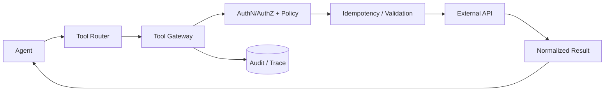

# Q024 · 支付 API 成功但响应丢失，Agent 认为失败并重试，如何避免重复执行？

> **能力轴**：Tool Calling、MCP 与外部动作  
> **GitHub Edition**：Expanded Professional Version  
> **训练目标**：能给出 30 秒结论、3 分钟工程展开，并承受连续系统追问。

## 题目定位

| 维度 | 定位 |
|---|---|
| 面试层级 | Senior / Staff 倾向 |
| 失败类别 | Tool / Side Effect |
| 风险等级 | 高 |
| 核心 Invariant | 相同业务意图在任意 retry/crash 后都映射到同一 operation_id，并由服务端去重。 |
| 面试频率 | 必考 |
| 难度 | 难 |

## 面试官在考什么

这是分布式系统的 exactly-once 幻觉问题；实际通常用 at-least-once + idempotency 达成业务上的 once。

这道题表面在问一个局部技术点，实际上通常同时检查以下三层能力：

- 幂等键必须跨 retry 和 crash 稳定。
- 服务端需要持久化去重结果。
- 对不可幂等外部系统使用 reconciliation/compensation。
- Tool description 影响选择，但 Tool Gateway 决定能否执行
- 网络超时不等于业务失败；先识别调用语义，再决定 retry

> **判断高级答案的标志**：不仅告诉面试官“用什么机制”，还能说明 **为什么需要它、它保护哪个 invariant、失败时怎么恢复、怎么证明方案有效**。

## 30 秒回答

客户端生成稳定 idempotency key / operation_id，服务端用它去重；超时后先查询该 operation 状态，再决定补发。Agent checkpoint 中必须保存 operation_id，恢复后沿用同一个 ID。

## 深挖解析

> 下面先逐条展开 PDF 原始深挖点；这些是本题最应该讲清的技术机制。

### 1. 幂等键必须跨 retry 和 crash 稳定。

这里最重要的是“逻辑操作身份”而不是 HTTP 请求身份。`operation_id` 必须在第一次执行前持久化，并在 retry、进程重启、队列重投时保持不变；服务端或可信代理根据该 ID 返回同一 canonical result。

### 2. 服务端需要持久化去重结果。

Checkpoint 只解决“本地执行状态从哪里恢复”。如果步骤已经对外产生副作用，仍需要额外的 idempotency/reconciliation 机制；否则从旧 checkpoint 重放会重复执行外部动作。

### 3. 对不可幂等外部系统使用 reconciliation/compensation。

这里最重要的是“逻辑操作身份”而不是 HTTP 请求身份。`operation_id` 必须在第一次执行前持久化，并在 retry、进程重启、队列重投时保持不变；服务端或可信代理根据该 ID 返回同一 canonical result。

### 从机制到系统

把上面几点合起来，本题不能只用一个局部 API 或 Prompt 技巧解决。需要把 **`在 Tool Gateway 生成 operation_id，持久化 request/result 状态；恢复和重试统一走同一 operation。`** 变成 runtime 中可测试的状态迁移，并给关键 transition 设计失败分支。
## 3 分钟专业展开

先把问题抽象成一个工程约束：**相同业务意图在任意 retry/crash 后都映射到同一 operation_id，并由服务端去重。**。然后按下面四层回答：

1. **语义层**：先定义“成功 / 失败 / 完成 / 重试 / 授权”等词在这个场景中的准确含义，避免把 HTTP、LLM 或消息状态误当业务状态。
2. **状态层**：指出哪些事实必须结构化、持久化、带版本或 operation identity；不要只依赖聊天历史或自然语言总结。
3. **控制层**：明确模型可以提出什么、runtime/策略引擎必须强制什么，以及异常时走 retry、replan、fallback、HITL 还是 fail-safe。
4. **验证层**：给出 trace / metric / eval，证明机制既能挡住已知 failure mode，又不会产生不可接受的延迟、成本或误拦截。

### 核心机制

- **幂等键必须跨 retry 和 crash 稳定。**
- **服务端需要持久化去重结果。**
- **对不可幂等外部系统使用 reconciliation/compensation。**
- Tool description 影响选择，但 Tool Gateway 决定能否执行
- 网络超时不等于业务失败；先识别调用语义，再决定 retry
- 副作用要有 operation_id / idempotency / audit / approval 机制

### 关键设计决策

- 调用是 read-only 还是产生 side effect？
- 是否幂等/可查询/可补偿？
- 谁授权这个动作？
- 错误是否可重试且仍在 deadline 内？

## 参考架构 / 控制流



重点不是“多重试几次”，而是在 Gateway/业务服务侧建立 operation ledger。调用方只持有稳定 operation_id；任何 retry 都成为同一逻辑操作的再次查询/提交。

## 状态与接口设计

面试中建议显式说出“**哪些字段需要存在**”，这样比只说框架名更有工程可信度。一个最小设计通常包括：

- `run_id / task_id / step_id`：把一次执行和子任务串起来。
- `attempt / version / deadline`：区分重试、版本与剩余时间。
- `status`：使用有限状态机，而不是自由文本表示执行状态。
- `input_ref / output_ref / artifact_ref`：大对象保存为引用，避免在 context/消息中复制。
- `trace_id / correlation_id`：跨模型、工具、Agent 和异步任务关联。
- 对副作用步骤再加入 `operation_id / idempotency_key / approval_id`；对知识步骤加入 `source / provenance / freshness`。

## 实现骨架 / 伪代码

```text
PREPARED(operation_id)
   | persist intent
   v
IN_FLIGHT ----timeout/crash----> UNKNOWN
   | success                    |
   v                            | query(operation_id)
COMMITTED <---------------------+
   |
   +--> repeated request returns stored result
```

## 典型生产场景

退款 Tool 的 HTTP 请求超时。系统不直接发第二次退款，而是用 operation_id 查询退款状态；只有确认未提交时才重试。

## Failure Modes：方案最容易坏在哪里

- **每次 retry 生成新幂等键**
- **幂等键只存在内存，crash 后丢失**
- **服务端去重表 TTL 小于调用重试窗口**

遇到异常时，不要立即跳到“重试”。建议统一使用：

`Detect → Classify → Contain → Recover → Preserve → Verify`

本题最重要的 Preserve 对象是：**相同业务意图在任意 retry/crash 后都映射到同一 operation_id，并由服务端去重。**。

## Trade-off：为什么不能只有一个标准答案

- **自动化 vs 风险**：只读工具可更激进自动执行；不可逆副作用需要更强校验和审批。
- **重试成功率 vs 重复副作用**：提高 retry 会提升瞬时故障恢复率，但没有幂等会放大业务错误。

面试时最好给出一个“默认选择 + 改变选择的条件”，而不是绝对化表达。例如：默认用更简单的单 Agent/同步/低并发方案，只有当评估数据证明瓶颈来自专业化、并行或长任务时再增加复杂度。

## 可观测性与关键指标

工具指标要按 tool_name、operation_type、side_effect_class 切片，不能只看总成功率。 建议至少记录：

- `tool_success_rate`
- `tool_selection_accuracy`
- `timeout_rate`
- `duplicate_side_effect_rate`
- `tool_p95_latency`

此外所有指标都应该按 `workflow_version / model / tool / tenant / task_type / failure_class` 等维度切片，否则总体平均值很容易掩盖局部事故。

## 连续追问

### 1. 如果第三方 API 不支持幂等键怎么办？

**回答方向**：如果远端没有幂等能力，先寻找可查询的业务唯一键/创建结果；其次可在自有 Gateway 建 operation ledger 和去重代理。若远端既不可查询也不可幂等，只能降低自动重试并依靠 reconciliation/compensation/HITL，不能声称实现 exactly-once。

### 2. 幂等记录保留多久？

**回答方向**：幂等记录至少覆盖“客户端最大重试窗口 + 异步队列最大重投窗口 + 业务对账/补偿窗口”。高价值交易通常还要结合业务唯一键长期去重；TTL 到期前应明确是否允许同一业务请求重新发生。

## ⭐ 必刷题：深水区

### 重复副作用测试

模拟网络超时 + 进程重启 + 队列重投三连击，验证三次执行都复用同一 operation_id，最终外部系统只产生一个业务对象。

### 面试评分点

- **60 分**：知道核心术语和基本方案。
- **75 分**：能说明状态、失败窗口与恢复动作。
- **90 分**：能主动提出 invariant、故障注入、指标和 trade-off。
- **95+ 分**：能把方案抽象为与具体框架无关的 runtime / protocol / trust-boundary 设计，并指出何时不值得增加复杂度。

## 易错回答

> 只在客户端记录‘我已经调用过’，却没有服务端去重依据。

为什么这是低质量答案：它通常只描述 happy path，没有说明失败语义、状态所有权或可信边界，也没有给出验证手段。高级回答要把“模型可能错、网络可能断、进程可能崩、消息可能重复、知识可能过期”当作设计前提。

## Know-Why

这是分布式系统的 exactly-once 幻觉问题；实际通常用 at-least-once + idempotency 达成业务上的 once。

更深一层看，本题的本质是保护这个系统 invariant：**相同业务意图在任意 retry/crash 后都映射到同一 operation_id，并由服务端去重。**。Agent 引入的是概率决策，因此工程层需要把不可违反的规则外置为 deterministic guardrails/state machines，并给非确定路径准备恢复机制。

## Know-How

在 Tool Gateway 生成 operation_id，持久化 request/result 状态；恢复和重试统一走同一 operation。

### 落地步骤

1. 先写出业务 invariant 和明确的完成/失败定义。
2. 建立结构化 state，给每个关键字段确定 owner、版本与持久化周期。
3. 在可信 runtime / gateway 中实现校验、权限、预算和异常策略，不只依赖 prompt。
4. 为关键 transition 添加 trace、state diff 和可聚合 error code。
5. 构造至少 3 个故障注入案例：超时/重复/崩溃（或本题等价异常）。
6. 用 regression eval + 线上指标确认修复没有把问题转移到成本、时延或误拦截。

## Production Checklist

- [ ] 核心 invariant 已写成可验证条件：相同业务意图在任意 retry/crash 后都映射到同一 operation_id，并由服务端去重。
- [ ] 关键状态不只存在于 prompt/messages 中。
- [ ] 存在明确 timeout / retry / stop / fallback / HITL 策略。
- [ ] 所有高风险副作用经过资源侧授权与审计。
- [ ] Trace 能定位到发生错误的具体 transition。
- [ ] 变更有离线 regression，关键路径有线上 SLO/告警。

## 面试自测

- [ ] 我能在 **30 秒**内讲清核心结论，不报框架名堆术语。
- [ ] 我能在 **3 分钟**内说明状态、控制边界、失败恢复和指标。
- [ ] 我能画出上面的控制流，并解释每个箭头的失败语义。
- [ ] 面试官换成“网络断了 / Worker crash / 重复消息 / 权限不足”时，我仍能沿 invariant 推导方案。

## 关联题目

- [Q023 · 工具调用 timeout 了，你会直接 retry 吗？](q023.md)
- [Q021 · Function Calling 背后模型如何决定调用哪个工具？](q021.md)
- [Q022 · Agent 总在两个类似工具之间选错，怎么解决？](q022.md)
- [Q025 · Tool 返回 partial success，接口应该怎么表达？](q025.md)
- [Q026 · 五个工具可以并行调用，如何决定并行还是串行？](q026.md)

## 延伸阅读

### 对应官方工程资料

- [MCP · Tools](https://modelcontextprotocol.io/specification/2025-11-25/server/tools)
- [MCP · Authorization](https://modelcontextprotocol.io/specification/2025-11-25/basic/authorization)

> 外部资料用于 GitHub Expanded Edition 的工程深化；PDF 原始题目与核心字段仍按仓库结构化源数据保留。

- [Reliability First：六步故障回答框架](../../docs/04-reliability-first.md)
- [系统设计白板模板](../../docs/06-whiteboard-system-design.md)
- [参考资料与官方工程资料](../../docs/09-references.md)

---

[← Q023](q023.md) · [本章目录](README.md) · [Q025 →](q025.md)
