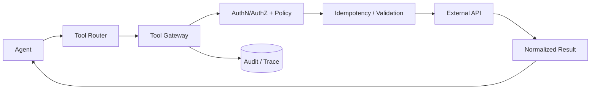

# Q028 · MCP 和普通 Function Calling 有什么本质区别？

> **能力轴**：Tool Calling、MCP 与外部动作  
> **GitHub Edition**：Expanded Professional Version  
> **训练目标**：能给出 30 秒结论、3 分钟工程展开，并承受连续系统追问。

## 题目定位

| 维度 | 定位 |
|---|---|
| 面试层级 | Senior / Staff 倾向 |
| 失败类别 | Tool / Side Effect |
| 风险等级 | 中 |
| 核心 Invariant | Function Calling 是模型输出接口；MCP 是 Host/Client/Server 之间的上下文与能力协议。 |
| 面试频率 | 必考 |
| 难度 | 中 |

## 面试官在考什么

当工具数量和提供方增加时，标准化的发现与交互协议能显著降低集成成本。

这道题表面在问一个局部技术点，实际上通常同时检查以下三层能力：

- MCP 把工具接入从单应用私有适配推进到协议化。
- 协议化后仍需要本地权限和风险控制。
- MCP server 不等于可信 server。
- Tool description 影响选择，但 Tool Gateway 决定能否执行
- 网络超时不等于业务失败；先识别调用语义，再决定 retry

> **判断高级答案的标志**：不仅告诉面试官“用什么机制”，还能说明 **为什么需要它、它保护哪个 invariant、失败时怎么恢复、怎么证明方案有效**。

## 30 秒回答

Function Calling 解决‘模型如何表达一个函数调用’，MCP 更偏向标准化模型/Agent 与外部能力之间的协议，包括能力发现、工具/资源暴露、连接与授权语义。它解决的是生态互操作，不只是 JSON schema。

## 深挖解析

> 下面先逐条展开 PDF 原始深挖点；这些是本题最应该讲清的技术机制。

### 1. MCP 把工具接入从单应用私有适配推进到协议化。

回答 MCP 时要区分“模型如何表达 tool call”和“系统如何标准化发现/连接外部能力”。MCP 的协议对象和授权/传输语义属于集成层，不是单次函数调用语法糖。

### 2. 协议化后仍需要本地权限和风险控制。

ACL 是可信数据平面的强约束。未授权文档最好在候选召回前就被排除；即使做二次过滤，也不能依赖模型“看到了但不使用”。

### 3. MCP server 不等于可信 server。

回答 MCP 时要区分“模型如何表达 tool call”和“系统如何标准化发现/连接外部能力”。MCP 的协议对象和授权/传输语义属于集成层，不是单次函数调用语法糖。

### 从机制到系统

把上面几点合起来，本题不能只用一个局部 API 或 Prompt 技巧解决。需要把 **`在架构上把 MCP client/server 与 Tool Gateway 分层：MCP 负责协议接入，Gateway 负责 policy、审计、限流。`** 变成 runtime 中可测试的状态迁移，并给关键 transition 设计失败分支。
## 3 分钟专业展开

先把问题抽象成一个工程约束：**Function Calling 是模型输出接口；MCP 是 Host/Client/Server 之间的上下文与能力协议。**。然后按下面四层回答：

1. **语义层**：先定义“成功 / 失败 / 完成 / 重试 / 授权”等词在这个场景中的准确含义，避免把 HTTP、LLM 或消息状态误当业务状态。
2. **状态层**：指出哪些事实必须结构化、持久化、带版本或 operation identity；不要只依赖聊天历史或自然语言总结。
3. **控制层**：明确模型可以提出什么、runtime/策略引擎必须强制什么，以及异常时走 retry、replan、fallback、HITL 还是 fail-safe。
4. **验证层**：给出 trace / metric / eval，证明机制既能挡住已知 failure mode，又不会产生不可接受的延迟、成本或误拦截。

### 核心机制

- **MCP 把工具接入从单应用私有适配推进到协议化。**
- **协议化后仍需要本地权限和风险控制。**
- **MCP server 不等于可信 server。**
- Tool description 影响选择，但 Tool Gateway 决定能否执行
- 网络超时不等于业务失败；先识别调用语义，再决定 retry
- 副作用要有 operation_id / idempotency / audit / approval 机制

### 关键设计决策

- 调用是 read-only 还是产生 side effect？
- 是否幂等/可查询/可补偿？
- 谁授权这个动作？
- 错误是否可重试且仍在 deadline 内？

## 参考架构 / 控制流



这张图强调本章的可信边界：所有副作用可鉴权、可幂等、可审计、可恢复。面试时先讲数据/控制流，再讲每个边界上的校验与恢复。

## 状态与接口设计

面试中建议显式说出“**哪些字段需要存在**”，这样比只说框架名更有工程可信度。一个最小设计通常包括：

- `run_id / task_id / step_id`：把一次执行和子任务串起来。
- `attempt / version / deadline`：区分重试、版本与剩余时间。
- `status`：使用有限状态机，而不是自由文本表示执行状态。
- `input_ref / output_ref / artifact_ref`：大对象保存为引用，避免在 context/消息中复制。
- `trace_id / correlation_id`：跨模型、工具、Agent 和异步任务关联。
- 对副作用步骤再加入 `operation_id / idempotency_key / approval_id`；对知识步骤加入 `source / provenance / freshness`。

## 实现骨架 / 伪代码

```python
call = tool_router.propose(intent, allowed_tools)
policy.authorize(subject, call.tool, call.args)
normalized = gateway.execute(
    call,
    deadline=remaining_deadline(),
    operation_id=stable_operation_id(call),
)
state = reduce_tool_result(state, normalized)
```

## 典型生产场景

退款 Tool 的 HTTP 请求超时。系统不直接发第二次退款，而是用 operation_id 查询退款状态；只有确认未提交时才重试。

## Failure Modes：方案最容易坏在哪里

- **tool schema/description 含糊导致误选**
- **超时/重试语义错误导致重复副作用**
- **权限校验只在模型层而不在执行层**

遇到异常时，不要立即跳到“重试”。建议统一使用：

`Detect → Classify → Contain → Recover → Preserve → Verify`

本题最重要的 Preserve 对象是：**Function Calling 是模型输出接口；MCP 是 Host/Client/Server 之间的上下文与能力协议。**。

## Trade-off：为什么不能只有一个标准答案

- **自动化 vs 风险**：只读工具可更激进自动执行；不可逆副作用需要更强校验和审批。
- **重试成功率 vs 重复副作用**：提高 retry 会提升瞬时故障恢复率，但没有幂等会放大业务错误。

面试时最好给出一个“默认选择 + 改变选择的条件”，而不是绝对化表达。例如：默认用更简单的单 Agent/同步/低并发方案，只有当评估数据证明瓶颈来自专业化、并行或长任务时再增加复杂度。

## 可观测性与关键指标

工具指标要按 tool_name、operation_type、side_effect_class 切片，不能只看总成功率。 建议至少记录：

- `tool_success_rate`
- `tool_selection_accuracy`
- `timeout_rate`
- `duplicate_side_effect_rate`
- `tool_p95_latency`

此外所有指标都应该按 `workflow_version / model / tool / tenant / task_type / failure_class` 等维度切片，否则总体平均值很容易掩盖局部事故。

## 连续追问

### 1. MCP 是否替代 Agent framework？

**回答方向**：先以“MCP 把工具接入从单应用私有适配推进到协议化。”为主结论，再补充状态所有权、失败窗口和验证指标。回答必须给出一个明确边界：什么情况下采用该方案，什么情况下应 fail-safe / clarify / HITL。

### 2. MCP 如何做权限隔离？

**回答方向**：先以“MCP 把工具接入从单应用私有适配推进到协议化。”为主结论，再补充状态所有权、失败窗口和验证指标。回答必须给出一个明确边界：什么情况下采用该方案，什么情况下应 fail-safe / clarify / HITL。

## 易错回答

> 把 MCP 简化成‘另一种 function call 格式’。

为什么这是低质量答案：它通常只描述 happy path，没有说明失败语义、状态所有权或可信边界，也没有给出验证手段。高级回答要把“模型可能错、网络可能断、进程可能崩、消息可能重复、知识可能过期”当作设计前提。

## Know-Why

当工具数量和提供方增加时，标准化的发现与交互协议能显著降低集成成本。

更深一层看，本题的本质是保护这个系统 invariant：**Function Calling 是模型输出接口；MCP 是 Host/Client/Server 之间的上下文与能力协议。**。Agent 引入的是概率决策，因此工程层需要把不可违反的规则外置为 deterministic guardrails/state machines，并给非确定路径准备恢复机制。

## Know-How

在架构上把 MCP client/server 与 Tool Gateway 分层：MCP 负责协议接入，Gateway 负责 policy、审计、限流。

### 落地步骤

1. 先写出业务 invariant 和明确的完成/失败定义。
2. 建立结构化 state，给每个关键字段确定 owner、版本与持久化周期。
3. 在可信 runtime / gateway 中实现校验、权限、预算和异常策略，不只依赖 prompt。
4. 为关键 transition 添加 trace、state diff 和可聚合 error code。
5. 构造至少 3 个故障注入案例：超时/重复/崩溃（或本题等价异常）。
6. 用 regression eval + 线上指标确认修复没有把问题转移到成本、时延或误拦截。

## Production Checklist

- [ ] 核心 invariant 已写成可验证条件：Function Calling 是模型输出接口；MCP 是 Host/Client/Server 之间的上下文与能力协议。
- [ ] 关键状态不只存在于 prompt/messages 中。
- [ ] 存在明确 timeout / retry / stop / fallback / HITL 策略。
- [ ] 所有高风险副作用经过资源侧授权与审计。
- [ ] Trace 能定位到发生错误的具体 transition。
- [ ] 变更有离线 regression，关键路径有线上 SLO/告警。

## 面试自测

- [ ] 我能在 **30 秒**内讲清核心结论，不报框架名堆术语。
- [ ] 我能在 **3 分钟**内说明状态、控制边界、失败恢复和指标。
- [ ] 我能画出上面的控制流，并解释每个箭头的失败语义。
- [ ] 面试官换成“网络断了 / Worker crash / 重复消息 / 权限不足”时，我仍能沿 invariant 推导方案。

## 关联题目

- [Q021 · Function Calling 背后模型如何决定调用哪个工具？](q021.md)
- [Q022 · Agent 总在两个类似工具之间选错，怎么解决？](q022.md)
- [Q023 · 工具调用 timeout 了，你会直接 retry 吗？](q023.md)
- [Q024 · 支付 API 成功但响应丢失，Agent 认为失败并重试，如何避免重复执行？](q024.md)
- [Q025 · Tool 返回 partial success，接口应该怎么表达？](q025.md)

## 延伸阅读

### 对应官方工程资料

- [MCP · Tools](https://modelcontextprotocol.io/specification/2025-11-25/server/tools)
- [MCP · Authorization](https://modelcontextprotocol.io/specification/2025-11-25/basic/authorization)

> 外部资料用于 GitHub Expanded Edition 的工程深化；PDF 原始题目与核心字段仍按仓库结构化源数据保留。

- [Reliability First：六步故障回答框架](../../docs/04-reliability-first.md)
- [系统设计白板模板](../../docs/06-whiteboard-system-design.md)
- [参考资料与官方工程资料](../../docs/09-references.md)

---

[← Q027](q027.md) · [本章目录](README.md) · [Q029 →](q029.md)
