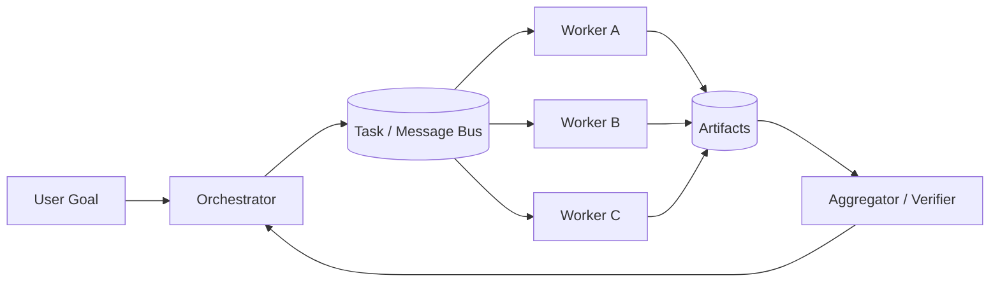

# CHAPTER 04 · Multi-Agent 通信与协作

> **系统层**：Distributed Agent Coordination  
> **本章 Invariant**：任务 ownership 明确，消息可关联、可去重、可恢复，隔离边界不泄漏

## 为什么这一章重要

这一章训练的是 **Distributed Agent Coordination** 的工程能力。面试里不要把问题回答成“某个框架怎么配置”，而要把 Agent 当作有概率决策、有外部副作用、会跨轮运行的生产系统。

### 三条主线

- Multi-Agent 首先是分布式系统，其次才是多个 Prompt
- transport complete、agent done、business complete 必须区分
- 跨 Agent 只传 contract + artifact + provenance，不默认共享全部内部状态

## 本章概念图

## 本章答题框架

任何题都可以先问四个问题：

1. 任务是否值得拆分？
1. 谁拥有 task state？
1. 消息如何去重/排序/关联？
1. 失败如何隔离或降级？

然后用统一可靠性框架收口：`Detect → Classify → Contain → Recover → Preserve → Verify`。

## 关键指标

- `handoff_success_rate`
- `message_redelivery_rate`
- `coordination_overhead`
- `worker_utilization`
- `orchestration_loop_rate`

协调成本本身就是指标：handoff 数、消息量、重复任务率、worker 等待时间会吞噬 Multi-Agent 收益。

## 推荐学习顺序

1. [Q033 · 多个 Agent 使用异步 JSON 消息通信，你会设计哪些字段？](q033.md) ⭐
2. [Q034 · Agent 消息丢失、重复、乱序分别怎么办？](q034.md) ⭐
3. [Q035 · 主 Agent 怎么知道子 Agent 真正完成？](q035.md) ⭐
4. [Q038 · 多个 Agent 相互调用进入无限‘甩锅循环’，怎么发现和阻断？](q038.md) ⭐
5. [Q031 · 什么时候 Multi-Agent 比 Single-Agent 更好？什么时候反而更差？](q031.md)
6. [Q032 · Orchestrator-Worker 架构怎么设计？](q032.md)
7. [Q036 · Handoff 时传整个聊天记录还是最小上下文？](q036.md)
8. [Q037 · 两个 Agent 对同一问题给出冲突结论怎么办？](q037.md)
9. [Q039 · 8 个 Worker 中一个失败，要不要整个任务失败？](q039.md)
10. [Q040 · 多 Agent 如何实现 Context、Storage、Permission 完全隔离，又允许必要交换？](q040.md)

## 题目索引

| 题号 | 问题 | 频率 | 难度 | 风险 |
|---|---|---|---|---|
| [Q031](q031.md) | 什么时候 Multi-Agent 比 Single-Agent 更好？什么时候反而更差？ | 必考 | 中 | 中 |
| [Q032](q032.md) | Orchestrator-Worker 架构怎么设计？ | 必考 | 难 | 中高 |
| [Q033](q033.md) | 多个 Agent 使用异步 JSON 消息通信，你会设计哪些字段？ | 必考 | 难 | 中高 |
| [Q034](q034.md) | Agent 消息丢失、重复、乱序分别怎么办？ | 必考 | 难 | 高 |
| [Q035](q035.md) | 主 Agent 怎么知道子 Agent 真正完成？ | 必考 | 难 | 中高 |
| [Q036](q036.md) | Handoff 时传整个聊天记录还是最小上下文？ | 高频 | 中 | 中高 |
| [Q037](q037.md) | 两个 Agent 对同一问题给出冲突结论怎么办？ | 高频 | 难 | 中高 |
| [Q038](q038.md) | 多个 Agent 相互调用进入无限‘甩锅循环’，怎么发现和阻断？ | 必考 | 难 | 高 |
| [Q039](q039.md) | 8 个 Worker 中一个失败，要不要整个任务失败？ | 中频 | 中 | 中 |
| [Q040](q040.md) | 多 Agent 如何实现 Context、Storage、Permission 完全隔离，又允许必要交换？ | 必考 | 难 | 高 |

> ⭐ 表示属于 [20 道必刷题](../../docs/05-priority-20.md)。

## 本章完成标准

- [ ] 能在白板上画出本章控制流和 trust boundary。
- [ ] 能说出至少 3 个 failure mode 及其观测信号。
- [ ] 能把一个框架能力还原成 state / protocol / policy / runtime 原语。
- [ ] 能解释主要 trade-off，而不是给出绝对化“最佳实践”。
- [ ] 能为关键设计给出 metric / eval / SLO。

[← 返回总题库](../README.md)
