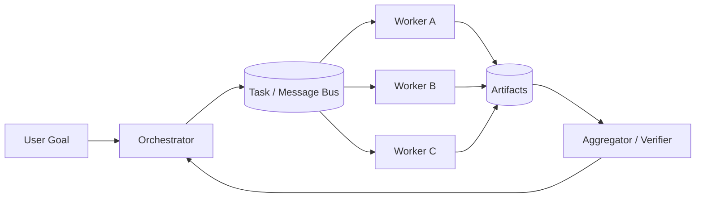

# Q034 · Agent 消息丢失、重复、乱序分别怎么办？

> **能力轴**：Multi-Agent 通信与协作  
> **GitHub Edition**：Expanded Professional Version  
> **训练目标**：能给出 30 秒结论、3 分钟工程展开，并承受连续系统追问。

## 题目定位

| 维度 | 定位 |
|---|---|
| 面试层级 | Senior / Staff 倾向 |
| 失败类别 | Coordination / Protocol |
| 风险等级 | 高 |
| 核心 Invariant | 传输层允许 at-least-once；消费端必须去重，业务状态机必须拒绝非法/过期状态迁移。 |
| 面试频率 | 必考 |
| 难度 | 难 |

## 面试官在考什么

多 Agent 通信继承了分布式消息系统的所有经典问题。

这道题表面在问一个局部技术点，实际上通常同时检查以下三层能力：

- 至少一次投递是常见现实。
- 顺序要求通常按 task/resource key 局部保证。
- 重试要有 dead-letter queue。
- Multi-Agent 首先是分布式系统，其次才是多个 Prompt
- transport complete、agent done、business complete 必须区分

> **判断高级答案的标志**：不仅告诉面试官“用什么机制”，还能说明 **为什么需要它、它保护哪个 invariant、失败时怎么恢复、怎么证明方案有效**。

## 30 秒回答

丢失用持久队列+ACK+重试；重复用 message_id/operation_id 去重；乱序用 sequence/version 或按业务 key 串行化。不要追求不存在的完美 exactly-once，而要设计业务幂等。

## 深挖解析

> 下面先逐条展开 PDF 原始深挖点；这些是本题最应该讲清的技术机制。

### 1. 至少一次投递是常见现实。

把这个点落到分布式任务语义：需要 task ownership、消息 identity、持久化状态和失败传播策略。

### 2. 顺序要求通常按 task/resource key 局部保证。

把这个点落到分布式任务语义：需要 task ownership、消息 identity、持久化状态和失败传播策略。

### 3. 重试要有 dead-letter queue。

Retry 必须同时满足：错误瞬时可恢复、操作可安全重放、仍在父 deadline 内、没有超过 retry budget。否则重试只是把局部故障放大成队列/下游雪崩。

### 从机制到系统

把上面几点合起来，本题不能只用一个局部 API 或 Prompt 技巧解决。需要把 **`使用 durable queue；consumer 先查 dedup store，再执行业务；失败超过阈值进入 DLQ。`** 变成 runtime 中可测试的状态迁移，并给关键 transition 设计失败分支。
## 3 分钟专业展开

先把问题抽象成一个工程约束：**传输层允许 at-least-once；消费端必须去重，业务状态机必须拒绝非法/过期状态迁移。**。然后按下面四层回答：

1. **语义层**：先定义“成功 / 失败 / 完成 / 重试 / 授权”等词在这个场景中的准确含义，避免把 HTTP、LLM 或消息状态误当业务状态。
2. **状态层**：指出哪些事实必须结构化、持久化、带版本或 operation identity；不要只依赖聊天历史或自然语言总结。
3. **控制层**：明确模型可以提出什么、runtime/策略引擎必须强制什么，以及异常时走 retry、replan、fallback、HITL 还是 fail-safe。
4. **验证层**：给出 trace / metric / eval，证明机制既能挡住已知 failure mode，又不会产生不可接受的延迟、成本或误拦截。

### 核心机制

- **至少一次投递是常见现实。**
- **顺序要求通常按 task/resource key 局部保证。**
- **重试要有 dead-letter queue。**
- Multi-Agent 首先是分布式系统，其次才是多个 Prompt
- transport complete、agent done、business complete 必须区分
- 跨 Agent 只传 contract + artifact + provenance，不默认共享全部内部状态

### 关键设计决策

- 任务是否值得拆分？
- 谁拥有 task state？
- 消息如何去重/排序/关联？
- 失败如何隔离或降级？

## 参考架构 / 控制流



消息队列只提供传输语义；业务状态机负责拒绝重复、旧 attempt 和非法状态迁移。不要把“使用 Kafka/SQS”当作消息正确性的完整答案。

## 状态与接口设计

面试中建议显式说出“**哪些字段需要存在**”，这样比只说框架名更有工程可信度。一个最小设计通常包括：

- `run_id / task_id / step_id`：把一次执行和子任务串起来。
- `attempt / version / deadline`：区分重试、版本与剩余时间。
- `status`：使用有限状态机，而不是自由文本表示执行状态。
- `input_ref / output_ref / artifact_ref`：大对象保存为引用，避免在 context/消息中复制。
- `trace_id / correlation_id`：跨模型、工具、Agent 和异步任务关联。
- 对副作用步骤再加入 `operation_id / idempotency_key / approval_id`；对知识步骤加入 `source / provenance / freshness`。

## 实现骨架 / 伪代码

```text
Orchestrator
  -> persist Task(task_id, attempt, deadline)
  -> publish task.request(message_id, correlation_id)
Worker
  -> deduplicate(message_id)
  -> execute scoped task
  -> persist Artifact + terminal task status
Orchestrator
  -> verify artifact/business completion
```

## 典型生产场景

主 Agent 把“整理退款证据”分给 Worker。Worker 返回 artifact_id 和 task status；Orchestrator 验证证据字段完整后才进入退款决策。

## Failure Modes：方案最容易坏在哪里

- **收到重复消息重复执行副作用**
- **旧 attempt 的迟到结果覆盖新 attempt**
- **只靠队列 FIFO 假设全局顺序**

遇到异常时，不要立即跳到“重试”。建议统一使用：

`Detect → Classify → Contain → Recover → Preserve → Verify`

本题最重要的 Preserve 对象是：**传输层允许 at-least-once；消费端必须去重，业务状态机必须拒绝非法/过期状态迁移。**。

## Trade-off：为什么不能只有一个标准答案

- **专业化/并行 vs 协调成本**：拆 Agent 能提升隔离与并行，但会增加消息、上下文同步和 failure surface。
- **共享上下文 vs 隔离**：共享更多信息减少重复检索，但提高污染、越权和耦合。

面试时最好给出一个“默认选择 + 改变选择的条件”，而不是绝对化表达。例如：默认用更简单的单 Agent/同步/低并发方案，只有当评估数据证明瓶颈来自专业化、并行或长任务时再增加复杂度。

## 可观测性与关键指标

协调成本本身就是指标：handoff 数、消息量、重复任务率、worker 等待时间会吞噬 Multi-Agent 收益。 建议至少记录：

- `handoff_success_rate`
- `message_redelivery_rate`
- `coordination_overhead`
- `worker_utilization`
- `orchestration_loop_rate`

此外所有指标都应该按 `workflow_version / model / tool / tenant / task_type / failure_class` 等维度切片，否则总体平均值很容易掩盖局部事故。

## 连续追问

### 1. 重复执行无法幂等怎么办？

**回答方向**：先以“至少一次投递是常见现实。”为主结论，再补充状态所有权、失败窗口和验证指标。回答必须给出一个明确边界：什么情况下采用该方案，什么情况下应 fail-safe / clarify / HITL。

### 2. 如何做 poison message 处理？

**回答方向**：先以“至少一次投递是常见现实。”为主结论，再补充状态所有权、失败窗口和验证指标。回答必须给出一个明确边界：什么情况下采用该方案，什么情况下应 fail-safe / clarify / HITL。

## ⭐ 必刷题：深水区

### 消息语义测试

人工制造 duplicate、out-of-order、late result，验证 consumer 去重和状态机 version check；不要用“队列保证顺序”作为唯一措施。

### 面试评分点

- **60 分**：知道核心术语和基本方案。
- **75 分**：能说明状态、失败窗口与恢复动作。
- **90 分**：能主动提出 invariant、故障注入、指标和 trade-off。
- **95+ 分**：能把方案抽象为与具体框架无关的 runtime / protocol / trust-boundary 设计，并指出何时不值得增加复杂度。

## 易错回答

> 假设消息总能可靠、按序且只送达一次。

为什么这是低质量答案：它通常只描述 happy path，没有说明失败语义、状态所有权或可信边界，也没有给出验证手段。高级回答要把“模型可能错、网络可能断、进程可能崩、消息可能重复、知识可能过期”当作设计前提。

## Know-Why

多 Agent 通信继承了分布式消息系统的所有经典问题。

更深一层看，本题的本质是保护这个系统 invariant：**传输层允许 at-least-once；消费端必须去重，业务状态机必须拒绝非法/过期状态迁移。**。Agent 引入的是概率决策，因此工程层需要把不可违反的规则外置为 deterministic guardrails/state machines，并给非确定路径准备恢复机制。

## Know-How

使用 durable queue；consumer 先查 dedup store，再执行业务；失败超过阈值进入 DLQ。

### 落地步骤

1. 先写出业务 invariant 和明确的完成/失败定义。
2. 建立结构化 state，给每个关键字段确定 owner、版本与持久化周期。
3. 在可信 runtime / gateway 中实现校验、权限、预算和异常策略，不只依赖 prompt。
4. 为关键 transition 添加 trace、state diff 和可聚合 error code。
5. 构造至少 3 个故障注入案例：超时/重复/崩溃（或本题等价异常）。
6. 用 regression eval + 线上指标确认修复没有把问题转移到成本、时延或误拦截。

## Production Checklist

- [ ] 核心 invariant 已写成可验证条件：传输层允许 at-least-once；消费端必须去重，业务状态机必须拒绝非法/过期状态迁移。
- [ ] 关键状态不只存在于 prompt/messages 中。
- [ ] 存在明确 timeout / retry / stop / fallback / HITL 策略。
- [ ] 所有高风险副作用经过资源侧授权与审计。
- [ ] Trace 能定位到发生错误的具体 transition。
- [ ] 变更有离线 regression，关键路径有线上 SLO/告警。

## 面试自测

- [ ] 我能在 **30 秒**内讲清核心结论，不报框架名堆术语。
- [ ] 我能在 **3 分钟**内说明状态、控制边界、失败恢复和指标。
- [ ] 我能画出上面的控制流，并解释每个箭头的失败语义。
- [ ] 面试官换成“网络断了 / Worker crash / 重复消息 / 权限不足”时，我仍能沿 invariant 推导方案。

## 关联题目

- [Q033 · 多个 Agent 使用异步 JSON 消息通信，你会设计哪些字段？](q033.md)
- [Q038 · 多个 Agent 相互调用进入无限‘甩锅循环’，怎么发现和阻断？](q038.md)
- [Q031 · 什么时候 Multi-Agent 比 Single-Agent 更好？什么时候反而更差？](q031.md)
- [Q032 · Orchestrator-Worker 架构怎么设计？](q032.md)
- [Q035 · 主 Agent 怎么知道子 Agent 真正完成？](q035.md)

## 延伸阅读

### 对应官方工程资料

- [A2A Protocol · v1.0](https://a2a-protocol.org/v1.0.0/)
- [OpenAI Agents SDK · Agent orchestration](https://openai.github.io/openai-agents-python/multi_agent/)

> 外部资料用于 GitHub Expanded Edition 的工程深化；PDF 原始题目与核心字段仍按仓库结构化源数据保留。

- [Reliability First：六步故障回答框架](../../docs/04-reliability-first.md)
- [系统设计白板模板](../../docs/06-whiteboard-system-design.md)
- [参考资料与官方工程资料](../../docs/09-references.md)

---

[← Q033](q033.md) · [本章目录](README.md) · [Q035 →](q035.md)
