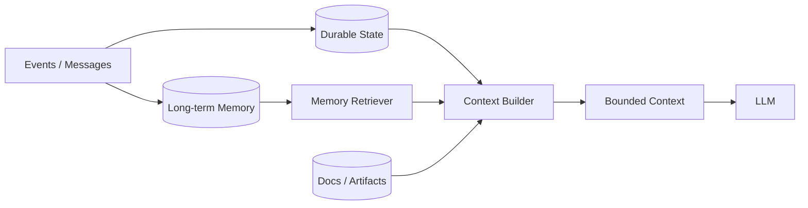

# CHAPTER 05 · Context Engineering 与 Memory

> **系统层**：Context Plane / Memory Plane  
> **本章 Invariant**：模型只看到当前决策所需上下文；关键状态不因摘要或窗口裁剪而丢失

## 为什么这一章重要

这一章训练的是 **Context Plane / Memory Plane** 的工程能力。面试里不要把问题回答成“某个框架怎么配置”，而要把 Agent 当作有概率决策、有外部副作用、会跨轮运行的生产系统。

### 三条主线

- Context 是工作集，不是数据库
- lossless state 与 lossy narrative 分离
- Memory 写入和读取都需要 policy、provenance、TTL/版本

## 本章概念图

## 本章答题框架

任何题都可以先问四个问题：

1. 这是状态、记忆还是临时上下文？
1. 能否有损压缩？
1. 信息是否可信/新鲜/相关？
1. 谁有权读取和写入？

然后用统一可靠性框架收口：`Detect → Classify → Contain → Recover → Preserve → Verify`。

## 关键指标

- `context_utilization`
- `context_hit_rate`
- `memory_precision`
- `stale_memory_rate`
- `contradiction_rate`
- `tokens_per_step`

Context/Memory 指标必须能解释 token 与质量之间的 trade-off，并监测 stale/contradiction。

## 推荐学习顺序

1. [Q041 · 长任务 Context Window 快爆了怎么办？](q041.md) ⭐
2. [Q043 · 摘要会丢关键细节，如何保证压缩后 Agent 不失忆？](q043.md) ⭐
3. [Q042 · Context Compaction 和 Context Reset 有什么区别？](q042.md)
4. [Q044 · 什么是 Context Pollution？如何判断 context 已经‘脏了’？](q044.md)
5. [Q045 · 100K token context budget 应该怎么分配？](q045.md)
6. [Q046 · 多 Agent 是否应该共享同一个 Context？](q046.md)
7. [Q047 · Agent 什么内容值得写入长期记忆？](q047.md)
8. [Q048 · 长期记忆出现两条互相冲突的信息怎么办？](q048.md)
9. [Q049 · Semantic、Episodic、Procedural Memory 分别解决什么问题？](q049.md)
10. [Q050 · 怎么证明你的 Memory 系统真的有效？](q050.md)

## 题目索引

| 题号 | 问题 | 频率 | 难度 | 风险 |
|---|---|---|---|---|
| [Q041](q041.md) | 长任务 Context Window 快爆了怎么办？ | 必考 | 难 | 中高 |
| [Q042](q042.md) | Context Compaction 和 Context Reset 有什么区别？ | 必考 | 难 | 中高 |
| [Q043](q043.md) | 摘要会丢关键细节，如何保证压缩后 Agent 不失忆？ | 必考 | 难 | 高 |
| [Q044](q044.md) | 什么是 Context Pollution？如何判断 context 已经‘脏了’？ | 高频 | 中 | 中高 |
| [Q045](q045.md) | 100K token context budget 应该怎么分配？ | 中频 | 中 | 中 |
| [Q046](q046.md) | 多 Agent 是否应该共享同一个 Context？ | 高频 | 中 | 中 |
| [Q047](q047.md) | Agent 什么内容值得写入长期记忆？ | 必考 | 中 | 中高 |
| [Q048](q048.md) | 长期记忆出现两条互相冲突的信息怎么办？ | 高频 | 难 | 中高 |
| [Q049](q049.md) | Semantic、Episodic、Procedural Memory 分别解决什么问题？ | 中频 | 中 | 中 |
| [Q050](q050.md) | 怎么证明你的 Memory 系统真的有效？ | 必考 | 难 | 中高 |

> ⭐ 表示属于 [20 道必刷题](../../docs/05-priority-20.md)。

## 本章完成标准

- [ ] 能在白板上画出本章控制流和 trust boundary。
- [ ] 能说出至少 3 个 failure mode 及其观测信号。
- [ ] 能把一个框架能力还原成 state / protocol / policy / runtime 原语。
- [ ] 能解释主要 trade-off，而不是给出绝对化“最佳实践”。
- [ ] 能为关键设计给出 metric / eval / SLO。

[← 返回总题库](../README.md)
