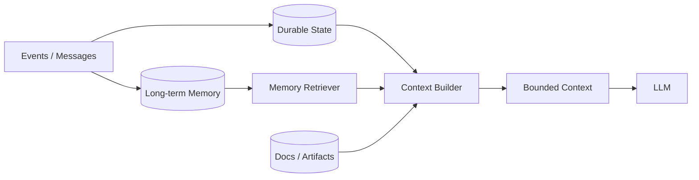

# Q041 · 长任务 Context Window 快爆了怎么办？

> **能力轴**：Context Engineering 与 Memory  
> **GitHub Edition**：Expanded Professional Version  
> **训练目标**：能给出 30 秒结论、3 分钟工程展开，并承受连续系统追问。

## 题目定位

| 维度 | 定位 |
|---|---|
| 面试层级 | Senior / Staff 倾向 |
| 失败类别 | Context / Memory |
| 风险等级 | 中高 |
| 核心 Invariant | 上下文超限时优先外置状态和按需检索；压缩只处理可有损叙事，关键状态不能摘要化。 |
| 面试频率 | 必考 |
| 难度 | 难 |

## 面试官在考什么

更长窗口缓解容量，不解决噪声和污染；有效 context engineering 优化的是决策相关性。

这道题表面在问一个局部技术点，实际上通常同时检查以下三层能力：

- 区分 must-preserve state 与可压缩叙事。
- 工具大结果不要常驻 context。
- 压缩后仍保留原始 artifact 引用。
- Context 是工作集，不是数据库
- lossless state 与 lossy narrative 分离

> **判断高级答案的标志**：不仅告诉面试官“用什么机制”，还能说明 **为什么需要它、它保护哪个 invariant、失败时怎么恢复、怎么证明方案有效**。

## 30 秒回答

把 context 当稀缺工作内存：保留目标、约束、当前状态和最近必要观察；历史工具结果外置，旧轨迹做 compaction，长期事实通过 retrieval 按需加载。必要时在 milestone 做 context reset。

## 深挖解析

> 下面先逐条展开 PDF 原始深挖点；这些是本题最应该讲清的技术机制。

### 1. 区分 must-preserve state 与可压缩叙事。

把这个点落到 context builder：先确定必须保留的事实，再决定压缩、检索和优先级，而不是按时间顺序简单截断。

### 2. 工具大结果不要常驻 context。

大输出应该成为 artifact，而不是 prompt 附件。模型只接收摘要、索引、局部片段和引用；如果后续需要细节，再按需检索对应区间。

### 3. 压缩后仍保留原始 artifact 引用。

把这个点落到 context builder：先确定必须保留的事实，再决定压缩、检索和优先级，而不是按时间顺序简单截断。

### 从机制到系统

把上面几点合起来，本题不能只用一个局部 API 或 Prompt 技巧解决。需要把 **`实现 context builder：按 priority/token budget 拼装 system、goal、state、recent、retrieved、reserve。`** 变成 runtime 中可测试的状态迁移，并给关键 transition 设计失败分支。
## 3 分钟专业展开

先把问题抽象成一个工程约束：**上下文超限时优先外置状态和按需检索；压缩只处理可有损叙事，关键状态不能摘要化。**。然后按下面四层回答：

1. **语义层**：先定义“成功 / 失败 / 完成 / 重试 / 授权”等词在这个场景中的准确含义，避免把 HTTP、LLM 或消息状态误当业务状态。
2. **状态层**：指出哪些事实必须结构化、持久化、带版本或 operation identity；不要只依赖聊天历史或自然语言总结。
3. **控制层**：明确模型可以提出什么、runtime/策略引擎必须强制什么，以及异常时走 retry、replan、fallback、HITL 还是 fail-safe。
4. **验证层**：给出 trace / metric / eval，证明机制既能挡住已知 failure mode，又不会产生不可接受的延迟、成本或误拦截。

### 核心机制

- **区分 must-preserve state 与可压缩叙事。**
- **工具大结果不要常驻 context。**
- **压缩后仍保留原始 artifact 引用。**
- Context 是工作集，不是数据库
- lossless state 与 lossy narrative 分离
- Memory 写入和读取都需要 policy、provenance、TTL/版本

### 关键设计决策

- 这是状态、记忆还是临时上下文？
- 能否有损压缩？
- 信息是否可信/新鲜/相关？
- 谁有权读取和写入？

## 参考架构 / 控制流



核心是把 context 当成模型工作集：Durable State/Artifacts 在上下文之外长期保存，Context Builder 每轮按任务重建有限输入。

## 状态与接口设计

面试中建议显式说出“**哪些字段需要存在**”，这样比只说框架名更有工程可信度。一个最小设计通常包括：

- `run_id / task_id / step_id`：把一次执行和子任务串起来。
- `attempt / version / deadline`：区分重试、版本与剩余时间。
- `status`：使用有限状态机，而不是自由文本表示执行状态。
- `input_ref / output_ref / artifact_ref`：大对象保存为引用，避免在 context/消息中复制。
- `trace_id / correlation_id`：跨模型、工具、Agent 和异步任务关联。
- 对副作用步骤再加入 `operation_id / idempotency_key / approval_id`；对知识步骤加入 `source / provenance / freshness`。

## 实现骨架 / 伪代码

```python
ctx = ContextBuilder(budget=MAX_INPUT_TOKENS)
ctx.add(lossless_state, priority="must_keep")
ctx.add(retrieve_relevant_memory(goal), priority="high")
ctx.add(compact_history(history), priority="medium")
ctx.reserve(OUTPUT_BUDGET + TOOL_SCHEMA_BUDGET)
model_input = ctx.build()
```

## 典型生产场景

长对话中订单号、已执行操作和用户授权保存为结构化 state；聊天历史可以摘要，而这些字段永不依赖摘要保存。

## Failure Modes：方案最容易坏在哪里

- **摘要丢失业务事实**
- **陈旧记忆污染新任务**
- **把大工具输出长期堆在 context 中**

遇到异常时，不要立即跳到“重试”。建议统一使用：

`Detect → Classify → Contain → Recover → Preserve → Verify`

本题最重要的 Preserve 对象是：**上下文超限时优先外置状态和按需检索；压缩只处理可有损叙事，关键状态不能摘要化。**。

## Trade-off：为什么不能只有一个标准答案

- **信息保留 vs token 成本**：保留更多历史未必提高质量；关键在信息密度和决策相关性。
- **长期记忆 vs 陈旧污染**：Memory 提升跨会话连续性，同时引入 stale/contradiction/poisoning 风险。

面试时最好给出一个“默认选择 + 改变选择的条件”，而不是绝对化表达。例如：默认用更简单的单 Agent/同步/低并发方案，只有当评估数据证明瓶颈来自专业化、并行或长任务时再增加复杂度。

## 可观测性与关键指标

Context/Memory 指标必须能解释 token 与质量之间的 trade-off，并监测 stale/contradiction。 建议至少记录：

- `context_utilization`
- `context_hit_rate`
- `memory_precision`
- `stale_memory_rate`
- `contradiction_rate`
- `tokens_per_step`

此外所有指标都应该按 `workflow_version / model / tool / tenant / task_type / failure_class` 等维度切片，否则总体平均值很容易掩盖局部事故。

## 连续追问

### 1. Sliding window 会丢什么？

**回答方向**：Sliding window 最容易丢远距离约束、早期授权、已完成动作和来源信息。因此只能裁剪可重建叙事；订单号、operation_id、验收条件等必须在结构化 state 中独立保存。

### 2. 什么时候 reset 比 compaction 更好？

**回答方向**：当历史主要仍相关、只是过长时优先 compaction；当阶段边界明显、历史污染严重、工具轨迹噪声高或摘要继续累积会失真时，用 structured handoff 做 context reset 更干净。

## ⭐ 必刷题：深水区

### 上下文压力测试

持续注入大 Tool outputs 直到超预算，确认 artifact 外置和 context builder 能保持关键 state，并记录压缩后 task success 是否下降。

### 面试评分点

- **60 分**：知道核心术语和基本方案。
- **75 分**：能说明状态、失败窗口与恢复动作。
- **90 分**：能主动提出 invariant、故障注入、指标和 trade-off。
- **95+ 分**：能把方案抽象为与具体框架无关的 runtime / protocol / trust-boundary 设计，并指出何时不值得增加复杂度。

## 易错回答

> 只换一个更大上下文模型。

为什么这是低质量答案：它通常只描述 happy path，没有说明失败语义、状态所有权或可信边界，也没有给出验证手段。高级回答要把“模型可能错、网络可能断、进程可能崩、消息可能重复、知识可能过期”当作设计前提。

## Know-Why

更长窗口缓解容量，不解决噪声和污染；有效 context engineering 优化的是决策相关性。

更深一层看，本题的本质是保护这个系统 invariant：**上下文超限时优先外置状态和按需检索；压缩只处理可有损叙事，关键状态不能摘要化。**。Agent 引入的是概率决策，因此工程层需要把不可违反的规则外置为 deterministic guardrails/state machines，并给非确定路径准备恢复机制。

## Know-How

实现 context builder：按 priority/token budget 拼装 system、goal、state、recent、retrieved、reserve。

### 落地步骤

1. 先写出业务 invariant 和明确的完成/失败定义。
2. 建立结构化 state，给每个关键字段确定 owner、版本与持久化周期。
3. 在可信 runtime / gateway 中实现校验、权限、预算和异常策略，不只依赖 prompt。
4. 为关键 transition 添加 trace、state diff 和可聚合 error code。
5. 构造至少 3 个故障注入案例：超时/重复/崩溃（或本题等价异常）。
6. 用 regression eval + 线上指标确认修复没有把问题转移到成本、时延或误拦截。

## Production Checklist

- [ ] 核心 invariant 已写成可验证条件：上下文超限时优先外置状态和按需检索；压缩只处理可有损叙事，关键状态不能摘要化。
- [ ] 关键状态不只存在于 prompt/messages 中。
- [ ] 存在明确 timeout / retry / stop / fallback / HITL 策略。
- [ ] 所有高风险副作用经过资源侧授权与审计。
- [ ] Trace 能定位到发生错误的具体 transition。
- [ ] 变更有离线 regression，关键路径有线上 SLO/告警。

## 面试自测

- [ ] 我能在 **30 秒**内讲清核心结论，不报框架名堆术语。
- [ ] 我能在 **3 分钟**内说明状态、控制边界、失败恢复和指标。
- [ ] 我能画出上面的控制流，并解释每个箭头的失败语义。
- [ ] 面试官换成“网络断了 / Worker crash / 重复消息 / 权限不足”时，我仍能沿 invariant 推导方案。

## 关联题目

- [Q042 · Context Compaction 和 Context Reset 有什么区别？](q042.md)
- [Q043 · 摘要会丢关键细节，如何保证压缩后 Agent 不失忆？](q043.md)
- [Q045 · 100K token context budget 应该怎么分配？](q045.md)
- [Q044 · 什么是 Context Pollution？如何判断 context 已经‘脏了’？](q044.md)
- [Q046 · 多 Agent 是否应该共享同一个 Context？](q046.md)

## 延伸阅读

### 对应官方工程资料

- [Anthropic · Effective context engineering for AI agents](https://www.anthropic.com/engineering/effective-context-engineering-for-ai-agents)
- [OpenAI Agents SDK · Running agents / history shaping](https://openai.github.io/openai-agents-python/running_agents/)

> 外部资料用于 GitHub Expanded Edition 的工程深化；PDF 原始题目与核心字段仍按仓库结构化源数据保留。

- [Reliability First：六步故障回答框架](../../docs/04-reliability-first.md)
- [系统设计白板模板](../../docs/06-whiteboard-system-design.md)
- [参考资料与官方工程资料](../../docs/09-references.md)

---

[← Q040](../04-multi-agent/q040.md) · [本章目录](README.md) · [Q042 →](q042.md)
