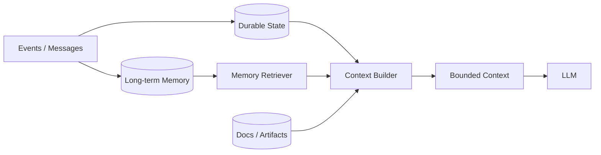

# Q043 · 摘要会丢关键细节，如何保证压缩后 Agent 不失忆？

> **能力轴**：Context Engineering 与 Memory  
> **GitHub Edition**：Expanded Professional Version  
> **训练目标**：能给出 30 秒结论、3 分钟工程展开，并承受连续系统追问。

## 题目定位

| 维度 | 定位 |
|---|---|
| 面试层级 | Senior / Staff 倾向 |
| 失败类别 | Context / Memory |
| 风险等级 | 高 |
| 核心 Invariant | 业务状态、操作 ID、验收条件等 lossless state 永不依赖自然语言摘要。 |
| 面试频率 | 必考 |
| 难度 | 难 |

## 面试官在考什么

压缩不可避免地有信息损失，因此必须把不可损失的信息移出自然语言压缩通道。

这道题表面在问一个局部技术点，实际上通常同时检查以下三层能力：

- lossless state 与 lossy narrative 分离。
- 摘要可做 completeness check。
- 关键数值、ID、权限不能只留自然语言。
- Context 是工作集，不是数据库
- lossless state 与 lossy narrative 分离

> **判断高级答案的标志**：不仅告诉面试官“用什么机制”，还能说明 **为什么需要它、它保护哪个 invariant、失败时怎么恢复、怎么证明方案有效**。

## 30 秒回答

不要让 summary 成为唯一事实源。关键状态用结构化字段/数据库无损保存；summary 只压缩叙事。对重要事实附 source reference、version、confidence，并支持按需回看原始记录。

## 深挖解析

> 下面先逐条展开 PDF 原始深挖点；这些是本题最应该讲清的技术机制。

### 1. lossless state 与 lossy narrative 分离。

把这个点落到 context builder：先确定必须保留的事实，再决定压缩、检索和优先级，而不是按时间顺序简单截断。

### 2. 摘要可做 completeness check。

Context 是模型当轮工作集。关键事实必须在 Durable State / Artifact Store 中 lossless 保存；compaction 只压缩可有损叙事，并保留指向原始证据的引用。

### 3. 关键数值、ID、权限不能只留自然语言。

ACL 是可信数据平面的强约束。未授权文档最好在候选召回前就被排除；即使做二次过滤，也不能依赖模型“看到了但不使用”。

### 从机制到系统

把上面几点合起来，本题不能只用一个局部 API 或 Prompt 技巧解决。需要把 **`定义 state schema；summary 只能引用 state，不负责创造 state；原始 artifact 保留可追溯句柄。`** 变成 runtime 中可测试的状态迁移，并给关键 transition 设计失败分支。
## 3 分钟专业展开

先把问题抽象成一个工程约束：**业务状态、操作 ID、验收条件等 lossless state 永不依赖自然语言摘要。**。然后按下面四层回答：

1. **语义层**：先定义“成功 / 失败 / 完成 / 重试 / 授权”等词在这个场景中的准确含义，避免把 HTTP、LLM 或消息状态误当业务状态。
2. **状态层**：指出哪些事实必须结构化、持久化、带版本或 operation identity；不要只依赖聊天历史或自然语言总结。
3. **控制层**：明确模型可以提出什么、runtime/策略引擎必须强制什么，以及异常时走 retry、replan、fallback、HITL 还是 fail-safe。
4. **验证层**：给出 trace / metric / eval，证明机制既能挡住已知 failure mode，又不会产生不可接受的延迟、成本或误拦截。

### 核心机制

- **lossless state 与 lossy narrative 分离。**
- **摘要可做 completeness check。**
- **关键数值、ID、权限不能只留自然语言。**
- Context 是工作集，不是数据库
- lossless state 与 lossy narrative 分离
- Memory 写入和读取都需要 policy、provenance、TTL/版本

### 关键设计决策

- 这是状态、记忆还是临时上下文？
- 能否有损压缩？
- 信息是否可信/新鲜/相关？
- 谁有权读取和写入？

## 参考架构 / 控制流



核心是把 context 当成模型工作集：Durable State/Artifacts 在上下文之外长期保存，Context Builder 每轮按任务重建有限输入。

## 状态与接口设计

面试中建议显式说出“**哪些字段需要存在**”，这样比只说框架名更有工程可信度。一个最小设计通常包括：

- `run_id / task_id / step_id`：把一次执行和子任务串起来。
- `attempt / version / deadline`：区分重试、版本与剩余时间。
- `status`：使用有限状态机，而不是自由文本表示执行状态。
- `input_ref / output_ref / artifact_ref`：大对象保存为引用，避免在 context/消息中复制。
- `trace_id / correlation_id`：跨模型、工具、Agent 和异步任务关联。
- 对副作用步骤再加入 `operation_id / idempotency_key / approval_id`；对知识步骤加入 `source / provenance / freshness`。

## 实现骨架 / 伪代码

```python
ctx = ContextBuilder(budget=MAX_INPUT_TOKENS)
ctx.add(lossless_state, priority="must_keep")
ctx.add(retrieve_relevant_memory(goal), priority="high")
ctx.add(compact_history(history), priority="medium")
ctx.reserve(OUTPUT_BUDGET + TOOL_SCHEMA_BUDGET)
model_input = ctx.build()
```

## 典型生产场景

长对话中订单号、已执行操作和用户授权保存为结构化 state；聊天历史可以摘要，而这些字段永不依赖摘要保存。

## Failure Modes：方案最容易坏在哪里

- **摘要遗漏“已退款”导致重复退款**
- **总结把 uncertainty 写成事实**
- **压缩后丢失来源/provenance**

遇到异常时，不要立即跳到“重试”。建议统一使用：

`Detect → Classify → Contain → Recover → Preserve → Verify`

本题最重要的 Preserve 对象是：**业务状态、操作 ID、验收条件等 lossless state 永不依赖自然语言摘要。**。

## Trade-off：为什么不能只有一个标准答案

- **信息保留 vs token 成本**：保留更多历史未必提高质量；关键在信息密度和决策相关性。
- **长期记忆 vs 陈旧污染**：Memory 提升跨会话连续性，同时引入 stale/contradiction/poisoning 风险。

面试时最好给出一个“默认选择 + 改变选择的条件”，而不是绝对化表达。例如：默认用更简单的单 Agent/同步/低并发方案，只有当评估数据证明瓶颈来自专业化、并行或长任务时再增加复杂度。

## 可观测性与关键指标

Context/Memory 指标必须能解释 token 与质量之间的 trade-off，并监测 stale/contradiction。 建议至少记录：

- `context_utilization`
- `context_hit_rate`
- `memory_precision`
- `stale_memory_rate`
- `contradiction_rate`
- `tokens_per_step`

此外所有指标都应该按 `workflow_version / model / tool / tenant / task_type / failure_class` 等维度切片，否则总体平均值很容易掩盖局部事故。

## 连续追问

### 1. 如何验证摘要质量？

**回答方向**：先以“lossless state 与 lossy narrative 分离。”为主结论，再补充状态所有权、失败窗口和验证指标。回答必须给出一个明确边界：什么情况下采用该方案，什么情况下应 fail-safe / clarify / HITL。

### 2. 摘要模型也可能幻觉怎么办？

**回答方向**：先以“lossless state 与 lossy narrative 分离。”为主结论，再补充状态所有权、失败窗口和验证指标。回答必须给出一个明确边界：什么情况下采用该方案，什么情况下应 fail-safe / clarify / HITL。

## ⭐ 必刷题：深水区

### 摘要失真测试

在早期写入“已执行退款 op-123”，随后多次 compaction。任何后续上下文重建都必须从 lossless state 恢复该事实，而不是相信 summary。

### 面试评分点

- **60 分**：知道核心术语和基本方案。
- **75 分**：能说明状态、失败窗口与恢复动作。
- **90 分**：能主动提出 invariant、故障注入、指标和 trade-off。
- **95+ 分**：能把方案抽象为与具体框架无关的 runtime / protocol / trust-boundary 设计，并指出何时不值得增加复杂度。

## 易错回答

> 把整段历史总结成一段话后删除原始数据。

为什么这是低质量答案：它通常只描述 happy path，没有说明失败语义、状态所有权或可信边界，也没有给出验证手段。高级回答要把“模型可能错、网络可能断、进程可能崩、消息可能重复、知识可能过期”当作设计前提。

## Know-Why

压缩不可避免地有信息损失，因此必须把不可损失的信息移出自然语言压缩通道。

更深一层看，本题的本质是保护这个系统 invariant：**业务状态、操作 ID、验收条件等 lossless state 永不依赖自然语言摘要。**。Agent 引入的是概率决策，因此工程层需要把不可违反的规则外置为 deterministic guardrails/state machines，并给非确定路径准备恢复机制。

## Know-How

定义 state schema；summary 只能引用 state，不负责创造 state；原始 artifact 保留可追溯句柄。

### 落地步骤

1. 先写出业务 invariant 和明确的完成/失败定义。
2. 建立结构化 state，给每个关键字段确定 owner、版本与持久化周期。
3. 在可信 runtime / gateway 中实现校验、权限、预算和异常策略，不只依赖 prompt。
4. 为关键 transition 添加 trace、state diff 和可聚合 error code。
5. 构造至少 3 个故障注入案例：超时/重复/崩溃（或本题等价异常）。
6. 用 regression eval + 线上指标确认修复没有把问题转移到成本、时延或误拦截。

## Production Checklist

- [ ] 核心 invariant 已写成可验证条件：业务状态、操作 ID、验收条件等 lossless state 永不依赖自然语言摘要。
- [ ] 关键状态不只存在于 prompt/messages 中。
- [ ] 存在明确 timeout / retry / stop / fallback / HITL 策略。
- [ ] 所有高风险副作用经过资源侧授权与审计。
- [ ] Trace 能定位到发生错误的具体 transition。
- [ ] 变更有离线 regression，关键路径有线上 SLO/告警。

## 面试自测

- [ ] 我能在 **30 秒**内讲清核心结论，不报框架名堆术语。
- [ ] 我能在 **3 分钟**内说明状态、控制边界、失败恢复和指标。
- [ ] 我能画出上面的控制流，并解释每个箭头的失败语义。
- [ ] 面试官换成“网络断了 / Worker crash / 重复消息 / 权限不足”时，我仍能沿 invariant 推导方案。

## 关联题目

- [Q041 · 长任务 Context Window 快爆了怎么办？](q041.md)
- [Q047 · Agent 什么内容值得写入长期记忆？](q047.md)
- [Q042 · Context Compaction 和 Context Reset 有什么区别？](q042.md)
- [Q044 · 什么是 Context Pollution？如何判断 context 已经‘脏了’？](q044.md)
- [Q045 · 100K token context budget 应该怎么分配？](q045.md)

## 延伸阅读

### 对应官方工程资料

- [Anthropic · Effective context engineering for AI agents](https://www.anthropic.com/engineering/effective-context-engineering-for-ai-agents)
- [OpenAI Agents SDK · Running agents / history shaping](https://openai.github.io/openai-agents-python/running_agents/)

> 外部资料用于 GitHub Expanded Edition 的工程深化；PDF 原始题目与核心字段仍按仓库结构化源数据保留。

- [Reliability First：六步故障回答框架](../../docs/04-reliability-first.md)
- [系统设计白板模板](../../docs/06-whiteboard-system-design.md)
- [参考资料与官方工程资料](../../docs/09-references.md)

---

[← Q042](q042.md) · [本章目录](README.md) · [Q044 →](q044.md)
