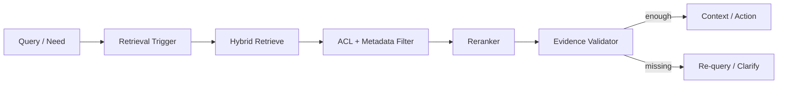

# CHAPTER 06 · Agentic RAG

> **系统层**：Retrieval / Knowledge Grounding  
> **本章 Invariant**：检索结果相关、授权、足够新，并且证据强度匹配动作风险

## 为什么这一章重要

这一章训练的是 **Retrieval / Knowledge Grounding** 的工程能力。面试里不要把问题回答成“某个框架怎么配置”，而要把 Agent 当作有概率决策、有外部副作用、会跨轮运行的生产系统。

### 三条主线

- RAG 不只是 top-k，相当于一个可评估的证据供应链
- 高风险动作不能把“检索到了文本”当作“事实已确认”
- ACL、freshness、provenance 是检索正确性的组成部分

## 本章概念图

## 本章答题框架

任何题都可以先问四个问题：

1. 是否需要检索？
1. 召回是否足够？
1. 证据是否经过授权和 freshness 检查？
1. 当前证据足以回答还是足以执行动作？

然后用统一可靠性框架收口：`Detect → Classify → Contain → Recover → Preserve → Verify`。

## 关键指标

- `retrieval_recall`
- `precision_at_k`
- `nDCG`
- `rerank_gain`
- `grounded_action_rate`
- `freshness_lag`

离线 retrieval 指标与线上 task success 要建立关联，否则 nDCG 提升可能没有业务价值。

## 推荐学习顺序

1. [Q051 · Agent 中 RAG 应该一直执行，还是作为 Tool 按需调用？](q051.md)
2. [Q052 · 模型怎么判断自己现在需要检索？](q052.md)
3. [Q053 · Chunk 越大越好吗？](q053.md)
4. [Q054 · 为什么生产 RAG 常采用 Hybrid Retrieval + Rerank？](q054.md)
5. [Q055 · Retriever 找错资料，Agent 根据错误资料执行错误动作，怎么解决？](q055.md)
6. [Q056 · Agent 如何做 Multi-hop / Iterative Retrieval？](q056.md)
7. [Q057 · 有 ACL 的企业知识库，是 retrieval 前过滤还是 retrieval 后过滤？](q057.md)
8. [Q058 · 知识库一分钟更新一次，但向量索引十分钟更新一次，Agent 如何避免读旧数据？](q058.md)
9. [Q059 · RAG 到底怎么评估？](q059.md)
10. [Q060 · 向量数据库挂了，Agent 是直接失败还是降级？](q060.md)

## 题目索引

| 题号 | 问题 | 频率 | 难度 | 风险 |
|---|---|---|---|---|
| [Q051](q051.md) | Agent 中 RAG 应该一直执行，还是作为 Tool 按需调用？ | 高频 | 中 | 中 |
| [Q052](q052.md) | 模型怎么判断自己现在需要检索？ | 高频 | 中 | 中高 |
| [Q053](q053.md) | Chunk 越大越好吗？ | 高频 | 中 | 中 |
| [Q054](q054.md) | 为什么生产 RAG 常采用 Hybrid Retrieval + Rerank？ | 必考 | 中 | 中高 |
| [Q055](q055.md) | Retriever 找错资料，Agent 根据错误资料执行错误动作，怎么解决？ | 必考 | 难 | 高 |
| [Q056](q056.md) | Agent 如何做 Multi-hop / Iterative Retrieval？ | 高频 | 难 | 中高 |
| [Q057](q057.md) | 有 ACL 的企业知识库，是 retrieval 前过滤还是 retrieval 后过滤？ | 必考 | 难 | 高 |
| [Q058](q058.md) | 知识库一分钟更新一次，但向量索引十分钟更新一次，Agent 如何避免读旧数据？ | 高频 | 难 | 中高 |
| [Q059](q059.md) | RAG 到底怎么评估？ | 必考 | 难 | 中高 |
| [Q060](q060.md) | 向量数据库挂了，Agent 是直接失败还是降级？ | 高频 | 中 | 中高 |

> ⭐ 表示属于 [20 道必刷题](../../docs/05-priority-20.md)。

## 本章完成标准

- [ ] 能在白板上画出本章控制流和 trust boundary。
- [ ] 能说出至少 3 个 failure mode 及其观测信号。
- [ ] 能把一个框架能力还原成 state / protocol / policy / runtime 原语。
- [ ] 能解释主要 trade-off，而不是给出绝对化“最佳实践”。
- [ ] 能为关键设计给出 metric / eval / SLO。

[← 返回总题库](../README.md)
