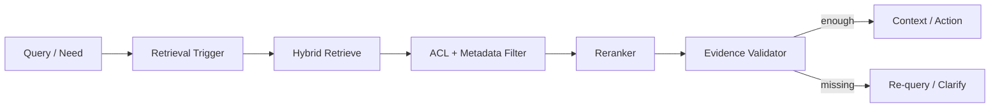

# Q054 · 为什么生产 RAG 常采用 Hybrid Retrieval + Rerank？

> **能力轴**：Agentic RAG  
> **GitHub Edition**：Expanded Professional Version  
> **训练目标**：能给出 30 秒结论、3 分钟工程展开，并承受连续系统追问。

## 题目定位

| 维度 | 定位 |
|---|---|
| 面试层级 | Senior / Staff 倾向 |
| 失败类别 | Retrieval / Grounding |
| 风险等级 | 中高 |
| 核心 Invariant | 召回层优先 recall，rerank 层恢复 precision；不同检索信号互补。 |
| 面试频率 | 必考 |
| 难度 | 中 |

## 面试官在考什么

生产知识包含语义、字面、结构等多种信号，单一检索范式容易漏召。

这道题表面在问一个局部技术点，实际上通常同时检查以下三层能力：

- 第一阶段追求 recall，第二阶段追求 precision。
- 融合可用 RRF 或加权分数。
- rerank 的输入规模受 latency budget 限制。
- RAG 不只是 top-k，相当于一个可评估的证据供应链
- 高风险动作不能把“检索到了文本”当作“事实已确认”

> **判断高级答案的标志**：不仅告诉面试官“用什么机制”，还能说明 **为什么需要它、它保护哪个 invariant、失败时怎么恢复、怎么证明方案有效**。

## 30 秒回答

向量检索擅长语义相似，BM25 擅长关键词、编号和专有名词；Hybrid 提高召回，Rerank 再用更强相关性模型压缩候选，提高最终 precision。

## 深挖解析

> 下面先逐条展开 PDF 原始深挖点；这些是本题最应该讲清的技术机制。

### 1. 第一阶段追求 recall，第二阶段追求 precision。

把这个点落到证据质量：相关性、权限、freshness、provenance 和 sufficiency 都要在动作前被显式验证。

### 2. 融合可用 RRF 或加权分数。

把这个点落到证据质量：相关性、权限、freshness、provenance 和 sufficiency 都要在动作前被显式验证。

### 3. rerank 的输入规模受 latency budget 限制。

把 RAG 看成证据供应链：trigger → retrieve → filter → rerank → validate → consume。每一层都有独立 failure mode 和指标，不能用最终回答准确率掩盖检索故障。

### 从机制到系统

把上面几点合起来，本题不能只用一个局部 API 或 Prompt 技巧解决。需要把 **`建立 query taxonomy；分别统计各路召回贡献与 rerank lift，再做按类型动态融合。`** 变成 runtime 中可测试的状态迁移，并给关键 transition 设计失败分支。
## 3 分钟专业展开

先把问题抽象成一个工程约束：**召回层优先 recall，rerank 层恢复 precision；不同检索信号互补。**。然后按下面四层回答：

1. **语义层**：先定义“成功 / 失败 / 完成 / 重试 / 授权”等词在这个场景中的准确含义，避免把 HTTP、LLM 或消息状态误当业务状态。
2. **状态层**：指出哪些事实必须结构化、持久化、带版本或 operation identity；不要只依赖聊天历史或自然语言总结。
3. **控制层**：明确模型可以提出什么、runtime/策略引擎必须强制什么，以及异常时走 retry、replan、fallback、HITL 还是 fail-safe。
4. **验证层**：给出 trace / metric / eval，证明机制既能挡住已知 failure mode，又不会产生不可接受的延迟、成本或误拦截。

### 核心机制

- **第一阶段追求 recall，第二阶段追求 precision。**
- **融合可用 RRF 或加权分数。**
- **rerank 的输入规模受 latency budget 限制。**
- RAG 不只是 top-k，相当于一个可评估的证据供应链
- 高风险动作不能把“检索到了文本”当作“事实已确认”
- ACL、freshness、provenance 是检索正确性的组成部分

### 关键设计决策

- 是否需要检索？
- 召回是否足够？
- 证据是否经过授权和 freshness 检查？
- 当前证据足以回答还是足以执行动作？

## 参考架构 / 控制流



这张图强调本章的可信边界：检索结果相关、授权、足够新，并且证据强度匹配动作风险。面试时先讲数据/控制流，再讲每个边界上的校验与恢复。

## 状态与接口设计

面试中建议显式说出“**哪些字段需要存在**”，这样比只说框架名更有工程可信度。一个最小设计通常包括：

- `run_id / task_id / step_id`：把一次执行和子任务串起来。
- `attempt / version / deadline`：区分重试、版本与剩余时间。
- `status`：使用有限状态机，而不是自由文本表示执行状态。
- `input_ref / output_ref / artifact_ref`：大对象保存为引用，避免在 context/消息中复制。
- `trace_id / correlation_id`：跨模型、工具、Agent 和异步任务关联。
- 对副作用步骤再加入 `operation_id / idempotency_key / approval_id`；对知识步骤加入 `source / provenance / freshness`。

## 实现骨架 / 伪代码

```python
if retrieval_policy.should_retrieve(task, risk):
    candidates = hybrid_search(query, acl=subject_acl)
    ranked = rerank(query, candidates)
    evidence = validate_freshness_and_provenance(ranked)
    if not evidence.sufficient:
        return requery_or_clarify()
```

## 典型生产场景

知识库检索到“旧版退款政策”，但 freshness validator 发现版本过期，因此不能驱动实际退款动作，转而回源最新政策。

## Failure Modes：方案最容易坏在哪里

- **召回错误或过期资料被当作事实**
- **ACL 后过滤造成数据暴露风险**
- **只评最终回答，定位不了检索层问题**

遇到异常时，不要立即跳到“重试”。建议统一使用：

`Detect → Classify → Contain → Recover → Preserve → Verify`

本题最重要的 Preserve 对象是：**召回层优先 recall，rerank 层恢复 precision；不同检索信号互补。**。

## Trade-off：为什么不能只有一个标准答案

- **Recall vs Precision**：第一阶段广召回，第二阶段重排恢复精度；过早过滤会漏证据。
- **新鲜度 vs 索引成本**：更低 index lag 需要更高写入成本，也可用回源策略补充。

面试时最好给出一个“默认选择 + 改变选择的条件”，而不是绝对化表达。例如：默认用更简单的单 Agent/同步/低并发方案，只有当评估数据证明瓶颈来自专业化、并行或长任务时再增加复杂度。

## 可观测性与关键指标

离线 retrieval 指标与线上 task success 要建立关联，否则 nDCG 提升可能没有业务价值。 建议至少记录：

- `retrieval_recall`
- `precision_at_k`
- `nDCG`
- `rerank_gain`
- `grounded_action_rate`
- `freshness_lag`

此外所有指标都应该按 `workflow_version / model / tool / tenant / task_type / failure_class` 等维度切片，否则总体平均值很容易掩盖局部事故。

## 连续追问

### 1. Hybrid 一定优于纯向量吗？

**回答方向**：先以“第一阶段追求 recall，第二阶段追求 precision。”为主结论，再补充状态所有权、失败窗口和验证指标。回答必须给出一个明确边界：什么情况下采用该方案，什么情况下应 fail-safe / clarify / HITL。

### 2. Reranker 选 cross-encoder 还是 LLM？

**回答方向**：先以“第一阶段追求 recall，第二阶段追求 precision。”为主结论，再补充状态所有权、失败窗口和验证指标。回答必须给出一个明确边界：什么情况下采用该方案，什么情况下应 fail-safe / clarify / HITL。

## 易错回答

> 把所有改进都归因于 embedding 模型更强。

为什么这是低质量答案：它通常只描述 happy path，没有说明失败语义、状态所有权或可信边界，也没有给出验证手段。高级回答要把“模型可能错、网络可能断、进程可能崩、消息可能重复、知识可能过期”当作设计前提。

## Know-Why

生产知识包含语义、字面、结构等多种信号，单一检索范式容易漏召。

更深一层看，本题的本质是保护这个系统 invariant：**召回层优先 recall，rerank 层恢复 precision；不同检索信号互补。**。Agent 引入的是概率决策，因此工程层需要把不可违反的规则外置为 deterministic guardrails/state machines，并给非确定路径准备恢复机制。

## Know-How

建立 query taxonomy；分别统计各路召回贡献与 rerank lift，再做按类型动态融合。

### 落地步骤

1. 先写出业务 invariant 和明确的完成/失败定义。
2. 建立结构化 state，给每个关键字段确定 owner、版本与持久化周期。
3. 在可信 runtime / gateway 中实现校验、权限、预算和异常策略，不只依赖 prompt。
4. 为关键 transition 添加 trace、state diff 和可聚合 error code。
5. 构造至少 3 个故障注入案例：超时/重复/崩溃（或本题等价异常）。
6. 用 regression eval + 线上指标确认修复没有把问题转移到成本、时延或误拦截。

## Production Checklist

- [ ] 核心 invariant 已写成可验证条件：召回层优先 recall，rerank 层恢复 precision；不同检索信号互补。
- [ ] 关键状态不只存在于 prompt/messages 中。
- [ ] 存在明确 timeout / retry / stop / fallback / HITL 策略。
- [ ] 所有高风险副作用经过资源侧授权与审计。
- [ ] Trace 能定位到发生错误的具体 transition。
- [ ] 变更有离线 regression，关键路径有线上 SLO/告警。

## 面试自测

- [ ] 我能在 **30 秒**内讲清核心结论，不报框架名堆术语。
- [ ] 我能在 **3 分钟**内说明状态、控制边界、失败恢复和指标。
- [ ] 我能画出上面的控制流，并解释每个箭头的失败语义。
- [ ] 面试官换成“网络断了 / Worker crash / 重复消息 / 权限不足”时，我仍能沿 invariant 推导方案。

## 关联题目

- [Q051 · Agent 中 RAG 应该一直执行，还是作为 Tool 按需调用？](q051.md)
- [Q052 · 模型怎么判断自己现在需要检索？](q052.md)
- [Q053 · Chunk 越大越好吗？](q053.md)
- [Q055 · Retriever 找错资料，Agent 根据错误资料执行错误动作，怎么解决？](q055.md)
- [Q056 · Agent 如何做 Multi-hop / Iterative Retrieval？](q056.md)

## 延伸阅读

### 对应官方工程资料

- [Anthropic · Contextual Retrieval](https://www.anthropic.com/news/contextual-retrieval)
- [本仓库 · RAG 参考资料](../../docs/09-references.md)

> 外部资料用于 GitHub Expanded Edition 的工程深化；PDF 原始题目与核心字段仍按仓库结构化源数据保留。

- [Reliability First：六步故障回答框架](../../docs/04-reliability-first.md)
- [系统设计白板模板](../../docs/06-whiteboard-system-design.md)
- [参考资料与官方工程资料](../../docs/09-references.md)

---

[← Q053](q053.md) · [本章目录](README.md) · [Q055 →](q055.md)
