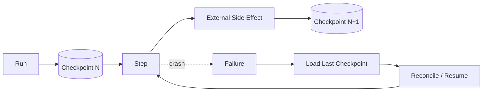

# CHAPTER 07 · Durable Execution 与 Fault Tolerance

> **系统层**：Durable Runtime / Recovery  
> **本章 Invariant**：进程可随时崩溃，任务仍能从一致状态恢复且不重复产生副作用

## 为什么这一章重要

这一章训练的是 **Durable Runtime / Recovery** 的工程能力。面试里不要把问题回答成“某个框架怎么配置”，而要把 Agent 当作有概率决策、有外部副作用、会跨轮运行的生产系统。

### 三条主线

- 把 crash 当常态设计，而不是异常路径
- checkpoint 解决本地状态恢复，idempotency 解决外部副作用重复
- retry 必须建立在 error taxonomy、deadline 和 retry budget 上

## 本章概念图

## 本章答题框架

任何题都可以先问四个问题：

1. 失败点之前哪些动作已产生副作用？
1. 最近一致 checkpoint 在哪？
1. 错误可重试吗？
1. 恢复需要 reconcile、compensate 还是人工介入？

然后用统一可靠性框架收口：`Detect → Classify → Contain → Recover → Preserve → Verify`。

## 关键指标

- `resume_success_rate`
- `checkpoint_age`
- `retry_success_rate`
- `duplicate_operation_rate`
- `recovery_time`
- `dead_letter_rate`

恢复系统要做故障注入；只在正常路径统计成功率无法证明 durable。

## 推荐学习顺序

1. [Q061 · 一个 Agent 运行 40 分钟，第 39 分钟进程 crash，怎么办？](q061.md) ⭐
2. [Q063 · Tool 已执行成功，但 Agent 在写 checkpoint 前 crash，会发生什么？](q063.md) ⭐
3. [Q062 · Checkpoint 应该保存什么？](q062.md)
4. [Q064 · 哪些错误应该 retry，哪些绝对不应该 retry？](q064.md)
5. [Q065 · Agent 为什么需要 Circuit Breaker？](q065.md)
6. [Q066 · 整个 Agent SLA 30 秒，内部 5 个工具 timeout 怎么分？](q066.md)
7. [Q067 · 流量突然增长 20 倍，Agent 队列怎么保护系统？](q067.md)
8. [Q068 · 同一用户同时启动两个修改同一资源的 Agent，怎么办？](q068.md)
9. [Q069 · Agent 已执行 A、B、C，D 失败，需要 rollback，怎么设计？](q069.md)
10. [Q070 · v1 代码产生的 checkpoint，在 v2 发布后如何恢复？](q070.md)

## 题目索引

| 题号 | 问题 | 频率 | 难度 | 风险 |
|---|---|---|---|---|
| [Q061](q061.md) | 一个 Agent 运行 40 分钟，第 39 分钟进程 crash，怎么办？ | 必考 | 难 | 高 |
| [Q062](q062.md) | Checkpoint 应该保存什么？ | 必考 | 中 | 中高 |
| [Q063](q063.md) | Tool 已执行成功，但 Agent 在写 checkpoint 前 crash，会发生什么？ | 必考 | 难 | 高 |
| [Q064](q064.md) | 哪些错误应该 retry，哪些绝对不应该 retry？ | 必考 | 中 | 高 |
| [Q065](q065.md) | Agent 为什么需要 Circuit Breaker？ | 高频 | 中 | 中高 |
| [Q066](q066.md) | 整个 Agent SLA 30 秒，内部 5 个工具 timeout 怎么分？ | 高频 | 中 | 中高 |
| [Q067](q067.md) | 流量突然增长 20 倍，Agent 队列怎么保护系统？ | 高频 | 难 | 中高 |
| [Q068](q068.md) | 同一用户同时启动两个修改同一资源的 Agent，怎么办？ | 高频 | 难 | 高 |
| [Q069](q069.md) | Agent 已执行 A、B、C，D 失败，需要 rollback，怎么设计？ | 必考 | 难 | 高 |
| [Q070](q070.md) | v1 代码产生的 checkpoint，在 v2 发布后如何恢复？ | 高频 | 难 | 高 |

> ⭐ 表示属于 [20 道必刷题](../../docs/05-priority-20.md)。

## 本章完成标准

- [ ] 能在白板上画出本章控制流和 trust boundary。
- [ ] 能说出至少 3 个 failure mode 及其观测信号。
- [ ] 能把一个框架能力还原成 state / protocol / policy / runtime 原语。
- [ ] 能解释主要 trade-off，而不是给出绝对化“最佳实践”。
- [ ] 能为关键设计给出 metric / eval / SLO。

[← 返回总题库](../README.md)
