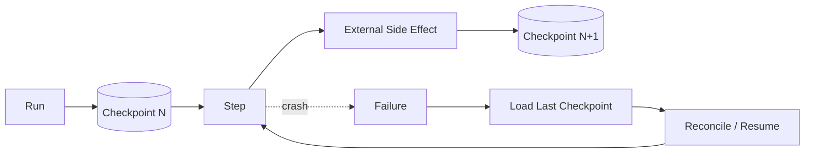

# Q070 · v1 代码产生的 checkpoint，在 v2 发布后如何恢复？

> **能力轴**：Durable Execution 与 Fault Tolerance  
> **GitHub Edition**：Expanded Professional Version  
> **训练目标**：能给出 30 秒结论、3 分钟工程展开，并承受连续系统追问。

## 题目定位

| 维度 | 定位 |
|---|---|
| 面试层级 | Senior / Staff 倾向 |
| 失败类别 | Runtime / Recovery |
| 风险等级 | 高 |
| 核心 Invariant | checkpoint schema 与 runtime version 可迁移；恢复前必须执行兼容性检查和 migration。 |
| 面试频率 | 高频 |
| 难度 | 难 |

## 面试官在考什么

Durable execution 把运行时状态变成长期数据，因此必须像数据库 schema 一样管理版本。

这道题表面在问一个局部技术点，实际上通常同时检查以下三层能力：

- 长任务跨部署版本很常见。
- 状态迁移要可回滚。
- 工具和 prompt 版本也影响 replay 可重复性。
- 把 crash 当常态设计，而不是异常路径
- checkpoint 解决本地状态恢复，idempotency 解决外部副作用重复

> **判断高级答案的标志**：不仅告诉面试官“用什么机制”，还能说明 **为什么需要它、它保护哪个 invariant、失败时怎么恢复、怎么证明方案有效**。

## 30 秒回答

Checkpoint 必须带 schema/runtime version。新版本读取旧状态时经过 migration/compatibility layer；无法兼容则继续由旧 worker 完成或显式终止，而不是直接反序列化碰运气。

## 深挖解析

> 下面先逐条展开 PDF 原始深挖点；这些是本题最应该讲清的技术机制。

### 1. 长任务跨部署版本很常见。

把这个点放进 crash/replay 模型：假设进程在任意两行代码之间崩溃，检查恢复是否会丢状态或重复副作用。

### 2. 状态迁移要可回滚。

消息适合承载对话叙事，不适合作为唯一数据库。业务游标、预算、operation id、权限与任务状态应结构化保存，否则无法做可靠恢复、并发控制和版本迁移。

### 3. 工具和 prompt 版本也影响 replay 可重复性。

消息正确性需要业务状态机兜底：传输层可以 at-least-once，但 consumer 必须按 `message_id/task_id/attempt` 去重，并拒绝旧 attempt 迟到结果覆盖新状态。

### 从机制到系统

把上面几点合起来，本题不能只用一个局部 API 或 Prompt 技巧解决。需要把 **`checkpoint 加 schema_version/runtime_version；维护 migration registry；部署时做 can-resume 测试。`** 变成 runtime 中可测试的状态迁移，并给关键 transition 设计失败分支。
## 3 分钟专业展开

先把问题抽象成一个工程约束：**checkpoint schema 与 runtime version 可迁移；恢复前必须执行兼容性检查和 migration。**。然后按下面四层回答：

1. **语义层**：先定义“成功 / 失败 / 完成 / 重试 / 授权”等词在这个场景中的准确含义，避免把 HTTP、LLM 或消息状态误当业务状态。
2. **状态层**：指出哪些事实必须结构化、持久化、带版本或 operation identity；不要只依赖聊天历史或自然语言总结。
3. **控制层**：明确模型可以提出什么、runtime/策略引擎必须强制什么，以及异常时走 retry、replan、fallback、HITL 还是 fail-safe。
4. **验证层**：给出 trace / metric / eval，证明机制既能挡住已知 failure mode，又不会产生不可接受的延迟、成本或误拦截。

### 核心机制

- **长任务跨部署版本很常见。**
- **状态迁移要可回滚。**
- **工具和 prompt 版本也影响 replay 可重复性。**
- 把 crash 当常态设计，而不是异常路径
- checkpoint 解决本地状态恢复，idempotency 解决外部副作用重复
- retry 必须建立在 error taxonomy、deadline 和 retry budget 上

### 关键设计决策

- 失败点之前哪些动作已产生副作用？
- 最近一致 checkpoint 在哪？
- 错误可重试吗？
- 恢复需要 reconcile、compensate 还是人工介入？

## 参考架构 / 控制流



这张图强调本章的可信边界：进程可随时崩溃，任务仍能从一致状态恢复且不重复产生副作用。面试时先讲数据/控制流，再讲每个边界上的校验与恢复。

## 状态与接口设计

面试中建议显式说出“**哪些字段需要存在**”，这样比只说框架名更有工程可信度。一个最小设计通常包括：

- `run_id / task_id / step_id`：把一次执行和子任务串起来。
- `attempt / version / deadline`：区分重试、版本与剩余时间。
- `status`：使用有限状态机，而不是自由文本表示执行状态。
- `input_ref / output_ref / artifact_ref`：大对象保存为引用，避免在 context/消息中复制。
- `trace_id / correlation_id`：跨模型、工具、Agent 和异步任务关联。
- 对副作用步骤再加入 `operation_id / idempotency_key / approval_id`；对知识步骤加入 `source / provenance / freshness`。

## 实现骨架 / 伪代码

```python
state = checkpoint_store.load(run_id)
for step in state.pending_steps:
    status = reconcile_external_state(step.operation_id)
    if status == "committed":
        state.mark_done(step, status.result)
    elif retry_policy.allows(step.error, deadline):
        execute_with_same_operation_id(step)
checkpoint_store.save(state)
```

## 典型生产场景

任务在调用外部工单系统后 crash。恢复时从 checkpoint 发现该 step 处于 IN_FLIGHT，先查询 operation_id，再决定标 DONE 或补发。

## Failure Modes：方案最容易坏在哪里

- **checkpoint 与外部副作用不一致**
- **盲目 retry 放大故障**
- **版本升级后旧状态无法反序列化**

遇到异常时，不要立即跳到“重试”。建议统一使用：

`Detect → Classify → Contain → Recover → Preserve → Verify`

本题最重要的 Preserve 对象是：**checkpoint schema 与 runtime version 可迁移；恢复前必须执行兼容性检查和 migration。**。

## Trade-off：为什么不能只有一个标准答案

- **Checkpoint 频率 vs 开销**：更频繁 checkpoint 缩短重放窗口，但增加存储/序列化成本；副作用一致性仍需幂等。
- **自动 retry vs 故障放大**：retry budget 应和 deadline、错误类型、下游健康联动。

面试时最好给出一个“默认选择 + 改变选择的条件”，而不是绝对化表达。例如：默认用更简单的单 Agent/同步/低并发方案，只有当评估数据证明瓶颈来自专业化、并行或长任务时再增加复杂度。

## 可观测性与关键指标

恢复系统要做故障注入；只在正常路径统计成功率无法证明 durable。 建议至少记录：

- `resume_success_rate`
- `checkpoint_age`
- `retry_success_rate`
- `duplicate_operation_rate`
- `recovery_time`
- `dead_letter_rate`

此外所有指标都应该按 `workflow_version / model / tool / tenant / task_type / failure_class` 等维度切片，否则总体平均值很容易掩盖局部事故。

## 连续追问

### 1. 蓝绿发布怎么处理长 run？

**回答方向**：先以“长任务跨部署版本很常见。”为主结论，再补充状态所有权、失败窗口和验证指标。回答必须给出一个明确边界：什么情况下采用该方案，什么情况下应 fail-safe / clarify / HITL。

### 2. Replay 需要固定模型版本吗？

**回答方向**：先以“长任务跨部署版本很常见。”为主结论，再补充状态所有权、失败窗口和验证指标。回答必须给出一个明确边界：什么情况下采用该方案，什么情况下应 fail-safe / clarify / HITL。

## 易错回答

> 默认发布后所有旧 run 自动适配新代码。

为什么这是低质量答案：它通常只描述 happy path，没有说明失败语义、状态所有权或可信边界，也没有给出验证手段。高级回答要把“模型可能错、网络可能断、进程可能崩、消息可能重复、知识可能过期”当作设计前提。

## Know-Why

Durable execution 把运行时状态变成长期数据，因此必须像数据库 schema 一样管理版本。

更深一层看，本题的本质是保护这个系统 invariant：**checkpoint schema 与 runtime version 可迁移；恢复前必须执行兼容性检查和 migration。**。Agent 引入的是概率决策，因此工程层需要把不可违反的规则外置为 deterministic guardrails/state machines，并给非确定路径准备恢复机制。

## Know-How

checkpoint 加 schema_version/runtime_version；维护 migration registry；部署时做 can-resume 测试。

### 落地步骤

1. 先写出业务 invariant 和明确的完成/失败定义。
2. 建立结构化 state，给每个关键字段确定 owner、版本与持久化周期。
3. 在可信 runtime / gateway 中实现校验、权限、预算和异常策略，不只依赖 prompt。
4. 为关键 transition 添加 trace、state diff 和可聚合 error code。
5. 构造至少 3 个故障注入案例：超时/重复/崩溃（或本题等价异常）。
6. 用 regression eval + 线上指标确认修复没有把问题转移到成本、时延或误拦截。

## Production Checklist

- [ ] 核心 invariant 已写成可验证条件：checkpoint schema 与 runtime version 可迁移；恢复前必须执行兼容性检查和 migration。
- [ ] 关键状态不只存在于 prompt/messages 中。
- [ ] 存在明确 timeout / retry / stop / fallback / HITL 策略。
- [ ] 所有高风险副作用经过资源侧授权与审计。
- [ ] Trace 能定位到发生错误的具体 transition。
- [ ] 变更有离线 regression，关键路径有线上 SLO/告警。

## 面试自测

- [ ] 我能在 **30 秒**内讲清核心结论，不报框架名堆术语。
- [ ] 我能在 **3 分钟**内说明状态、控制边界、失败恢复和指标。
- [ ] 我能画出上面的控制流，并解释每个箭头的失败语义。
- [ ] 面试官换成“网络断了 / Worker crash / 重复消息 / 权限不足”时，我仍能沿 invariant 推导方案。

## 关联题目

- [Q061 · 一个 Agent 运行 40 分钟，第 39 分钟进程 crash，怎么办？](q061.md)
- [Q062 · Checkpoint 应该保存什么？](q062.md)
- [Q063 · Tool 已执行成功，但 Agent 在写 checkpoint 前 crash，会发生什么？](q063.md)
- [Q064 · 哪些错误应该 retry，哪些绝对不应该 retry？](q064.md)
- [Q065 · Agent 为什么需要 Circuit Breaker？](q065.md)

## 延伸阅读

### 对应官方工程资料

- [LangGraph · Persistence](https://docs.langchain.com/oss/python/langgraph/persistence)
- [LangGraph · Interrupts](https://docs.langchain.com/oss/python/langgraph/interrupts)

> 外部资料用于 GitHub Expanded Edition 的工程深化；PDF 原始题目与核心字段仍按仓库结构化源数据保留。

- [Reliability First：六步故障回答框架](../../docs/04-reliability-first.md)
- [系统设计白板模板](../../docs/06-whiteboard-system-design.md)
- [参考资料与官方工程资料](../../docs/09-references.md)

---

[← Q069](q069.md) · [本章目录](README.md) · [Q071 →](../08-eval-observability/q071.md)
