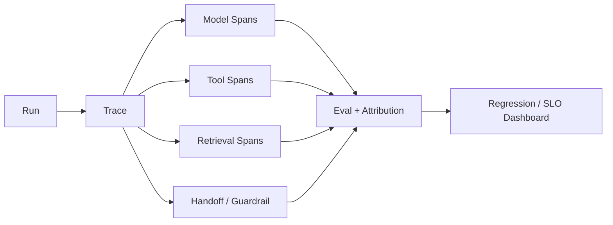

# CHAPTER 08 · Evaluation、Tracing 与 Observability

> **系统层**：Observability / Quality Control  
> **本章 Invariant**：每次失败能定位 first bad transition，每次发布能量化行为变化

## 为什么这一章重要

这一章训练的是 **Observability / Quality Control** 的工程能力。面试里不要把问题回答成“某个框架怎么配置”，而要把 Agent 当作有概率决策、有外部副作用、会跨轮运行的生产系统。

### 三条主线

- Agent Eval 必须覆盖 trajectory，不只看 final answer
- Trace 是可重放的执行证据，不是日志堆积
- 先做 failure segmentation，再改 prompt/model

## 本章概念图

## 本章答题框架

任何题都可以先问四个问题：

1. first bad transition 在哪？
1. 是模型、检索、工具、状态还是策略问题？
1. 变更是否通过 regression？
1. 指标是否能对应用户任务成功？

然后用统一可靠性框架收口：`Detect → Classify → Contain → Recover → Preserve → Verify`。

## 关键指标

- `task_success_rate`
- `trajectory_score`
- `failure_attribution_coverage`
- `regression_rate`
- `judge_agreement`
- `p95_latency`
- `cost_per_success`

Trace completeness 是元指标：没有 span 覆盖率，就无法相信 failure attribution。

## 推荐学习顺序

1. [Q071 · Agent 每次 Run 到底应该 Trace 什么？](q071.md) ⭐
2. [Q079 · 用户说‘Agent 答错了’，怎么判断是 Model、RAG、Tool 还是 Planner 的问题？](q079.md) ⭐
3. [Q072 · 线上 Agent 成功率从 85% 降到 70%，怎么定位？](q072.md)
4. [Q073 · Agent Eval Dataset 怎么构建？](q073.md)
5. [Q074 · 为什么 Agent 不能只评最终答案？](q074.md)
6. [Q075 · LLM-as-a-Judge 有什么问题？](q075.md)
7. [Q076 · 修改一句 System Prompt，怎么确定没有让其他任务退化？](q076.md)
8. [Q077 · Agent 在线 A/B Test 应该观察什么？](q077.md)
9. [Q078 · 怎么在线发现一个 Agent 已经开始 runaway？](q078.md)
10. [Q080 · Agent 的 SLO 应该怎么定义？](q080.md)

## 题目索引

| 题号 | 问题 | 频率 | 难度 | 风险 |
|---|---|---|---|---|
| [Q071](q071.md) | Agent 每次 Run 到底应该 Trace 什么？ | 必考 | 中 | 中高 |
| [Q072](q072.md) | 线上 Agent 成功率从 85% 降到 70%，怎么定位？ | 必考 | 难 | 中高 |
| [Q073](q073.md) | Agent Eval Dataset 怎么构建？ | 必考 | 中 | 中高 |
| [Q074](q074.md) | 为什么 Agent 不能只评最终答案？ | 必考 | 难 | 中高 |
| [Q075](q075.md) | LLM-as-a-Judge 有什么问题？ | 高频 | 中 | 中高 |
| [Q076](q076.md) | 修改一句 System Prompt，怎么确定没有让其他任务退化？ | 必考 | 中 | 中高 |
| [Q077](q077.md) | Agent 在线 A/B Test 应该观察什么？ | 高频 | 中 | 中 |
| [Q078](q078.md) | 怎么在线发现一个 Agent 已经开始 runaway？ | 必考 | 难 | 中高 |
| [Q079](q079.md) | 用户说‘Agent 答错了’，怎么判断是 Model、RAG、Tool 还是 Planner 的问题？ | 必考 | 难 | 中高 |
| [Q080](q080.md) | Agent 的 SLO 应该怎么定义？ | 高频 | 难 | 中高 |

> ⭐ 表示属于 [20 道必刷题](../../docs/05-priority-20.md)。

## 本章完成标准

- [ ] 能在白板上画出本章控制流和 trust boundary。
- [ ] 能说出至少 3 个 failure mode 及其观测信号。
- [ ] 能把一个框架能力还原成 state / protocol / policy / runtime 原语。
- [ ] 能解释主要 trade-off，而不是给出绝对化“最佳实践”。
- [ ] 能为关键设计给出 metric / eval / SLO。

[← 返回总题库](../README.md)
