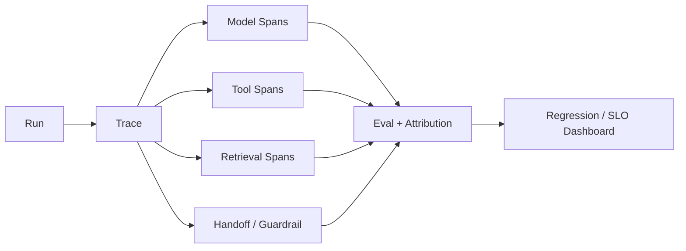

# Q077 · Agent 在线 A/B Test 应该观察什么？

> **能力轴**：Evaluation、Tracing 与 Observability  
> **GitHub Edition**：Expanded Professional Version  
> **训练目标**：能给出 30 秒结论、3 分钟工程展开，并承受连续系统追问。

## 题目定位

| 维度 | 定位 |
|---|---|
| 面试层级 | Mid / Senior |
| 失败类别 | Quality / Observability |
| 风险等级 | 中 |
| 核心 Invariant | A/B 不只比较点击/满意度，还要看 task success、成本、尾延迟、升级人工和安全事件。 |
| 面试频率 | 高频 |
| 难度 | 中 |

## 面试官在考什么

Agent 的收益和代价同时发生，单指标可能掩盖严重退化。

这道题表面在问一个局部技术点，实际上通常同时检查以下三层能力：

- 实验单元要避免同用户跨组污染。
- 长任务需考虑 delayed outcome。
- 按任务类型分层分析。
- Agent Eval 必须覆盖 trajectory，不只看 final answer
- Trace 是可重放的执行证据，不是日志堆积

> **判断高级答案的标志**：不仅告诉面试官“用什么机制”，还能说明 **为什么需要它、它保护哪个 invariant、失败时怎么恢复、怎么证明方案有效**。

## 30 秒回答

主指标看任务成功/业务转化；同时看 P95 latency、token/cost、tool call 数、error、人工升级率、安全事件和用户重试。Agent 优化是多目标，不能只追一个质量分。

## 深挖解析

> 下面先逐条展开 PDF 原始深挖点；这些是本题最应该讲清的技术机制。

### 1. 实验单元要避免同用户跨组污染。

把这个点落到 trace/eval：给出可聚合 signal 和 failure class，使线上回归可以被定位而不是靠人工猜测。

### 2. 长任务需考虑 delayed outcome。

把这个点落到 trace/eval：给出可聚合 signal 和 failure class，使线上回归可以被定位而不是靠人工猜测。

### 3. 按任务类型分层分析。

把这个点落到 trace/eval：给出可聚合 signal 和 failure class，使线上回归可以被定位而不是靠人工猜测。

### 从机制到系统

把上面几点合起来，本题不能只用一个局部 API 或 Prompt 技巧解决。需要把 **`建立 scorecard：quality/reliability/latency/cost/safety；预先定义 non-inferiority guardrails。`** 变成 runtime 中可测试的状态迁移，并给关键 transition 设计失败分支。
## 3 分钟专业展开

先把问题抽象成一个工程约束：**A/B 不只比较点击/满意度，还要看 task success、成本、尾延迟、升级人工和安全事件。**。然后按下面四层回答：

1. **语义层**：先定义“成功 / 失败 / 完成 / 重试 / 授权”等词在这个场景中的准确含义，避免把 HTTP、LLM 或消息状态误当业务状态。
2. **状态层**：指出哪些事实必须结构化、持久化、带版本或 operation identity；不要只依赖聊天历史或自然语言总结。
3. **控制层**：明确模型可以提出什么、runtime/策略引擎必须强制什么，以及异常时走 retry、replan、fallback、HITL 还是 fail-safe。
4. **验证层**：给出 trace / metric / eval，证明机制既能挡住已知 failure mode，又不会产生不可接受的延迟、成本或误拦截。

### 核心机制

- **实验单元要避免同用户跨组污染。**
- **长任务需考虑 delayed outcome。**
- **按任务类型分层分析。**
- Agent Eval 必须覆盖 trajectory，不只看 final answer
- Trace 是可重放的执行证据，不是日志堆积
- 先做 failure segmentation，再改 prompt/model

### 关键设计决策

- first bad transition 在哪？
- 是模型、检索、工具、状态还是策略问题？
- 变更是否通过 regression？
- 指标是否能对应用户任务成功？

## 参考架构 / 控制流



这张图强调本章的可信边界：每次失败能定位 first bad transition，每次发布能量化行为变化。面试时先讲数据/控制流，再讲每个边界上的校验与恢复。

## 状态与接口设计

面试中建议显式说出“**哪些字段需要存在**”，这样比只说框架名更有工程可信度。一个最小设计通常包括：

- `run_id / task_id / step_id`：把一次执行和子任务串起来。
- `attempt / version / deadline`：区分重试、版本与剩余时间。
- `status`：使用有限状态机，而不是自由文本表示执行状态。
- `input_ref / output_ref / artifact_ref`：大对象保存为引用，避免在 context/消息中复制。
- `trace_id / correlation_id`：跨模型、工具、Agent 和异步任务关联。
- 对副作用步骤再加入 `operation_id / idempotency_key / approval_id`；对知识步骤加入 `source / provenance / freshness`。

## 实现骨架 / 伪代码

```text
Run -> Trace -> Spans -> State Diffs -> Graders -> Failure Class
                                     |
                                     +-> regression / dashboard / alert

Debug target: first_bad_transition, not just final_bad_output.
```

## 典型生产场景

版本发布后成功率下降。按 trace 切片发现 retrieval span 的 ACL filter 变更导致 recall 降低，而 model span 行为基本稳定，因此修复检索而不是调 prompt。

## Failure Modes：方案最容易坏在哪里

- **只记录文本日志无法重建 trajectory**
- **eval 集只覆盖 happy path**
- **指标下降直接改 prompt，没有 failure attribution**

遇到异常时，不要立即跳到“重试”。建议统一使用：

`Detect → Classify → Contain → Recover → Preserve → Verify`

本题最重要的 Preserve 对象是：**A/B 不只比较点击/满意度，还要看 task success、成本、尾延迟、升级人工和安全事件。**。

## Trade-off：为什么不能只有一个标准答案

- **Trace 完整度 vs 隐私/成本**：更完整 payload 有利调试，但需要脱敏、采样和访问控制。
- **自动 Judge vs 人工标注**：Judge 扩展性高但有偏差，关键集需人工校准。

面试时最好给出一个“默认选择 + 改变选择的条件”，而不是绝对化表达。例如：默认用更简单的单 Agent/同步/低并发方案，只有当评估数据证明瓶颈来自专业化、并行或长任务时再增加复杂度。

## 可观测性与关键指标

Trace completeness 是元指标：没有 span 覆盖率，就无法相信 failure attribution。 建议至少记录：

- `task_success_rate`
- `trajectory_score`
- `failure_attribution_coverage`
- `regression_rate`
- `judge_agreement`
- `p95_latency`
- `cost_per_success`

此外所有指标都应该按 `workflow_version / model / tool / tenant / task_type / failure_class` 等维度切片，否则总体平均值很容易掩盖局部事故。

## 连续追问

### 1. 如何定义 guardrail metric？

**回答方向**：先以“实验单元要避免同用户跨组污染。”为主结论，再补充状态所有权、失败窗口和验证指标。回答必须给出一个明确边界：什么情况下采用该方案，什么情况下应 fail-safe / clarify / HITL。

### 2. 新版本质量更高但成本翻倍怎么办？

**回答方向**：先以“实验单元要避免同用户跨组污染。”为主结论，再补充状态所有权、失败窗口和验证指标。回答必须给出一个明确边界：什么情况下采用该方案，什么情况下应 fail-safe / clarify / HITL。

## 易错回答

> 只比较用户点赞率。

为什么这是低质量答案：它通常只描述 happy path，没有说明失败语义、状态所有权或可信边界，也没有给出验证手段。高级回答要把“模型可能错、网络可能断、进程可能崩、消息可能重复、知识可能过期”当作设计前提。

## Know-Why

Agent 的收益和代价同时发生，单指标可能掩盖严重退化。

更深一层看，本题的本质是保护这个系统 invariant：**A/B 不只比较点击/满意度，还要看 task success、成本、尾延迟、升级人工和安全事件。**。Agent 引入的是概率决策，因此工程层需要把不可违反的规则外置为 deterministic guardrails/state machines，并给非确定路径准备恢复机制。

## Know-How

建立 scorecard：quality/reliability/latency/cost/safety；预先定义 non-inferiority guardrails。

### 落地步骤

1. 先写出业务 invariant 和明确的完成/失败定义。
2. 建立结构化 state，给每个关键字段确定 owner、版本与持久化周期。
3. 在可信 runtime / gateway 中实现校验、权限、预算和异常策略，不只依赖 prompt。
4. 为关键 transition 添加 trace、state diff 和可聚合 error code。
5. 构造至少 3 个故障注入案例：超时/重复/崩溃（或本题等价异常）。
6. 用 regression eval + 线上指标确认修复没有把问题转移到成本、时延或误拦截。

## Production Checklist

- [ ] 核心 invariant 已写成可验证条件：A/B 不只比较点击/满意度，还要看 task success、成本、尾延迟、升级人工和安全事件。
- [ ] 关键状态不只存在于 prompt/messages 中。
- [ ] 存在明确 timeout / retry / stop / fallback / HITL 策略。
- [ ] 所有高风险副作用经过资源侧授权与审计。
- [ ] Trace 能定位到发生错误的具体 transition。
- [ ] 变更有离线 regression，关键路径有线上 SLO/告警。

## 面试自测

- [ ] 我能在 **30 秒**内讲清核心结论，不报框架名堆术语。
- [ ] 我能在 **3 分钟**内说明状态、控制边界、失败恢复和指标。
- [ ] 我能画出上面的控制流，并解释每个箭头的失败语义。
- [ ] 面试官换成“网络断了 / Worker crash / 重复消息 / 权限不足”时，我仍能沿 invariant 推导方案。

## 关联题目

- [Q071 · Agent 每次 Run 到底应该 Trace 什么？](q071.md)
- [Q072 · 线上 Agent 成功率从 85% 降到 70%，怎么定位？](q072.md)
- [Q073 · Agent Eval Dataset 怎么构建？](q073.md)
- [Q074 · 为什么 Agent 不能只评最终答案？](q074.md)
- [Q075 · LLM-as-a-Judge 有什么问题？](q075.md)

## 延伸阅读

### 对应官方工程资料

- [Anthropic · Demystifying evals for AI agents](https://www.anthropic.com/engineering/demystifying-evals-for-ai-agents)
- [OpenAI Agents SDK · Tracing](https://openai.github.io/openai-agents-python/tracing/)

> 外部资料用于 GitHub Expanded Edition 的工程深化；PDF 原始题目与核心字段仍按仓库结构化源数据保留。

- [Reliability First：六步故障回答框架](../../docs/04-reliability-first.md)
- [系统设计白板模板](../../docs/06-whiteboard-system-design.md)
- [参考资料与官方工程资料](../../docs/09-references.md)

---

[← Q076](q076.md) · [本章目录](README.md) · [Q078 →](q078.md)
