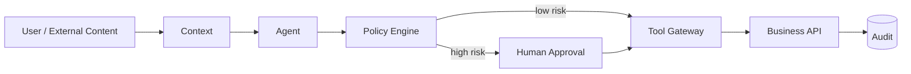

# CHAPTER 09 · Security、Permission 与 HITL

> **系统层**：Trust / Security / Human Control  
> **本章 Invariant**：不可信内容不能获得指令权；高风险动作必须经过最小权限与独立授权

## 为什么这一章重要

这一章训练的是 **Trust / Security / Human Control** 的工程能力。面试里不要把问题回答成“某个框架怎么配置”，而要把 Agent 当作有概率决策、有外部副作用、会跨轮运行的生产系统。

### 三条主线

- Prompt 不是安全边界，模型判断不是授权
- 把数据、指令、凭证、权限放在不同信任域
- HITL 的价值是给不可逆动作增加独立授权和恢复点

## 本章概念图

## 本章答题框架

任何题都可以先问四个问题：

1. 数据和指令是否混淆？
1. 当前 capability 是否最小？
1. 动作是否不可逆/高影响？
1. 最终资源层是否再次鉴权？

然后用统一可靠性框架收口：`Detect → Classify → Contain → Recover → Preserve → Verify`。

## 关键指标

- `policy_violation_rate`
- `unsafe_tool_block_rate`
- `approval_rate`
- `false_block_rate`
- `tenant_isolation_incidents`
- `sensitive_trace_rate`

安全指标必须同时看漏拦截与误拦截；只追求 block rate 会伤害可用性。

## 推荐学习顺序

1. [Q081 · 网页里的 Prompt Injection 告诉 Agent‘忽略之前指令’，怎么办？](q081.md)
2. [Q082 · 什么叫 Least Privilege Agent？](q082.md)
3. [Q083 · 什么操作应该 Human-in-the-Loop？](q083.md)
4. [Q084 · 执行代码的 Agent 为什么要 Sandbox？](q084.md)
5. [Q085 · Tracing 很重要，但 Trace 中包含用户敏感信息怎么办？](q085.md)
6. [Q086 · Multi-Tenant Agent 如何保证 A 公司数据不会进入 B 公司 Context？](q086.md)
7. [Q087 · 工具标记为 read-only、destructive、idempotent 有什么意义？](q087.md)
8. [Q088 · Agent 调第三方工具需要 Credential，Credential 应该放在哪里？](q088.md)
9. [Q089 · 权限控制应该放在 Prompt、Agent、Tool Gateway 还是业务 API？](q089.md)
10. [Q090 · Memory Poisoning 怎么解决？](q090.md)

## 题目索引

| 题号 | 问题 | 频率 | 难度 | 风险 |
|---|---|---|---|---|
| [Q081](q081.md) | 网页里的 Prompt Injection 告诉 Agent‘忽略之前指令’，怎么办？ | 必考 | 难 | 高 |
| [Q082](q082.md) | 什么叫 Least Privilege Agent？ | 必考 | 中 | 高 |
| [Q083](q083.md) | 什么操作应该 Human-in-the-Loop？ | 必考 | 中 | 高 |
| [Q084](q084.md) | 执行代码的 Agent 为什么要 Sandbox？ | 高频 | 难 | 高 |
| [Q085](q085.md) | Tracing 很重要，但 Trace 中包含用户敏感信息怎么办？ | 高频 | 中 | 高 |
| [Q086](q086.md) | Multi-Tenant Agent 如何保证 A 公司数据不会进入 B 公司 Context？ | 必考 | 难 | 高 |
| [Q087](q087.md) | 工具标记为 read-only、destructive、idempotent 有什么意义？ | 高频 | 中 | 中 |
| [Q088](q088.md) | Agent 调第三方工具需要 Credential，Credential 应该放在哪里？ | 必考 | 中 | 高 |
| [Q089](q089.md) | 权限控制应该放在 Prompt、Agent、Tool Gateway 还是业务 API？ | 必考 | 难 | 高 |
| [Q090](q090.md) | Memory Poisoning 怎么解决？ | 必考 | 难 | 高 |

> ⭐ 表示属于 [20 道必刷题](../../docs/05-priority-20.md)。

## 本章完成标准

- [ ] 能在白板上画出本章控制流和 trust boundary。
- [ ] 能说出至少 3 个 failure mode 及其观测信号。
- [ ] 能把一个框架能力还原成 state / protocol / policy / runtime 原语。
- [ ] 能解释主要 trade-off，而不是给出绝对化“最佳实践”。
- [ ] 能为关键设计给出 metric / eval / SLO。

[← 返回总题库](../README.md)
