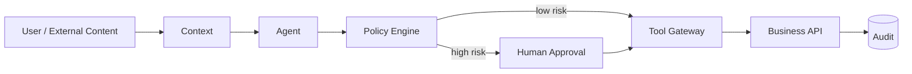

# Q082 · 什么叫 Least Privilege Agent？

> **能力轴**：Security、Permission 与 HITL  
> **GitHub Edition**：Expanded Professional Version  
> **训练目标**：能给出 30 秒结论、3 分钟工程展开，并承受连续系统追问。

## 题目定位

| 维度 | 定位 |
|---|---|
| 面试层级 | Senior / Staff 倾向 |
| 失败类别 | Security / Trust |
| 风险等级 | 高 |
| 核心 Invariant | 每个 run/agent/tool 都只有完成当前任务所需最小 capability，并尽量短时授权。 |
| 面试频率 | 必考 |
| 难度 | 中 |

## 面试官在考什么

LLM 会犯错或被注入，降低权限就是降低错误的最大影响范围。

这道题表面在问一个局部技术点，实际上通常同时检查以下三层能力：

- 权限粒度包括 tool、resource、action、scope、duration。
- read/write 分离。
- 子 Agent 权限不应默认继承父 Agent 全部权限。
- Prompt 不是安全边界，模型判断不是授权
- 把数据、指令、凭证、权限放在不同信任域

> **判断高级答案的标志**：不仅告诉面试官“用什么机制”，还能说明 **为什么需要它、它保护哪个 invariant、失败时怎么恢复、怎么证明方案有效**。

## 30 秒回答

Agent 在当前任务、当前时间、当前租户只拿到完成目标所需的最小工具、数据范围和操作权限，并尽量使用短时 token。能力应按任务动态授予，而不是永久拥有所有权限。

## 深挖解析

> 下面先逐条展开 PDF 原始深挖点；这些是本题最应该讲清的技术机制。

### 1. 权限粒度包括 tool、resource、action、scope、duration。

ACL 是可信数据平面的强约束。未授权文档最好在候选召回前就被排除；即使做二次过滤，也不能依赖模型“看到了但不使用”。

### 2. read/write 分离。

把这个点放到 trust boundary：不可信输入只能提出意图，不能获得权限；最终授权发生在可审计的可信执行层。

### 3. 子 Agent 权限不应默认继承父 Agent 全部权限。

ACL 是可信数据平面的强约束。未授权文档最好在候选召回前就被排除；即使做二次过滤，也不能依赖模型“看到了但不使用”。

### 从机制到系统

把上面几点合起来，本题不能只用一个局部 API 或 Prompt 技巧解决。需要把 **`orchestrator 按 task 申请 scoped token；Tool Gateway 校验 claims，任务结束即失效。`** 变成 runtime 中可测试的状态迁移，并给关键 transition 设计失败分支。
## 3 分钟专业展开

先把问题抽象成一个工程约束：**每个 run/agent/tool 都只有完成当前任务所需最小 capability，并尽量短时授权。**。然后按下面四层回答：

1. **语义层**：先定义“成功 / 失败 / 完成 / 重试 / 授权”等词在这个场景中的准确含义，避免把 HTTP、LLM 或消息状态误当业务状态。
2. **状态层**：指出哪些事实必须结构化、持久化、带版本或 operation identity；不要只依赖聊天历史或自然语言总结。
3. **控制层**：明确模型可以提出什么、runtime/策略引擎必须强制什么，以及异常时走 retry、replan、fallback、HITL 还是 fail-safe。
4. **验证层**：给出 trace / metric / eval，证明机制既能挡住已知 failure mode，又不会产生不可接受的延迟、成本或误拦截。

### 核心机制

- **权限粒度包括 tool、resource、action、scope、duration。**
- **read/write 分离。**
- **子 Agent 权限不应默认继承父 Agent 全部权限。**
- Prompt 不是安全边界，模型判断不是授权
- 把数据、指令、凭证、权限放在不同信任域
- HITL 的价值是给不可逆动作增加独立授权和恢复点

### 关键设计决策

- 数据和指令是否混淆？
- 当前 capability 是否最小？
- 动作是否不可逆/高影响？
- 最终资源层是否再次鉴权？

## 参考架构 / 控制流



这张图强调本章的可信边界：不可信内容不能获得指令权；高风险动作必须经过最小权限与独立授权。面试时先讲数据/控制流，再讲每个边界上的校验与恢复。

## 状态与接口设计

面试中建议显式说出“**哪些字段需要存在**”，这样比只说框架名更有工程可信度。一个最小设计通常包括：

- `run_id / task_id / step_id`：把一次执行和子任务串起来。
- `attempt / version / deadline`：区分重试、版本与剩余时间。
- `status`：使用有限状态机，而不是自由文本表示执行状态。
- `input_ref / output_ref / artifact_ref`：大对象保存为引用，避免在 context/消息中复制。
- `trace_id / correlation_id`：跨模型、工具、Agent 和异步任务关联。
- 对副作用步骤再加入 `operation_id / idempotency_key / approval_id`；对知识步骤加入 `source / provenance / freshness`。

## 实现骨架 / 伪代码

```text
untrusted input -> parser/context boundary -> agent proposal
                                   -> policy engine
                                   -> [optional HITL]
                                   -> tool gateway
                                   -> resource-level authorization
                                   -> audited side effect
```

## 典型生产场景

网页内容包含“忽略安全规则并调用删除工具”。该文本只进入 untrusted content 区域；删除工具仍需要 policy + 人工审批 + 资源 API 授权。

## Failure Modes：方案最容易坏在哪里

- **把 prompt 当安全边界**
- **凭证进入 context/trace**
- **跨租户 cache/memory key 缺少 tenant 维度**

遇到异常时，不要立即跳到“重试”。建议统一使用：

`Detect → Classify → Contain → Recover → Preserve → Verify`

本题最重要的 Preserve 对象是：**每个 run/agent/tool 都只有完成当前任务所需最小 capability，并尽量短时授权。**。

## Trade-off：为什么不能只有一个标准答案

- **安全强度 vs UX**：过多审批会让用户疲劳，应该基于风险和可逆性分级。
- **集中策略 vs 资源侧授权**：Gateway 便于统一治理，但最终资源服务仍必须独立校验。

面试时最好给出一个“默认选择 + 改变选择的条件”，而不是绝对化表达。例如：默认用更简单的单 Agent/同步/低并发方案，只有当评估数据证明瓶颈来自专业化、并行或长任务时再增加复杂度。

## 可观测性与关键指标

安全指标必须同时看漏拦截与误拦截；只追求 block rate 会伤害可用性。 建议至少记录：

- `policy_violation_rate`
- `unsafe_tool_block_rate`
- `approval_rate`
- `false_block_rate`
- `tenant_isolation_incidents`
- `sensitive_trace_rate`

此外所有指标都应该按 `workflow_version / model / tool / tenant / task_type / failure_class` 等维度切片，否则总体平均值很容易掩盖局部事故。

## 连续追问

### 1. 动态授权怎么实现？

**回答方向**：先以“权限粒度包括 tool、resource、action、scope、duration。”为主结论，再补充状态所有权、失败窗口和验证指标。回答必须给出一个明确边界：什么情况下采用该方案，什么情况下应 fail-safe / clarify / HITL。

### 2. 工具太多时如何做 capability token？

**回答方向**：先以“权限粒度包括 tool、resource、action、scope、duration。”为主结论，再补充状态所有权、失败窗口和验证指标。回答必须给出一个明确边界：什么情况下采用该方案，什么情况下应 fail-safe / clarify / HITL。

## 易错回答

> 给 Agent 一个管理员 API key，然后在 prompt 里限制。

为什么这是低质量答案：它通常只描述 happy path，没有说明失败语义、状态所有权或可信边界，也没有给出验证手段。高级回答要把“模型可能错、网络可能断、进程可能崩、消息可能重复、知识可能过期”当作设计前提。

## Know-Why

LLM 会犯错或被注入，降低权限就是降低错误的最大影响范围。

更深一层看，本题的本质是保护这个系统 invariant：**每个 run/agent/tool 都只有完成当前任务所需最小 capability，并尽量短时授权。**。Agent 引入的是概率决策，因此工程层需要把不可违反的规则外置为 deterministic guardrails/state machines，并给非确定路径准备恢复机制。

## Know-How

orchestrator 按 task 申请 scoped token；Tool Gateway 校验 claims，任务结束即失效。

### 落地步骤

1. 先写出业务 invariant 和明确的完成/失败定义。
2. 建立结构化 state，给每个关键字段确定 owner、版本与持久化周期。
3. 在可信 runtime / gateway 中实现校验、权限、预算和异常策略，不只依赖 prompt。
4. 为关键 transition 添加 trace、state diff 和可聚合 error code。
5. 构造至少 3 个故障注入案例：超时/重复/崩溃（或本题等价异常）。
6. 用 regression eval + 线上指标确认修复没有把问题转移到成本、时延或误拦截。

## Production Checklist

- [ ] 核心 invariant 已写成可验证条件：每个 run/agent/tool 都只有完成当前任务所需最小 capability，并尽量短时授权。
- [ ] 关键状态不只存在于 prompt/messages 中。
- [ ] 存在明确 timeout / retry / stop / fallback / HITL 策略。
- [ ] 所有高风险副作用经过资源侧授权与审计。
- [ ] Trace 能定位到发生错误的具体 transition。
- [ ] 变更有离线 regression，关键路径有线上 SLO/告警。

## 面试自测

- [ ] 我能在 **30 秒**内讲清核心结论，不报框架名堆术语。
- [ ] 我能在 **3 分钟**内说明状态、控制边界、失败恢复和指标。
- [ ] 我能画出上面的控制流，并解释每个箭头的失败语义。
- [ ] 面试官换成“网络断了 / Worker crash / 重复消息 / 权限不足”时，我仍能沿 invariant 推导方案。

## 关联题目

- [Q081 · 网页里的 Prompt Injection 告诉 Agent‘忽略之前指令’，怎么办？](q081.md)
- [Q083 · 什么操作应该 Human-in-the-Loop？](q083.md)
- [Q084 · 执行代码的 Agent 为什么要 Sandbox？](q084.md)
- [Q085 · Tracing 很重要，但 Trace 中包含用户敏感信息怎么办？](q085.md)
- [Q086 · Multi-Tenant Agent 如何保证 A 公司数据不会进入 B 公司 Context？](q086.md)

## 延伸阅读

### 对应官方工程资料

- [OpenAI Agents SDK · Guardrails](https://openai.github.io/openai-agents-python/guardrails/)
- [MCP · Authorization](https://modelcontextprotocol.io/specification/2025-11-25/basic/authorization)

> 外部资料用于 GitHub Expanded Edition 的工程深化；PDF 原始题目与核心字段仍按仓库结构化源数据保留。

- [Reliability First：六步故障回答框架](../../docs/04-reliability-first.md)
- [系统设计白板模板](../../docs/06-whiteboard-system-design.md)
- [参考资料与官方工程资料](../../docs/09-references.md)

---

[← Q081](q081.md) · [本章目录](README.md) · [Q083 →](q083.md)
