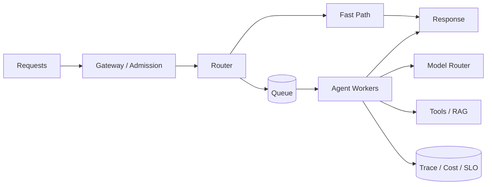

# CHAPTER 10 · 性能、成本与综合系统设计

> **系统层**：Production Scale / Economics  
> **本章 Invariant**：在成功率、安全和 SLO 约束下最小化单位任务成本，并能平滑扩展

## 为什么这一章重要

这一章训练的是 **Production Scale / Economics** 的工程能力。面试里不要把问题回答成“某个框架怎么配置”，而要把 Agent 当作有概率决策、有外部副作用、会跨轮运行的生产系统。

### 三条主线

- 优化的是 cost per successful task，而非单次 token 最少
- 并行、缓存、模型路由都必须计入尾延迟和失效率
- 规模化的核心变化来自队列、隔离、配额、背压、状态和可观测性

## 本章概念图

## 本章答题框架

任何题都可以先问四个问题：

1. critical path 在哪？
1. 哪些步骤可缓存/并行/降级？
1. 队列如何背压？
1. 优化后 cost per success 是否真正下降？

然后用统一可靠性框架收口：`Detect → Classify → Contain → Recover → Preserve → Verify`。

## 关键指标

- `p95_latency`
- `cost_per_task`
- `cost_per_success`
- `queue_wait`
- `cache_hit_rate`
- `model_escalation_rate`
- `throughput`

平均值容易掩盖尾部问题；至少跟踪 P50/P95/P99、queue wait、model/tool 分段时延。

## 推荐学习顺序

1. [Q091 · 一个 Agent 每次任务需要 200K tokens，怎么降到 50K？](q091.md)
2. [Q092 · 是否所有步骤都需要最强模型？](q092.md)
3. [Q093 · Agent 哪些东西适合缓存？](q093.md)
4. [Q094 · 并行 10 个 Agent 一定比串行更快吗？](q094.md)
5. [Q095 · 怎么设计 Agent latency budget？](q095.md)
6. [Q096 · Agent 怎么做 Load Test？](q096.md)
7. [Q097 · 遇到 LLM Rate Limit 怎么办？](q097.md)
8. [Q098 · 100 个用户和 100 万用户的 Agent architecture 最大区别在哪里？](q098.md)
9. [Q099 · Agent 成本怎么归因？](q099.md)
10. [Q100 · 综合系统设计：设计一个每天 100 万请求的企业级 Customer Support Agent。](q100.md)

## 题目索引

| 题号 | 问题 | 频率 | 难度 | 风险 |
|---|---|---|---|---|
| [Q091](q091.md) | 一个 Agent 每次任务需要 200K tokens，怎么降到 50K？ | 必考 | 难 | 中高 |
| [Q092](q092.md) | 是否所有步骤都需要最强模型？ | 高频 | 中 | 中 |
| [Q093](q093.md) | Agent 哪些东西适合缓存？ | 高频 | 中 | 中高 |
| [Q094](q094.md) | 并行 10 个 Agent 一定比串行更快吗？ | 高频 | 中 | 中高 |
| [Q095](q095.md) | 怎么设计 Agent latency budget？ | 必考 | 难 | 中高 |
| [Q096](q096.md) | Agent 怎么做 Load Test？ | 高频 | 难 | 中高 |
| [Q097](q097.md) | 遇到 LLM Rate Limit 怎么办？ | 高频 | 中 | 中高 |
| [Q098](q098.md) | 100 个用户和 100 万用户的 Agent architecture 最大区别在哪里？ | 必考 | 难 | 中高 |
| [Q099](q099.md) | Agent 成本怎么归因？ | 必考 | 中 | 中高 |
| [Q100](q100.md) | 综合系统设计：设计一个每天 100 万请求的企业级 Customer Support Agent。 | 压轴 | 难 | 高 |

> ⭐ 表示属于 [20 道必刷题](../../docs/05-priority-20.md)。

## 本章完成标准

- [ ] 能在白板上画出本章控制流和 trust boundary。
- [ ] 能说出至少 3 个 failure mode 及其观测信号。
- [ ] 能把一个框架能力还原成 state / protocol / policy / runtime 原语。
- [ ] 能解释主要 trade-off，而不是给出绝对化“最佳实践”。
- [ ] 能为关键设计给出 metric / eval / SLO。

[← 返回总题库](../README.md)
