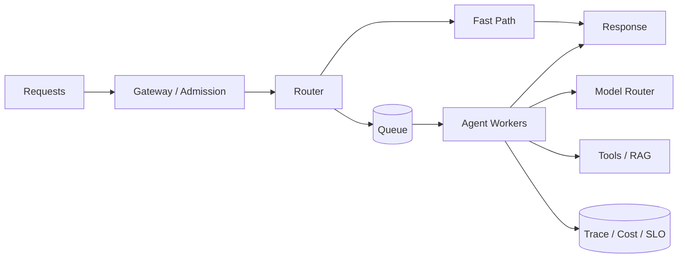

# Q095 · 怎么设计 Agent latency budget？

> **能力轴**：性能、成本与综合系统设计  
> **GitHub Edition**：Expanded Professional Version  
> **训练目标**：能给出 30 秒结论、3 分钟工程展开，并承受连续系统追问。

## 题目定位

| 维度 | 定位 |
|---|---|
| 面试层级 | Senior / Staff 倾向 |
| 失败类别 | Scale / Economics |
| 风险等级 | 中高 |
| 核心 Invariant | 总 deadline 自顶向下分解，所有子调用都知道剩余时间并可降级。 |
| 面试频率 | 必考 |
| 难度 | 难 |

## 面试官在考什么

没有全局预算，局部优化无法保证 P95 SLO。

这道题表面在问一个局部技术点，实际上通常同时检查以下三层能力：

- 保留 retry/reserve budget。
- 并行阶段预算取 max 而非 sum。
- 尾延迟决定用户体验。
- 优化的是 cost per successful task，而非单次 token 最少
- 并行、缓存、模型路由都必须计入尾延迟和失效率

> **判断高级答案的标志**：不仅告诉面试官“用什么机制”，还能说明 **为什么需要它、它保护哪个 invariant、失败时怎么恢复、怎么证明方案有效**。

## 30 秒回答

先从用户 SLO 倒推，把预算分给 routing/planning、retrieval、tools、generation 和 reserve；按关键路径而非平均值分配。每个子调用接收 remaining deadline，必要时提前降级。

## 深挖解析

> 下面先逐条展开 PDF 原始深挖点；这些是本题最应该讲清的技术机制。

### 1. 保留 retry/reserve budget。

Retry 必须同时满足：错误瞬时可恢复、操作可安全重放、仍在父 deadline 内、没有超过 retry budget。否则重试只是把局部故障放大成队列/下游雪崩。

### 2. 并行阶段预算取 max 而非 sum。

能并行不等于应该并行。需要检查依赖、资源冲突、副作用顺序、下游限流和尾延迟；工程目标是缩短 critical path，而不是最大化并发数。

### 3. 尾延迟决定用户体验。

时延要按 critical path 分解为 budget，并把 deadline 传到每个子调用。只优化平均时延没有意义；P95/P99、queue wait 和超时后的降级策略才决定生产体验。

### 从机制到系统

把上面几点合起来，本题不能只用一个局部 API 或 Prompt 技巧解决。需要把 **`从 trace 获取各 span P50/P95；按 critical path 设置 soft/hard deadline，runtime 动态降级。`** 变成 runtime 中可测试的状态迁移，并给关键 transition 设计失败分支。
## 3 分钟专业展开

先把问题抽象成一个工程约束：**总 deadline 自顶向下分解，所有子调用都知道剩余时间并可降级。**。然后按下面四层回答：

1. **语义层**：先定义“成功 / 失败 / 完成 / 重试 / 授权”等词在这个场景中的准确含义，避免把 HTTP、LLM 或消息状态误当业务状态。
2. **状态层**：指出哪些事实必须结构化、持久化、带版本或 operation identity；不要只依赖聊天历史或自然语言总结。
3. **控制层**：明确模型可以提出什么、runtime/策略引擎必须强制什么，以及异常时走 retry、replan、fallback、HITL 还是 fail-safe。
4. **验证层**：给出 trace / metric / eval，证明机制既能挡住已知 failure mode，又不会产生不可接受的延迟、成本或误拦截。

### 核心机制

- **保留 retry/reserve budget。**
- **并行阶段预算取 max 而非 sum。**
- **尾延迟决定用户体验。**
- 优化的是 cost per successful task，而非单次 token 最少
- 并行、缓存、模型路由都必须计入尾延迟和失效率
- 规模化的核心变化来自队列、隔离、配额、背压、状态和可观测性

### 关键设计决策

- critical path 在哪？
- 哪些步骤可缓存/并行/降级？
- 队列如何背压？
- 优化后 cost per success 是否真正下降？

## 参考架构 / 控制流



这张图强调本章的可信边界：在成功率、安全和 SLO 约束下最小化单位任务成本，并能平滑扩展。面试时先讲数据/控制流，再讲每个边界上的校验与恢复。

## 状态与接口设计

面试中建议显式说出“**哪些字段需要存在**”，这样比只说框架名更有工程可信度。一个最小设计通常包括：

- `run_id / task_id / step_id`：把一次执行和子任务串起来。
- `attempt / version / deadline`：区分重试、版本与剩余时间。
- `status`：使用有限状态机，而不是自由文本表示执行状态。
- `input_ref / output_ref / artifact_ref`：大对象保存为引用，避免在 context/消息中复制。
- `trace_id / correlation_id`：跨模型、工具、Agent 和异步任务关联。
- 对副作用步骤再加入 `operation_id / idempotency_key / approval_id`；对知识步骤加入 `source / provenance / freshness`。

## 实现骨架 / 伪代码

```text
Request -> admission -> route -> bounded context -> model/tools
        -> durable state -> response
        -> trace + cost attribution + SLO
```

## 典型生产场景

百万请求系统把 FAQ 走小模型/缓存快路径，复杂任务入队由 Agent Worker 执行；所有请求都记录 cost_per_success，而不是只统计 token 总量。

## Failure Modes：方案最容易坏在哪里

- **只优化平均延迟忽略 P95/P99**
- **并行放大下游限流和 token 成本**
- **成本无法和成功率关联，优化方向失真**

遇到异常时，不要立即跳到“重试”。建议统一使用：

`Detect → Classify → Contain → Recover → Preserve → Verify`

本题最重要的 Preserve 对象是：**总 deadline 自顶向下分解，所有子调用都知道剩余时间并可降级。**。

## Trade-off：为什么不能只有一个标准答案

- **延迟 vs 成本**：并行和强模型可能降低 latency 却显著增成本；需看 cost per successful task。
- **利用率 vs 尾延迟**：高 worker 利用率会放大 queue wait，需要为 P95/P99 保留容量。

面试时最好给出一个“默认选择 + 改变选择的条件”，而不是绝对化表达。例如：默认用更简单的单 Agent/同步/低并发方案，只有当评估数据证明瓶颈来自专业化、并行或长任务时再增加复杂度。

## 可观测性与关键指标

平均值容易掩盖尾部问题；至少跟踪 P50/P95/P99、queue wait、model/tool 分段时延。 建议至少记录：

- `p95_latency`
- `cost_per_task`
- `cost_per_success`
- `queue_wait`
- `cache_hit_rate`
- `model_escalation_rate`
- `throughput`

此外所有指标都应该按 `workflow_version / model / tool / tenant / task_type / failure_class` 等维度切片，否则总体平均值很容易掩盖局部事故。

## 连续追问

### 1. 模型生成时间波动大怎么预算？

**回答方向**：先以“保留 retry/reserve budget。”为主结论，再补充状态所有权、失败窗口和验证指标。回答必须给出一个明确边界：什么情况下采用该方案，什么情况下应 fail-safe / clarify / HITL。

### 2. 超预算时先砍哪一步？

**回答方向**：先以“保留 retry/reserve budget。”为主结论，再补充状态所有权、失败窗口和验证指标。回答必须给出一个明确边界：什么情况下采用该方案，什么情况下应 fail-safe / clarify / HITL。

## 易错回答

> 所有组件各自追求最快，却没有 end-to-end deadline。

为什么这是低质量答案：它通常只描述 happy path，没有说明失败语义、状态所有权或可信边界，也没有给出验证手段。高级回答要把“模型可能错、网络可能断、进程可能崩、消息可能重复、知识可能过期”当作设计前提。

## Know-Why

没有全局预算，局部优化无法保证 P95 SLO。

更深一层看，本题的本质是保护这个系统 invariant：**总 deadline 自顶向下分解，所有子调用都知道剩余时间并可降级。**。Agent 引入的是概率决策，因此工程层需要把不可违反的规则外置为 deterministic guardrails/state machines，并给非确定路径准备恢复机制。

## Know-How

从 trace 获取各 span P50/P95；按 critical path 设置 soft/hard deadline，runtime 动态降级。

### 落地步骤

1. 先写出业务 invariant 和明确的完成/失败定义。
2. 建立结构化 state，给每个关键字段确定 owner、版本与持久化周期。
3. 在可信 runtime / gateway 中实现校验、权限、预算和异常策略，不只依赖 prompt。
4. 为关键 transition 添加 trace、state diff 和可聚合 error code。
5. 构造至少 3 个故障注入案例：超时/重复/崩溃（或本题等价异常）。
6. 用 regression eval + 线上指标确认修复没有把问题转移到成本、时延或误拦截。

## Production Checklist

- [ ] 核心 invariant 已写成可验证条件：总 deadline 自顶向下分解，所有子调用都知道剩余时间并可降级。
- [ ] 关键状态不只存在于 prompt/messages 中。
- [ ] 存在明确 timeout / retry / stop / fallback / HITL 策略。
- [ ] 所有高风险副作用经过资源侧授权与审计。
- [ ] Trace 能定位到发生错误的具体 transition。
- [ ] 变更有离线 regression，关键路径有线上 SLO/告警。

## 面试自测

- [ ] 我能在 **30 秒**内讲清核心结论，不报框架名堆术语。
- [ ] 我能在 **3 分钟**内说明状态、控制边界、失败恢复和指标。
- [ ] 我能画出上面的控制流，并解释每个箭头的失败语义。
- [ ] 面试官换成“网络断了 / Worker crash / 重复消息 / 权限不足”时，我仍能沿 invariant 推导方案。

## 关联题目

- [Q094 · 并行 10 个 Agent 一定比串行更快吗？](q094.md)
- [Q097 · 遇到 LLM Rate Limit 怎么办？](q097.md)
- [Q066 · 整个 Agent SLA 30 秒，内部 5 个工具 timeout 怎么分？](../07-durable-execution/q066.md)
- [Q091 · 一个 Agent 每次任务需要 200K tokens，怎么降到 50K？](q091.md)
- [Q092 · 是否所有步骤都需要最强模型？](q092.md)

## 延伸阅读

### 对应官方工程资料

- [Anthropic · Engineering / long-running harnesses](https://www.anthropic.com/engineering)
- [LangGraph · Persistence](https://docs.langchain.com/oss/python/langgraph/persistence)

> 外部资料用于 GitHub Expanded Edition 的工程深化；PDF 原始题目与核心字段仍按仓库结构化源数据保留。

- [Reliability First：六步故障回答框架](../../docs/04-reliability-first.md)
- [系统设计白板模板](../../docs/06-whiteboard-system-design.md)
- [参考资料与官方工程资料](../../docs/09-references.md)

---

[← Q094](q094.md) · [本章目录](README.md) · [Q096 →](q096.md)
