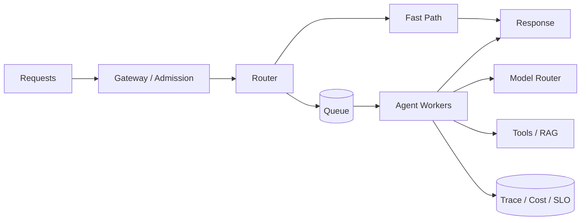
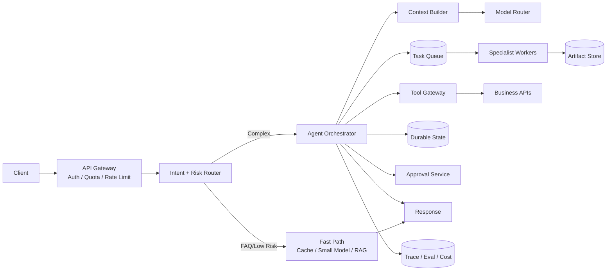
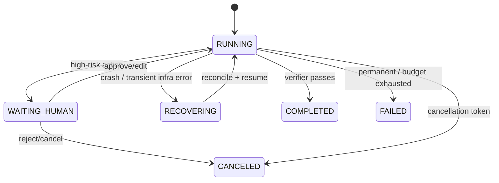

# Q100 · 综合系统设计：设计一个每天 100 万请求的企业级 Customer Support Agent。

> **能力轴**：性能、成本与综合系统设计  
> **GitHub Edition**：Expanded Professional Version  
> **训练目标**：能给出 30 秒结论、3 分钟工程展开，并承受连续系统追问。

## 题目定位

| 维度 | 定位 |
|---|---|
| 面试层级 | Senior / Staff 倾向 |
| 失败类别 | Scale / Economics |
| 风险等级 | 高 |
| 核心 Invariant | 所有非确定决策被确定性 trust boundary、durable state、eval/trace 和预算系统包围。 |
| 面试频率 | 压轴 |
| 难度 | 难 |

## 面试官在考什么

这道压轴题把 Agent 当作真实企业系统：面试官看的不是组件名，而是你能否让非确定决策在确定约束下安全运行。

这道题表面在问一个局部技术点，实际上通常同时检查以下三层能力：

- P95<8s：短路径同步，长路径异步；并行 RAG 与只读工具，设置 deadline budget。
- 权限：tenant identity 贯穿检索、工具和日志；高风险动作 action hash+approval token。
- 可靠性：operation id、checkpoint、retry policy、circuit breaker、Saga；上下文用 artifact store+compaction。
- 优化的是 cost per successful task，而非单次 token 最少
- 并行、缓存、模型路由都必须计入尾延迟和失效率

> **判断高级答案的标志**：不仅告诉面试官“用什么机制”，还能说明 **为什么需要它、它保护哪个 invariant、失败时怎么恢复、怎么证明方案有效**。

## 30 秒回答

采用确定性入口与风险控制外壳：API Gateway -> Intent/Policy Router -> Orchestrator -> RAG/Tool/Multi-Agent Workers；所有外部动作经过 Tool Gateway，任务状态进入 Durable Store，长任务由 Queue+Worker 执行，HITL 用可恢复 checkpoint，Trace/Eval 贯穿全链路。

## 深挖解析

> 下面先逐条展开 PDF 原始深挖点；这些是本题最应该讲清的技术机制。

### 1. P95<8s：短路径同步，长路径异步；并行 RAG 与只读工具，设置 deadline budget。

能并行不等于应该并行。需要检查依赖、资源冲突、副作用顺序、下游限流和尾延迟；工程目标是缩短 critical path，而不是最大化并发数。

### 2. 权限：tenant identity 贯穿检索、工具和日志；高风险动作 action hash+approval token。

隔离应由身份和存储边界实现，而不是在 prompt 中提醒“不要看别人的数据”。`tenant_id` 必须成为 retrieval filter、cache key、storage partition、tool auth 和 trace metadata 的共同维度。

### 3. 可靠性：operation id、checkpoint、retry policy、circuit breaker、Saga；上下文用 artifact store+compaction。

这里最重要的是“逻辑操作身份”而不是 HTTP 请求身份。`operation_id` 必须在第一次执行前持久化，并在 retry、进程重启、队列重投时保持不变；服务端或可信代理根据该 ID 返回同一 canonical result。

### 4. 质量：retrieval+trajectory+end-to-end eval；发布前 regression，线上 canary。

把 RAG 看成证据供应链：trigger → retrieve → filter → rerank → validate → consume。每一层都有独立 failure mode 和指标，不能用最终回答准确率掩盖检索故障。

### 从机制到系统

把上面几点合起来，本题不能只用一个局部 API 或 Prompt 技巧解决。需要把 **`白板按 ①请求路径 ②状态流 ③权限边界 ④故障恢复 ⑤观测评估 ⑥成本/时延 六条线讲，最后用 3 个故障场景验证设计。`** 变成 runtime 中可测试的状态迁移，并给关键 transition 设计失败分支。
## 3 分钟专业展开

先把问题抽象成一个工程约束：**所有非确定决策被确定性 trust boundary、durable state、eval/trace 和预算系统包围。**。然后按下面四层回答：

1. **语义层**：先定义“成功 / 失败 / 完成 / 重试 / 授权”等词在这个场景中的准确含义，避免把 HTTP、LLM 或消息状态误当业务状态。
2. **状态层**：指出哪些事实必须结构化、持久化、带版本或 operation identity；不要只依赖聊天历史或自然语言总结。
3. **控制层**：明确模型可以提出什么、runtime/策略引擎必须强制什么，以及异常时走 retry、replan、fallback、HITL 还是 fail-safe。
4. **验证层**：给出 trace / metric / eval，证明机制既能挡住已知 failure mode，又不会产生不可接受的延迟、成本或误拦截。

### 核心机制

- **P95<8s：短路径同步，长路径异步；并行 RAG 与只读工具，设置 deadline budget。**
- **权限：tenant identity 贯穿检索、工具和日志；高风险动作 action hash+approval token。**
- **可靠性：operation id、checkpoint、retry policy、circuit breaker、Saga；上下文用 artifact store+compaction。**
- **质量：retrieval+trajectory+end-to-end eval；发布前 regression，线上 canary。**
- 优化的是 cost per successful task，而非单次 token 最少
- 并行、缓存、模型路由都必须计入尾延迟和失效率
- 规模化的核心变化来自队列、隔离、配额、背压、状态和可观测性

### 关键设计决策

- critical path 在哪？
- 哪些步骤可缓存/并行/降级？
- 队列如何背压？
- 优化后 cost per success 是否真正下降？

## 参考架构 / 控制流



这张图强调本章的可信边界：在成功率、安全和 SLO 约束下最小化单位任务成本，并能平滑扩展。面试时先讲数据/控制流，再讲每个边界上的校验与恢复。

## 状态与接口设计

面试中建议显式说出“**哪些字段需要存在**”，这样比只说框架名更有工程可信度。一个最小设计通常包括：

- `run_id / task_id / step_id`：把一次执行和子任务串起来。
- `attempt / version / deadline`：区分重试、版本与剩余时间。
- `status`：使用有限状态机，而不是自由文本表示执行状态。
- `input_ref / output_ref / artifact_ref`：大对象保存为引用，避免在 context/消息中复制。
- `trace_id / correlation_id`：跨模型、工具、Agent 和异步任务关联。
- 对副作用步骤再加入 `operation_id / idempotency_key / approval_id`；对知识步骤加入 `source / provenance / freshness`。

## 实现骨架 / 伪代码

```text
Request -> admission -> route -> bounded context -> model/tools
        -> durable state -> response
        -> trace + cost attribution + SLO
```

## 典型生产场景

百万请求系统把 FAQ 走小模型/缓存快路径，复杂任务入队由 Agent Worker 执行；所有请求都记录 cost_per_success，而不是只统计 token 总量。

## Failure Modes：方案最容易坏在哪里

- **只优化平均延迟忽略 P95/P99**
- **并行放大下游限流和 token 成本**
- **成本无法和成功率关联，优化方向失真**

遇到异常时，不要立即跳到“重试”。建议统一使用：

`Detect → Classify → Contain → Recover → Preserve → Verify`

本题最重要的 Preserve 对象是：**所有非确定决策被确定性 trust boundary、durable state、eval/trace 和预算系统包围。**。

## Trade-off：为什么不能只有一个标准答案

- **延迟 vs 成本**：并行和强模型可能降低 latency 却显著增成本；需看 cost per successful task。
- **利用率 vs 尾延迟**：高 worker 利用率会放大 queue wait，需要为 P95/P99 保留容量。

面试时最好给出一个“默认选择 + 改变选择的条件”，而不是绝对化表达。例如：默认用更简单的单 Agent/同步/低并发方案，只有当评估数据证明瓶颈来自专业化、并行或长任务时再增加复杂度。

## 可观测性与关键指标

平均值容易掩盖尾部问题；至少跟踪 P50/P95/P99、queue wait、model/tool 分段时延。 建议至少记录：

- `p95_latency`
- `cost_per_task`
- `cost_per_success`
- `queue_wait`
- `cache_hit_rate`
- `model_escalation_rate`
- `throughput`

此外所有指标都应该按 `workflow_version / model / tool / tenant / task_type / failure_class` 等维度切片，否则总体平均值很容易掩盖局部事故。

## 连续追问

### 1. 如何避免重复退款？

**回答方向**：先以“P95<8s：短路径同步，长路径异步；并行 RAG 与只读工具，设置 deadline budget。”为主结论，再补充状态所有权、失败窗口和验证指标。回答必须给出一个明确边界：什么情况下采用该方案，什么情况下应 fail-safe / clarify / HITL。

### 2. Worker crash 如何恢复？

**回答方向**：Worker 必须先持久化 task/attempt/checkpoint；恢复时 claim 同一 task，按 operation_id 对已执行 side effect reconciliation，再从最近一致状态继续。

### 3. Context 爆了怎么办？

**回答方向**：先以“P95<8s：短路径同步，长路径异步；并行 RAG 与只读工具，设置 deadline budget。”为主结论，再补充状态所有权、失败窗口和验证指标。回答必须给出一个明确边界：什么情况下采用该方案，什么情况下应 fail-safe / clarify / HITL。

### 4. RAG 错误资料如何阻止错误动作？

**回答方向**：先以“P95<8s：短路径同步，长路径异步；并行 RAG 与只读工具，设置 deadline budget。”为主结论，再补充状态所有权、失败窗口和验证指标。回答必须给出一个明确边界：什么情况下采用该方案，什么情况下应 fail-safe / clarify / HITL。

### 5. 新模型上线如何证明更好？

**回答方向**：先以“P95<8s：短路径同步，长路径异步；并行 RAG 与只读工具，设置 deadline budget。”为主结论，再补充状态所有权、失败窗口和验证指标。回答必须给出一个明确边界：什么情况下采用该方案，什么情况下应 fail-safe / clarify / HITL。

## Q100 系统设计追问清单

> **白板顺序**：先讲请求路径，再讲状态；随后画 Trust Boundary；最后用故障场景验证恢复、观测和预算。不要从组件名开始堆框。

1. 为什么这里需要 Multi-Agent，而不是一个大 Agent？
2. Orchestrator 如何判断子任务真正完成？
3. Agent 间消息丢失、重复、乱序分别怎么处理？
4. Worker crash 后如何从 checkpoint 恢复？
5. Tool timeout 时为什么不能直接 retry？
6. 如何避免重复退款或重复创建工单？
7. RAG 返回过期/错误资料时如何阻断错误动作？
8. ACL 应该在检索前还是检索后做？
9. Context Window 爆掉如何 compaction/reset？
10. Memory 冲突和过时如何处理？
11. Prompt Injection 如何防止触发高权限工具？
12. 高风险动作的 HITL 如何暂停与恢复？
13. Tool Gateway 应承担哪些可信控制？
14. 整个 8 秒 P95 的 latency budget 怎么分？
15. 下游 API 连续失败为什么需要 Circuit Breaker？
16. 任务执行到一半如何 cancel 并保证不留下幽灵操作？
17. Trace 需要记录哪些 span 才能做 failure attribution？
18. 新 Prompt/模型上线怎样做 regression + canary？
19. 如何把成本归因到 tenant/task/agent/step？
20. 成功率、成本、时延、安全如何放进同一个 scorecard？

## 企业级参考设计：从入口到执行

### 1. 请求路径



关键不是组件多，而是**同步快路径与 durable agent path 分开**：简单 FAQ 不应该为了“Agent 化”进入昂贵 loop；复杂、多工具、长任务才进入 Orchestrator。

### 2. Durable State Model

```text
Run
├── run_id / tenant_id / user_id
├── workflow_version / model_policy_version
├── goal / constraints / deadline
├── status: RUNNING | WAITING_HUMAN | COMPLETED | FAILED | CANCELED
├── current_plan_version
├── steps[]
│   ├── step_id / attempt
│   ├── status
│   ├── input_ref / output_ref
│   ├── operation_id
│   └── error_code
├── approvals[]
├── artifact_refs[]
└── trace_id
```

这套 State 是恢复、取消、HITL、成本归因和 failure attribution 的共同基础。不要分别为每个功能再造一套“隐式状态”。

### 3. Tool Gateway Contract

每次外部调用至少包含：

```json
{
  "subject": {"tenant_id": "t1", "user_id": "u1"},
  "tool": "refund_order",
  "args": {"order_id": "...", "amount": 100},
  "operation_id": "op_...",
  "approval_id": "approval_...",
  "deadline_ms": 1200,
  "trace_id": "trace_..."
}
```

Gateway 依次完成：`AuthN -> AuthZ -> Schema -> Risk Policy -> Approval -> Idempotency -> Timeout/Retry Policy -> Execute -> Normalize -> Audit`。即使模型绕过 prompt 规则，也不能绕过真实资源权限。

### 4. P95 < 8s 的 Latency Budget 示例

| 阶段 | Budget | 说明 |
|---|---:|---|
| Gateway + routing | 250 ms | 身份、配额、意图/风险路由 |
| Context + retrieval | 900 ms | 可并行做 metadata/ACL 与召回 |
| Planner / first model | 1.2 s | 低风险任务可跳过复杂规划 |
| Tools | 2.5 s | 多只读工具可并行；副作用按依赖串行 |
| Final synthesis | 1.5 s | 保留输出预算 |
| Reserve / jitter | 1.65 s | 用于排队、网络抖动和 fallback |

这不是固定数字，而是展示 **deadline propagation**：每个子调用都知道剩余时间。如果剩余预算不足，就必须降级、异步化或返回 partial/progress，而不是继续“尽力调用”。

### 5. 可靠性状态机



**重要**：`RECOVERING` 不是简单 retry。先对所有 `IN_FLIGHT` side effect 做 reconciliation，再决定哪些 step 可以安全重放。

### 6. RAG 的 Action Safety

客服 Agent 中“回答问题”和“执行退款”需要不同证据阈值：

- Answer threshold：资料相关且来源可信，允许带不确定性回答。
- Action threshold：除了相关，还要求 ACL、freshness、版本、业务规则和必要的 authoritative source 一致。
- 高风险动作不能因为“向量检索 top-1 很像”就直接执行。

### 7. Multi-Agent 采用条件

只在三种收益足够明确时拆 Worker：

1. **Parallelism**：独立检索/分析能显著缩短 critical path。
2. **Specialization**：不同工具权限、schema 或专业 prompt 需要隔离。
3. **Context Isolation**：单 Agent context 被大量互不相关材料污染。

如果只是为了“角色丰富”，却没有这些收益，Single-Agent + Tools 往往更可靠、更便宜。

### 8. SLO / Scorecard

| 维度 | 例指标 | 目标含义 |
|---|---|---|
| Quality | task_success_rate | 用户目标真实完成 |
| Reliability | duplicate_side_effect_rate | 重复退款/工单接近 0 |
| Latency | P95 end-to-end | 交互路径 < 8s |
| Safety | unauthorized_action_rate | 必须为 0 级目标 |
| RAG | grounded_action_rate | 行动有有效证据 |
| Human | escalation_rate | 监控自动化边界 |
| Cost | cost_per_success | 成本必须和成功绑定 |
| Recovery | resume_success_rate | crash 后可恢复 |

### 9. 三个必须演示的故障场景

**场景 A：退款成功后响应丢失**  
期望：operation_id 不变 → 查询/重放返回 canonical result → 不产生第二笔退款。

**场景 B：Worker 在 39 分钟 crash**  
期望：加载 checkpoint → reconciliation `IN_FLIGHT` → 恢复未完成步骤 → 原始 artifact 和 trace 仍可关联。

**场景 C：恶意网页 Prompt Injection**  
期望：文本只作为 untrusted evidence；Tool Gateway 的租户授权、风险策略和 HITL 不受网页指令影响。

### 10. 面试白板收束

最后用六句话收尾通常很强：

1. LLM 负责非确定决策，Runtime 负责 invariant。
2. Context 是工作集，State/Artifact 才是事实存储。
3. Tool 副作用全部通过 Gateway 和 operation identity。
4. Multi-Agent 使用 task protocol，不共享隐式内部状态。
5. 任意 crash 都通过 checkpoint + reconciliation 恢复。
6. 所有改变都用 Trace + Eval + SLO 证明，而不是凭主观感觉。

## 易错回答

> 只画 LLM + Vector DB + Tools 三个框，忽略状态、权限、故障和评估。

为什么这是低质量答案：它通常只描述 happy path，没有说明失败语义、状态所有权或可信边界，也没有给出验证手段。高级回答要把“模型可能错、网络可能断、进程可能崩、消息可能重复、知识可能过期”当作设计前提。

## Know-Why

这道压轴题把 Agent 当作真实企业系统：面试官看的不是组件名，而是你能否让非确定决策在确定约束下安全运行。

更深一层看，本题的本质是保护这个系统 invariant：**所有非确定决策被确定性 trust boundary、durable state、eval/trace 和预算系统包围。**。Agent 引入的是概率决策，因此工程层需要把不可违反的规则外置为 deterministic guardrails/state machines，并给非确定路径准备恢复机制。

## Know-How

白板按 ①请求路径 ②状态流 ③权限边界 ④故障恢复 ⑤观测评估 ⑥成本/时延 六条线讲，最后用 3 个故障场景验证设计。

### 落地步骤

1. 先写出业务 invariant 和明确的完成/失败定义。
2. 建立结构化 state，给每个关键字段确定 owner、版本与持久化周期。
3. 在可信 runtime / gateway 中实现校验、权限、预算和异常策略，不只依赖 prompt。
4. 为关键 transition 添加 trace、state diff 和可聚合 error code。
5. 构造至少 3 个故障注入案例：超时/重复/崩溃（或本题等价异常）。
6. 用 regression eval + 线上指标确认修复没有把问题转移到成本、时延或误拦截。

## Production Checklist

- [ ] 核心 invariant 已写成可验证条件：所有非确定决策被确定性 trust boundary、durable state、eval/trace 和预算系统包围。
- [ ] 关键状态不只存在于 prompt/messages 中。
- [ ] 存在明确 timeout / retry / stop / fallback / HITL 策略。
- [ ] 所有高风险副作用经过资源侧授权与审计。
- [ ] Trace 能定位到发生错误的具体 transition。
- [ ] 变更有离线 regression，关键路径有线上 SLO/告警。

## 面试自测

- [ ] 我能在 **30 秒**内讲清核心结论，不报框架名堆术语。
- [ ] 我能在 **3 分钟**内说明状态、控制边界、失败恢复和指标。
- [ ] 我能画出上面的控制流，并解释每个箭头的失败语义。
- [ ] 面试官换成“网络断了 / Worker crash / 重复消息 / 权限不足”时，我仍能沿 invariant 推导方案。

## 关联题目

- [Q095 · 怎么设计 Agent latency budget？](q095.md)
- [Q030 · 设计一个 Production Tool Gateway。](../03-tools-mcp/q030.md)
- [Q040 · 多 Agent 如何实现 Context、Storage、Permission 完全隔离，又允许必要交换？](../04-multi-agent/q040.md)
- [Q061 · 一个 Agent 运行 40 分钟，第 39 分钟进程 crash，怎么办？](../07-durable-execution/q061.md)
- [Q071 · Agent 每次 Run 到底应该 Trace 什么？](../08-eval-observability/q071.md)

## 延伸阅读

### 对应官方工程资料

- [Anthropic · Engineering / long-running harnesses](https://www.anthropic.com/engineering)
- [LangGraph · Persistence](https://docs.langchain.com/oss/python/langgraph/persistence)

> 外部资料用于 GitHub Expanded Edition 的工程深化；PDF 原始题目与核心字段仍按仓库结构化源数据保留。

- [Reliability First：六步故障回答框架](../../docs/04-reliability-first.md)
- [系统设计白板模板](../../docs/06-whiteboard-system-design.md)
- [参考资料与官方工程资料](../../docs/09-references.md)

---

[← Q099](q099.md) · [本章目录](README.md)
