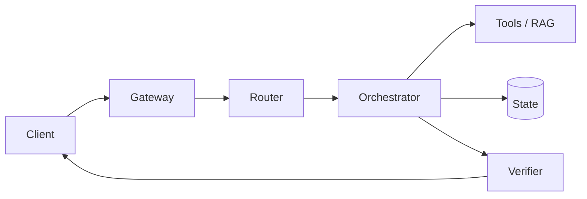

# Agent System Design Answer Template

## 0. Requirements

- Users / QPS:
- Peak factor:
- Sync vs async:
- P95/P99:
- Side effects:
- Data sensitivity:
- Multi-tenant:
- HITL requirement:
- Definition of task success:

## 1. Core Invariants

1. 
2. 
3. 

## 2. Main Request Path



## 3. State Model

```text
Run
├── identity
├── goal / constraints
├── deadline / budget
├── plan/version
├── steps
├── operations
├── approvals
├── artifacts
└── trace_id
```

## 4. Trust Boundary

- What can LLM decide?
- What is deterministic?
- Tool Gateway policy:
- Resource-side authorization:
- Credential handling:

## 5. Failure Scenarios

### Scenario A — timeout

Detect →  
Classify →  
Contain →  
Recover →  
Preserve →  
Verify →  

### Scenario B — crash

...

### Scenario C — duplicate / injection / stale knowledge

...

## 6. Context / Memory / RAG

- Lossless state:
- Compaction/reset:
- Retrieval trigger:
- ACL/freshness/provenance:

## 7. Multi-Agent

Why necessary?  
Task contract:  
Message semantics:  
Completion verifier:  
Isolation:  

## 8. Observability / Eval

- Trace spans:
- Failure taxonomy:
- Offline eval:
- Regression:
- Canary:

## 9. Latency / Cost

| Stage | Budget | Cost |
|---|---:|---:|
| Routing | | |
| Context/RAG | | |
| Model | | |
| Tools | | |
| Final | | |

Primary metric: `cost_per_success`.

## 10. Trade-offs / Alternatives

- Simpler design:
- Why not choose it?
- When would we switch back?

## Closing

用 5–6 句话总结：控制边界、State、副作用、恢复、Observability、SLO。
