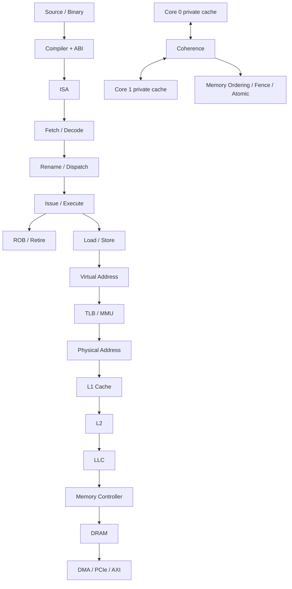

# 全书体系结构知识地图

```mermaid
flowchart TD
  SRC[Source / Binary] --> COMP[Compiler + ABI]
  COMP --> ISA[ISA]
  ISA --> FE[Fetch / Decode]
  FE --> RN[Rename / Dispatch]
  RN --> EX[Issue / Execute]
  EX --> ROB[ROB / Retire]
  EX --> LS[Load / Store]
  LS --> VA[Virtual Address]
  VA --> TLB[TLB / MMU]
  TLB --> PA[Physical Address]
  PA --> L1[L1 Cache]
  L1 --> L2[L2]
  L2 --> LLC[LLC]
  LLC --> MC[Memory Controller]
  MC --> DRAM[DRAM]
  DRAM --> DMA[DMA / PCIe / AXI]
  C0[Core 0 private cache] <--> COH[Coherence]
  COH <--> C1[Core 1 private cache]
  COH --> MM[Memory Ordering / Fence / Atomic]
```

学习时不要把这些模块当独立八股。真正高级的面试题往往沿一条链连续追问，例如：`Load → VA → TLB → Page Walk → PA → L1 → LLC → DRAM`，或 `Pipeline → RAW → Forwarding → Branch → OoO → Rename → ROB`。
