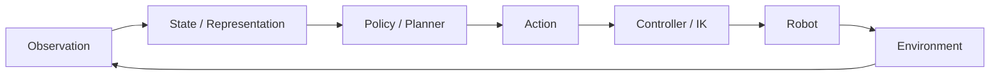

# 具身智能算法岗面试 100 题（2026）

> Embodied AI / VLA / Robot Learning / Robotics Interview Handbook

[](#100-题总索引)
[](CHANGELOG.md)
[](mkdocs.yml)
[](LICENSE.md)

这是一个面向 **具身智能算法 / VLA / Robot Learning / 强化学习 / 机械臂 / 人形机器人** 岗位的系统化面试仓库。仓库以随附 PDF《具身智能算法岗面试100题·剑指Offer式题解·2026》为 **Core Source**，并把每一道题扩展成可独立阅读、可追问、可项目迁移的 Markdown 题解。

## v2.0：100 题深度增强版

当前 GitHub 版已对 **Q001–Q100 全部进行二次专业增强**。与初版相比，重点变化不是单纯扩字数，而是：

- 移除大量重复的模板式解释；
- 每题增加专属机制深化与边界条件；
- 每题增加实现/白板骨架；
- 每题增加失败模式矩阵与证据链；
- 每题增加量化指标与 A/B 设计；
- 每题增加 Senior 追问树与项目化回答模板；
- 新增 [深度面试方法论](docs/guides/DEEP_INTERVIEW_METHOD.md)。

PDF Core 仍保持原内容边界；新增内容均明确属于 **Repository Expansion v2.0**。

## 为什么不是“100 个概念卡片”

具身智能的面试不是纯模型问答。真正的能力链是：



因此每题统一包含：

- **面试官意图**：为什么问；
- **30 秒回答**：先把结论说清；
- **5-10 分钟深答**：机制、假设、边界条件；
- **数学 / 白板 / 伪代码**：能落到公式或系统；
- **工程实现与指标**：如何上实机；
- **Gotchas / Debug Checklist**：常见失分与真实故障；
- **连环追问**：二面/终面继续怎么追；
- **项目迁移题**：怎样把答案变成项目证据；
- **References**：原论文、官方文档和 2026 前沿资料。

> **来源说明**：每题中的 `PDF Core` 忠实保留 PDF 结构、术语和结论；`Repository Expansion` 是仓库增强内容。二者在文中明确标记，便于追溯。

## 10 大模块

| # | 模块 | 题号 | 主线 |
|---:|---|---|---|
| 01 | [第一篇 机器人学基础与运动学](docs/questions/01-robotics-kinematics/README.md) | Q001-Q010 | 从坐标系、SE(3)、FK/IK、Jacobian 一直走到“模型动作如何真正落到电机”。 |
| 02 | [第二篇 感知、3D、SLAM 与状态估计](docs/questions/02-perception-slam-state-estimation/README.md) | Q011-Q020 | 把像素变成可操作的空间状态。 |
| 03 | [第三篇 规划、控制与 Manipulation](docs/questions/03-planning-control-manipulation/README.md) | Q021-Q030 | 把“想做什么”转成安全、连续、可执行的轨迹。 |
| 04 | [第四篇 模仿学习与机器人数据](docs/questions/04-imitation-learning-data/README.md) | Q031-Q040 | 从 demonstrations 学策略，并理解数据分布本身。 |
| 05 | [第五篇 强化学习与 Sim2Real](docs/questions/05-reinforcement-learning-sim2real/README.md) | Q041-Q050 | 用交互、奖励和仿真把“会做”打磨成“稳定做好”。 |
| 06 | [第六篇 VLM / VLA / Robot Foundation Model](docs/questions/06-vlm-vla-foundation-models/README.md) | Q051-Q060 | 理解从 RT-2 到 OpenVLA、Octo、π0、GR00T 的架构演进。 |
| 07 | [第七篇 ACT / Diffusion / Flow Matching](docs/questions/07-act-diffusion-flow/README.md) | Q061-Q070 | 理解现代动作生成器为什么从单步回归走向 action chunk 与生成式建模。 |
| 08 | [第八篇 World Model、Memory 与长时任务](docs/questions/08-world-model-memory-long-horizon/README.md) | Q071-Q080 | 从 reactive policy 走向预测、规划、记忆与组合泛化。 |
| 09 | [第九篇 仿真、数据工程与实机部署](docs/questions/09-simulation-data-deployment/README.md) | Q081-Q090 | 把研究代码变成可复现、可调试、可运行的机器人系统。 |
| 10 | [第十篇 系统设计、项目拷打与 2026 前沿](docs/questions/10-system-design-frontier/README.md) | Q091-Q100 | 以真实项目的方式回答，而不是背论文。 |

## 推荐学习路线

### 路线 A：两周高频面试

先读 [Top 25 高频路线](docs/guides/TOP25.md)，再按以下顺序：

`机器人学基本盘 → BC/ACT/Diffusion → PPO/Sim2Real → VLA → 系统设计`

### 路线 B：VLA / Robot Foundation Model

[RT-2 → OpenVLA → Octo → π₀ → π₀.₇ → World Model / Memory](docs/guides/VLA_ROADMAP.md)

### 路线 C：机械臂 / Robot Learning

[SE(3) → FK/IK/Jacobian → Planning → Impedance → Data → ACT/Diffusion → 实机部署](docs/guides/MANIPULATION_ROADMAP.md)

### 路线 D：RL / Sim2Real

[MDP → PPO/SAC → Reward → Parallel Simulation → Domain Randomization → Real Robot RL](docs/guides/RL_SIM2REAL_ROADMAP.md)

### 横向索引

- [Tag Index](docs/guides/TAG_INDEX.md)
- [题目贡献模板](docs/guides/QUESTION_TEMPLATE.md)
- [“真题”来源标注规范](docs/references/INTERVIEW_SOURCE_POLICY.md)


## 100 题总索引

### 第一篇 机器人学基础与运动学

- [Q001 · 什么是机器人自由度？6-DoF 位姿与关节自由度有什么区别？](docs/questions/01-robotics-kinematics/Q001.md) · ★★ · `geometry` `kinematics` `robotics`
- [Q002 · 齐次变换矩阵为什么是机器人坐标变换的核心？](docs/questions/01-robotics-kinematics/Q002.md) · ★★ · `geometry` `kinematics` `robotics`
- [Q003 · SO(3)、SE(3) 分别是什么？为什么机器人优化不能把旋转当普通欧式向量？](docs/questions/01-robotics-kinematics/Q003.md) · ★★ · `geometry` `kinematics` `robotics` `se3`
- [Q004 · Euler Angle、Rotation Matrix、Quaternion 如何选择？](docs/questions/01-robotics-kinematics/Q004.md) · ★★ · `geometry` `kinematics` `robotics`
- [Q005 · 正运动学与逆运动学分别解决什么问题？](docs/questions/01-robotics-kinematics/Q005.md) · ★★ · `fk` `geometry` `ik` `kinematics`
- [Q006 · Jacobian 在机器人运动与力控制里为什么重要？](docs/questions/01-robotics-kinematics/Q006.md) · ★★★★ · `control` `geometry` `jacobian` `kinematics`
- [Q007 · 什么是运动学奇异点？如何避免？](docs/questions/01-robotics-kinematics/Q007.md) · ★★★★ · `geometry` `kinematics` `robotics`
- [Q008 · Manipulability 是什么？为什么面试官会把它和冗余机械臂一起问？](docs/questions/01-robotics-kinematics/Q008.md) · ★★ · `geometry` `kinematics` `robotics`
- [Q009 · DH 参数是什么？现代机器人为什么仍值得掌握？](docs/questions/01-robotics-kinematics/Q009.md) · ★★ · `geometry` `kinematics` `robotics`
- [Q010 · VLA 输出 Cartesian Delta Action 后，怎样真正变成电机命令？](docs/questions/01-robotics-kinematics/Q010.md) · ★★ · `geometry` `kinematics` `robotics` `vla`

### 第二篇 感知、3D、SLAM 与状态估计

- [Q011 · 相机内参、外参分别是什么？](docs/questions/02-perception-slam-state-estimation/Q011.md) · ★★ · `3d-vision` `perception` `slam` `state-estimation`
- [Q012 · 什么是手眼标定？Eye-in-Hand 和 Eye-to-Hand 有什么区别？](docs/questions/02-perception-slam-state-estimation/Q012.md) · ★★ · `3d-vision` `perception` `slam` `state-estimation`
- [Q013 · RGB-D 如何从像素恢复三维点？](docs/questions/02-perception-slam-state-estimation/Q013.md) · ★★ · `3d-vision` `perception` `slam` `state-estimation`
- [Q014 · 点云处理的标准 pipeline 是什么？](docs/questions/02-perception-slam-state-estimation/Q014.md) · ★★ · `3d-vision` `perception` `slam` `state-estimation`
- [Q015 · ICP 的原理、适用条件和失败模式是什么？](docs/questions/02-perception-slam-state-estimation/Q015.md) · ★★ · `3d-vision` `icp` `perception` `slam`
- [Q016 · SLAM 解决什么问题？前端和后端分别做什么？](docs/questions/02-perception-slam-state-estimation/Q016.md) · ★★★★ · `3d-vision` `perception` `slam` `state-estimation`
- [Q017 · EKF 为什么常用于机器人状态估计？](docs/questions/02-perception-slam-state-estimation/Q017.md) · ★★★★ · `3d-vision` `ekf` `perception` `slam`
- [Q018 · IMU 为什么会漂移？如何与其他传感器融合？](docs/questions/02-perception-slam-state-estimation/Q018.md) · ★★ · `3d-vision` `perception` `slam` `state-estimation`
- [Q019 · 2D Detection、6D Pose、Tracking 在机器人任务里分别解决什么？](docs/questions/02-perception-slam-state-estimation/Q019.md) · ★★ · `3d-vision` `perception` `slam` `state-estimation`
- [Q020 · 有了 VLM/VLA，为什么传统 perception 仍然重要？](docs/questions/02-perception-slam-state-estimation/Q020.md) · ★★ · `3d-vision` `perception` `slam` `state-estimation`

### 第三篇 规划、控制与 Manipulation

- [Q021 · A* 与 Dijkstra 有什么区别？Heuristic 什么时候保证最优？](docs/questions/03-planning-control-manipulation/Q021.md) · ★★★ · `control` `manipulation` `planning` `search`
- [Q022 · 为什么导航规划器不一定走几何最短路径？](docs/questions/03-planning-control-manipulation/Q022.md) · ★★★ · `control` `manipulation` `planning`
- [Q023 · Costmap 中 inflation layer 的作用是什么？](docs/questions/03-planning-control-manipulation/Q023.md) · ★★★ · `control` `manipulation` `planning`
- [Q024 · RRT 与 RRT* 有什么区别？为什么高维机械臂喜欢采样规划？](docs/questions/03-planning-control-manipulation/Q024.md) · ★★★★ · `control` `manipulation` `motion-planning` `planning`
- [Q025 · MoveIt 的典型 motion planning pipeline 是什么？](docs/questions/03-planning-control-manipulation/Q025.md) · ★★★ · `control` `manipulation` `planning`
- [Q026 · PID 的三个项分别解决什么？为什么 D 项对噪声敏感？](docs/questions/03-planning-control-manipulation/Q026.md) · ★★★ · `control` `manipulation` `pid` `planning`
- [Q027 · Position、Velocity、Torque Control 有什么区别？](docs/questions/03-planning-control-manipulation/Q027.md) · ★★★ · `control` `manipulation` `planning`
- [Q028 · 什么是 Impedance Control？为什么适合接触操作？](docs/questions/03-planning-control-manipulation/Q028.md) · ★★★★ · `control` `impedance-control` `manipulation` `planning`
- [Q029 · Force Control 与 Impedance Control 有什么区别？](docs/questions/03-planning-control-manipulation/Q029.md) · ★★★★ · `control` `impedance-control` `manipulation` `planning`
- [Q030 · 为什么端到端策略仍常配 classical low-level controller？](docs/questions/03-planning-control-manipulation/Q030.md) · ★★★ · `control` `manipulation` `planning`

### 第四篇 模仿学习与机器人数据

- [Q031 · Behavior Cloning 的目标函数是什么？](docs/questions/04-imitation-learning-data/Q031.md) · ★★★ · `behavior-cloning` `imitation-learning` `robot-data`
- [Q032 · BC 为什么会产生 compounding error？](docs/questions/04-imitation-learning-data/Q032.md) · ★★★ · `behavior-cloning` `imitation-learning` `robot-data`
- [Q033 · DAgger 如何缓解 distribution shift？](docs/questions/04-imitation-learning-data/Q033.md) · ★★★ · `behavior-cloning` `dagger` `imitation-learning` `robot-data`
- [Q034 · 机器人模仿学习数据有哪些采集方式？如何选？](docs/questions/04-imitation-learning-data/Q034.md) · ★★★ · `behavior-cloning` `imitation-learning` `robot-data`
- [Q035 · Demonstration 是越多越好吗？如何定义数据覆盖？](docs/questions/04-imitation-learning-data/Q035.md) · ★★★ · `behavior-cloning` `imitation-learning` `robot-data`
- [Q036 · 为什么 teleoperation demonstrations 会 non-stationary？](docs/questions/04-imitation-learning-data/Q036.md) · ★★★ · `behavior-cloning` `imitation-learning` `robot-data`
- [Q037 · 多模态动作下，MSE Behavior Cloning 为什么会输出“不存在的平均动作”？](docs/questions/04-imitation-learning-data/Q037.md) · ★★★ · `behavior-cloning` `imitation-learning` `robot-data`
- [Q038 · 为什么 temporal context 对 manipulation 很重要？](docs/questions/04-imitation-learning-data/Q038.md) · ★★★ · `behavior-cloning` `imitation-learning` `robot-data`
- [Q039 · Cross-task / co-training 为什么可能比单任务数据更有效？](docs/questions/04-imitation-learning-data/Q039.md) · ★★★ · `behavior-cloning` `imitation-learning` `robot-data`
- [Q040 · 如果给你 1000 小时机器人数据预算，如何分配？](docs/questions/04-imitation-learning-data/Q040.md) · ★★★ · `behavior-cloning` `imitation-learning` `robot-data`

### 第五篇 强化学习与 Sim2Real

- [Q041 · MDP 的五元组是什么？机器人为什么经常其实是 POMDP？](docs/questions/05-reinforcement-learning-sim2real/Q041.md) · ★★★ · `reinforcement-learning` `robot-learning` `sim2real`
- [Q042 · Bellman Equation 表达了什么？](docs/questions/05-reinforcement-learning-sim2real/Q042.md) · ★★★ · `reinforcement-learning` `robot-learning` `sim2real`
- [Q043 · Value Iteration 与 Policy Iteration 有什么区别？](docs/questions/05-reinforcement-learning-sim2real/Q043.md) · ★★★ · `reinforcement-learning` `robot-learning` `sim2real`
- [Q044 · PPO 的 loss 包含哪些部分？Clip 的目的是什么？](docs/questions/05-reinforcement-learning-sim2real/Q044.md) · ★★★★ · `ppo` `reinforcement-learning` `robot-learning` `sim2real`
- [Q045 · 为什么 PPO 在 locomotion 与大规模仿真中很常见？](docs/questions/05-reinforcement-learning-sim2real/Q045.md) · ★★★★ · `ppo` `reinforcement-learning` `robot-learning` `sim2real`
- [Q046 · SAC 与 PPO 的核心区别是什么？](docs/questions/05-reinforcement-learning-sim2real/Q046.md) · ★★★★ · `ppo` `reinforcement-learning` `robot-learning` `sac`
- [Q047 · Model-based 与 Model-free RL 的区别是什么？](docs/questions/05-reinforcement-learning-sim2real/Q047.md) · ★★★ · `reinforcement-learning` `robot-learning` `sim2real`
- [Q048 · 机器人 Reward Function 如何设计？如何避免 reward hacking？](docs/questions/05-reinforcement-learning-sim2real/Q048.md) · ★★★ · `reinforcement-learning` `robot-learning` `sim2real`
- [Q049 · Domain Randomization 的目标是什么？哪些参数值得随机？](docs/questions/05-reinforcement-learning-sim2real/Q049.md) · ★★★ · `domain-randomization` `reinforcement-learning` `robot-learning` `sim2real`
- [Q050 · Sim2Real gap 主要来自哪些层？](docs/questions/05-reinforcement-learning-sim2real/Q050.md) · ★★★★★ · `reinforcement-learning` `robot-learning` `sim2real`

### 第六篇 VLM / VLA / Robot Foundation Model

- [Q051 · 如果从零设计一个 VLA，你会怎么设计？](docs/questions/06-vlm-vla-foundation-models/Q051.md) · ★★★★★ · `robot-foundation-model` `vla` `vlm`
- [Q052 · VLM 与 VLA 的本质差别是什么？](docs/questions/06-vlm-vla-foundation-models/Q052.md) · ★★★★ · `robot-foundation-model` `vla` `vlm`
- [Q053 · RT-2 的核心思想是什么？为什么它具有里程碑意义？](docs/questions/06-vlm-vla-foundation-models/Q053.md) · ★★★★ · `robot-foundation-model` `rt-2` `vla` `vlm`
- [Q054 · OpenVLA 的核心架构与价值是什么？](docs/questions/06-vlm-vla-foundation-models/Q054.md) · ★★★★ · `openvla` `robot-foundation-model` `vla` `vlm`
- [Q055 · Octo 的设计思想与 OpenVLA 有什么不同？](docs/questions/06-vlm-vla-foundation-models/Q055.md) · ★★★★ · `octo` `openvla` `robot-foundation-model` `vla`
- [Q056 · π0 为什么引入 Flow Matching Action Expert？](docs/questions/06-vlm-vla-foundation-models/Q056.md) · ★★★★★ · `flow-matching` `pi0` `robot-foundation-model` `vla`
- [Q057 · 什么是 Cross-Embodiment Learning？](docs/questions/06-vlm-vla-foundation-models/Q057.md) · ★★★★★ · `cross-embodiment` `robot-foundation-model` `vla` `vlm`
- [Q058 · 不同机器人 action dimension 不同，VLA 如何统一？](docs/questions/06-vlm-vla-foundation-models/Q058.md) · ★★★★ · `robot-foundation-model` `vla` `vlm`
- [Q059 · 为什么机器人 Foundation Model 不能简单照搬 LLM Scaling Law？](docs/questions/06-vlm-vla-foundation-models/Q059.md) · ★★★★ · `robot-foundation-model` `vla` `vlm`
- [Q060 · VLA 的“泛化”应该怎样分层评估？](docs/questions/06-vlm-vla-foundation-models/Q060.md) · ★★★★★ · `robot-foundation-model` `vla` `vlm`

### 第七篇 ACT / Diffusion / Flow Matching

- [Q061 · ACT 为什么要预测 Action Chunk？](docs/questions/07-act-diffusion-flow/Q061.md) · ★★★★ · `act` `action-modeling` `diffusion-policy` `flow-matching`
- [Q062 · ACT 为什么使用 CVAE？Latent z 在表示什么？](docs/questions/07-act-diffusion-flow/Q062.md) · ★★★★ · `act` `action-modeling` `diffusion-policy` `flow-matching`
- [Q063 · ACT 的 Temporal Aggregation 是什么？](docs/questions/07-act-diffusion-flow/Q063.md) · ★★★★ · `act` `action-modeling` `diffusion-policy` `flow-matching`
- [Q064 · Diffusion Policy 为什么适合机器人动作？](docs/questions/07-act-diffusion-flow/Q064.md) · ★★★★ · `act` `action-modeling` `diffusion-policy` `flow-matching`
- [Q065 · Diffusion Policy 的训练目标是什么？](docs/questions/07-act-diffusion-flow/Q065.md) · ★★★★ · `act` `action-modeling` `diffusion-policy` `flow-matching`
- [Q066 · Diffusion Policy 最大的部署瓶颈是什么？如何加速？](docs/questions/07-act-diffusion-flow/Q066.md) · ★★★★ · `act` `action-modeling` `diffusion-policy` `flow-matching`
- [Q067 · Flow Matching 与 Diffusion 有什么区别？](docs/questions/07-act-diffusion-flow/Q067.md) · ★★★★★ · `act` `action-modeling` `diffusion-policy` `flow-matching`
- [Q068 · Action Chunk 为什么不能无限长？](docs/questions/07-act-diffusion-flow/Q068.md) · ★★★★ · `act` `action-modeling` `diffusion-policy` `flow-matching`
- [Q069 · Receding Horizon Control 为什么和生成式动作策略很搭？](docs/questions/07-act-diffusion-flow/Q069.md) · ★★★★ · `act` `action-modeling` `diffusion-policy` `flow-matching`
- [Q070 · ACT、Diffusion、Flow Matching 三者应该怎么选？](docs/questions/07-act-diffusion-flow/Q070.md) · ★★★★★ · `act` `action-modeling` `diffusion-policy` `flow-matching`

### 第八篇 World Model、Memory 与长时任务

- [Q071 · VLA 与 World Model 两条路线有什么区别？](docs/questions/08-world-model-memory-long-horizon/Q071.md) · ★★★★★ · `long-horizon` `memory` `vla` `world-model`
- [Q072 · Model-free VLA 的优势与局限是什么？](docs/questions/08-world-model-memory-long-horizon/Q072.md) · ★★★★ · `long-horizon` `memory` `vla` `world-model`
- [Q073 · World Model 最大的失败模式是什么？](docs/questions/08-world-model-memory-long-horizon/Q073.md) · ★★★★★ · `long-horizon` `memory` `world-model`
- [Q074 · 什么是 Latent World Model？](docs/questions/08-world-model-memory-long-horizon/Q074.md) · ★★★★★ · `long-horizon` `memory` `world-model`
- [Q075 · World Model 如何用于 Action Planning？](docs/questions/08-world-model-memory-long-horizon/Q075.md) · ★★★★★ · `long-horizon` `memory` `world-model`
- [Q076 · 为什么长时任务需要 Hierarchical Policy？](docs/questions/08-world-model-memory-long-horizon/Q076.md) · ★★★★ · `long-horizon` `memory` `world-model`
- [Q077 · 机器人为什么需要 Memory？](docs/questions/08-world-model-memory-long-horizon/Q077.md) · ★★★★ · `long-horizon` `memory` `world-model`
- [Q078 · 视觉-语言推理怎样真正 Ground 到物理动作？](docs/questions/08-world-model-memory-long-horizon/Q078.md) · ★★★★ · `long-horizon` `memory` `world-model`
- [Q079 · Cosmos 这类 World Foundation Model 在机器人里能做什么？](docs/questions/08-world-model-memory-long-horizon/Q079.md) · ★★★★ · `long-horizon` `memory` `world-model`
- [Q080 · VLA 和 World Model 最终会二选一吗？](docs/questions/08-world-model-memory-long-horizon/Q080.md) · ★★★★★ · `long-horizon` `memory` `vla` `world-model`

### 第九篇 仿真、数据工程与实机部署

- [Q081 · Isaac Sim 与 Isaac Lab 有什么区别？](docs/questions/09-simulation-data-deployment/Q081.md) · ★★★ · `data-engineering` `deployment` `isaac-lab` `simulation`
- [Q082 · MuJoCo、Isaac、Gazebo 应如何选？](docs/questions/09-simulation-data-deployment/Q082.md) · ★★★ · `data-engineering` `deployment` `isaac-lab` `simulation`
- [Q083 · 为什么并行仿真对机器人 RL 很重要？](docs/questions/09-simulation-data-deployment/Q083.md) · ★★★ · `data-engineering` `deployment` `simulation`
- [Q084 · 一个专业机器人数据集应该保存哪些字段？](docs/questions/09-simulation-data-deployment/Q084.md) · ★★★ · `data-engineering` `deployment` `robot-data` `simulation`
- [Q085 · 为什么时间同步对机器人学习特别重要？](docs/questions/09-simulation-data-deployment/Q085.md) · ★★★ · `data-engineering` `deployment` `simulation`
- [Q086 · Absolute Action 与 Relative Action 有什么区别？](docs/questions/09-simulation-data-deployment/Q086.md) · ★★★ · `data-engineering` `deployment` `simulation`
- [Q087 · 为什么训练 control rate 与部署 control rate 必须匹配？](docs/questions/09-simulation-data-deployment/Q087.md) · ★★★ · `data-engineering` `deployment` `simulation`
- [Q088 · Robot Policy 应该怎样评估？为什么 Success Rate 不够？](docs/questions/09-simulation-data-deployment/Q088.md) · ★★★ · `data-engineering` `deployment` `simulation`
- [Q089 · 什么是 Real-time Inference Budget？如何设计异步执行？](docs/questions/09-simulation-data-deployment/Q089.md) · ★★★ · `data-engineering` `deployment` `simulation`
- [Q090 · LeRobot 的意义是什么？](docs/questions/09-simulation-data-deployment/Q090.md) · ★★★ · `data-engineering` `deployment` `lerobot` `simulation`

### 第十篇 系统设计、项目拷打与 2026 前沿

- [Q091 · 系统设计：设计一个“整理桌面”的具身机器人系统。](docs/questions/10-system-design-frontier/Q091.md) · ★★★★★ · `frontier` `robot-foundation-model` `system-design`
- [Q092 · 系统设计：机器人学习插 USB，BC、Diffusion、RL 怎么组合？](docs/questions/10-system-design-frontier/Q092.md) · ★★★★★ · `diffusion-policy` `frontier` `robot-foundation-model` `system-design`
- [Q093 · “如何改进当前 VLA？”应该怎样系统回答？](docs/questions/10-system-design-frontier/Q093.md) · ★★★★★ · `frontier` `robot-foundation-model` `system-design` `vla`
- [Q094 · VLA + RL 应该如何结合？](docs/questions/10-system-design-frontier/Q094.md) · ★★★★★ · `frontier` `robot-foundation-model` `system-design` `vla`
- [Q095 · 为什么失败数据可能比成功数据更有价值？](docs/questions/10-system-design-frontier/Q095.md) · ★★★★★ · `frontier` `robot-data` `robot-foundation-model` `system-design`
- [Q096 · Human Video 如何转化为 Robot Learning Data？](docs/questions/10-system-design-frontier/Q096.md) · ★★★★★ · `frontier` `robot-foundation-model` `system-design`
- [Q097 · Humanoid Foundation Model 与普通机械臂 VLA 有什么额外难点？](docs/questions/10-system-design-frontier/Q097.md) · ★★★★★ · `frontier` `humanoid` `robot-foundation-model` `system-design`
- [Q098 · 2026 具身 Foundation Model 的三条明显趋势是什么？](docs/questions/10-system-design-frontier/Q098.md) · ★★★★★ · `frontier` `robot-foundation-model` `system-design`
- [Q099 · “你做过最困难的机器人问题是什么？”怎样回答最有说服力？](docs/questions/10-system-design-frontier/Q099.md) · ★★★★★ · `frontier` `robot-foundation-model` `system-design`
- [Q100 · 终局题：10 台机器人、1000 GPU、6 个月，如何构建通用机器人模型？](docs/questions/10-system-design-frontier/Q100.md) · ★★★★★ · `frontier` `robot-foundation-model` `system-design`

## Repo 结构

```text
embodied-ai-interview-100/
├── README.md
├── docs/questions/             # 10 模块 / 100 个独立题解
├── docs/guides/                # 跨题学习路线、Top25、项目答题法
├── docs/references/            # 论文/官方资料索引与 2026 更新
├── releases/                   # PDF / DOCX 稳定发行版
├── scripts/                    # 题号、链接、frontmatter 自动校验
├── .github/workflows/          # CI 校验
├── mkdocs.yml                  # 可直接生成文档站
├── CITATION.cff
└── LICENSE.md
```

## 本地校验

```bash
python scripts/validate_repo.py
```

## 构建文档站

```bash
pip install -r requirements-docs.txt
mkdocs serve
```

## PDF 稳定版

- [`具身智能算法岗面试100题_剑指Offer式题解_2026.pdf`](releases/具身智能算法岗面试100题_剑指Offer式题解_2026.pdf)
- [`具身智能算法岗面试100题_剑指Offer式题解_2026.docx`](releases/具身智能算法岗面试100题_剑指Offer式题解_2026.docx)

## 贡献

欢迎修正公式、补充公开面经、增加复现实验和实机 Gotcha。提交前请阅读 [CONTRIBUTING.md](CONTRIBUTING.md)。

> 该仓库只借鉴《剑指 Offer》的“问题驱动、层层追问、重视方法论”的学习思想，不复制其文字、题目或版式。
