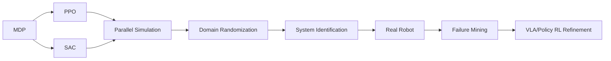

# RL / Sim2Real 路线

## 高频主线

- MDP / Bellman
- PPO clipped objective + GAE
- SAC entropy-regularized objective
- Reward shaping / reward hacking
- Parallel simulation / Isaac Lab
- Domain Randomization + system identification
- Sim2Real gap taxonomy
- Real robot online RL safety / reset / BC regularization
