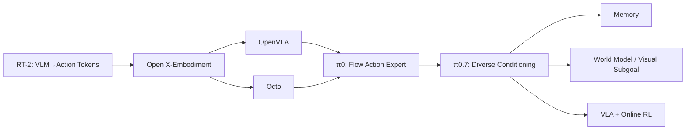

# VLA / Robot Foundation Model 路线

## 建议题目

- [Q051 从零设计 VLA](../questions/06-vlm-vla-foundation-models/Q051.md)
- [Q053 RT-2](../questions/06-vlm-vla-foundation-models/Q053.md)
- [Q054 OpenVLA](../questions/06-vlm-vla-foundation-models/Q054.md)
- [Q055 Octo](../questions/06-vlm-vla-foundation-models/Q055.md)
- [Q056 π0 / continuous action](../questions/06-vlm-vla-foundation-models/Q056.md)
- [Q057 Cross-Embodiment](../questions/06-vlm-vla-foundation-models/Q057.md)
- [Q060 泛化分层](../questions/06-vlm-vla-foundation-models/Q060.md)
- [Q071 VLA vs World Model](../questions/08-world-model-memory-long-horizon/Q071.md)
- [Q077 Memory](../questions/08-world-model-memory-long-horizon/Q077.md)
- [Q094 VLA + RL](../questions/10-system-design-frontier/Q094.md)
- [Q098 2026 趋势](../questions/10-system-design-frontier/Q098.md)
