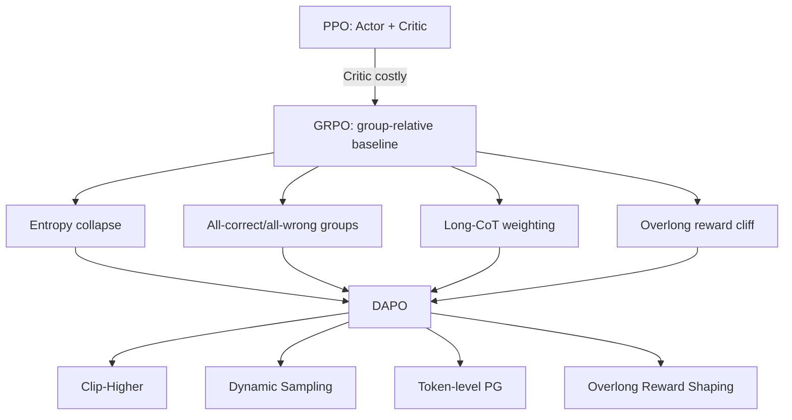
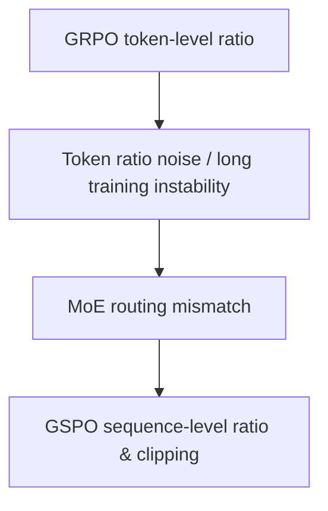

# 算法演化：从 Failure Mode 反推方法

## PPO -> GRPO -> DAPO

## GRPO -> GSPO

**核心原则**：不要说“因为算法更新”。要说“我观察到了某个具体 failure，因此这个机制是最小必要改动”。

<!-- GUIDE_V2 -->
## V2 · Failure-Driven 决策原则

不要把 PPO→GRPO→DAPO/GSPO 画成“新算法替代旧算法”的时间线。更准确的是：**critic 成本、group 退化、长序列权重、entropy、MoE/back-end mismatch、policy freshness** 分别触发不同修正；只在观测到对应 failure 时升级方法。
