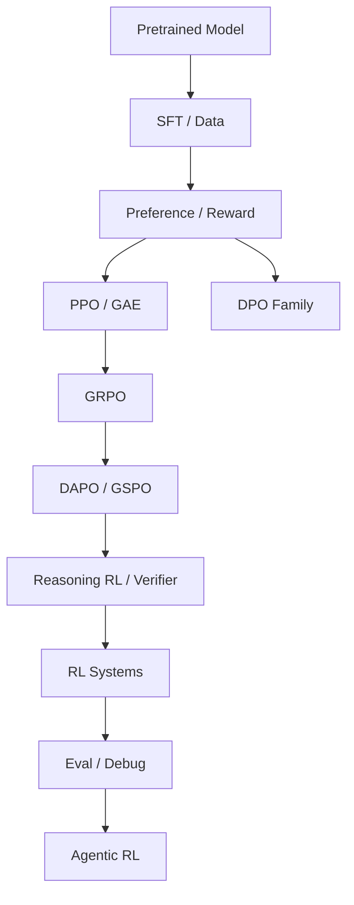

# 十章知识地图

| 章 | 题号 | 主线 | 面试目标 |
|---|---:|---|---|
| 1 | 1-10 | SFT / 数据 | 能解释 post-training 目标与数据工程 |
| 2 | 11-20 | Reward / RM | 能设计 reward 并识别 hacking |
| 3 | 21-30 | PPO / GAE | 能手推经典 RLHF |
| 4 | 31-40 | DPO family | 能从 RLHF 推导 offline preference |
| 5 | 41-50 | GRPO | 理解 group baseline 与 off-policy 工程 |
| 6 | 51-60 | DAPO / GSPO | 掌握 long-CoT RL failure modes |
| 7 | 61-70 | Reasoning / Verifier | 理解 credit 与可验证性 |
| 8 | 71-80 | RL System | 能画数据流、估显存、解 rollout |
| 9 | 81-90 | Eval / Debug | 能从曲线定位问题 |
| 10 | 91-100 | Agentic RL | 能做长程系统设计与项目答辩 |

<!-- GUIDE_V2 -->
## V2 · 依赖关系的读法

把知识图谱视为依赖 DAG：SFT/Data 是数据分布基础；RM/Verifier 定义优化信号；PPO/DPO/GRPO 等定义更新机制；DAPO/GSPO 是 failure-driven 修正；RL System 决定这些公式是否在真实吞吐和版本一致性下成立；Eval/Debug 决定你能否证明改动有效；Agentic RL 把 horizon 与环境交互进一步放大。
