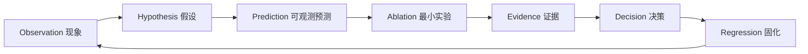

# 后训练研究方法论：从现象到可证伪实验

> 这份页面解决一个比“背算法”更重要的问题：**当训练真的出问题时，如何形成可以被实验否证的判断。**

## 1. 研究闭环

一个专业 post-training 实验不是“改一个超参看分数”，而是：

1. 现象必须能被复现，并且有明确时间点/样本切片。
2. 假设必须对应机制，而不是“可能是学习率”。
3. 假设必须产生一个**中间量预测**，例如 clip fraction 上升、group std 下降、data age 增大。
4. ablation 只改一个因子，并控制 token/compute/evaluator。
5. 结论需要同时覆盖 quality、behavior、stability、system cost。
6. 修复后把 failure case 进入自动 regression。

## 2. 四层假设树

| 层 | 典型问题 | 最小隔离方法 |
|---|---|---|
| Data | 分布、污染、难度、长度、标签错 | 固定 checkpoint，换干净小数据 |
| Reward/Objective | proxy、scale、mask、normalization | 常量/人工 reward、toy batch |
| Optimizer/Algorithm | ratio、clip、advantage、KL | 单卡、同步、固定 old policy |
| System | staleness、通信、OOM、backend mismatch | 单卡 vs 多卡；同步 vs 异步 |

## 3. 三种最常见的伪因果

### 3.1 “reward 涨，所以模型变好”

训练 reward 是优化器直接看到的 proxy。必须用独立 evaluator 验证，并审计 top-reward tail。

### 3.2 “长 CoT 涨，所以 reasoning 变强”

必须做 length-controlled evaluation 或 accuracy/token；否则可能只是更多 test-time compute。

### 3.3 “新算法更好，因为最终分更高”

如果新算法使用了更多 rollout tokens、更强 verifier 或更长训练，就不能把增益归因于 objective。

## 4. 一份合格实验记录必须包含

- Git commit / model checkpoint / tokenizer / chat template
- dataset/reward/verifier/policy version
- generation config：temperature、top-p、max tokens、G
- optimizer config：LR、beta、clip、epochs、batch/token budget
- system config：GPU、节点、sharding、rollout backend、sync policy
- 中间统计：ratio、KL、entropy、reward、length、group std、data age
- 结果：held-out benchmark、行为回归、system throughput
- 失败案例与下一步假设

## 5. 与 100 题的使用方式

每道题的 V2 专业进阶都给出 correctness test、mechanism ablation 与 scaling test。复习时不要把它们当附加阅读，而应把它们变成你自己的“实验设计口述题”。
