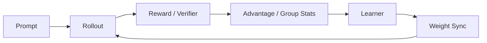

# RL 系统数据流与瓶颈定位

推荐排障顺序：

1. **policy version / dataflow** 是否正确；
2. **reward/verifier** 是否正确；
3. **logprob / ratio / clip / advantage** 的数值是否符合假设；
4. **mask / length normalization / padding**；
5. **distributed consistency**；
6. 最后才是 LR、batch、clip 等超参。

大量“算法不收敛”其实是 staleness、数据或版本 bug。

<!-- PROFESSIONAL_FOOTER -->
## 使用建议

把本页内容与具体问题文件联动使用：先选一个 Qxxx，按本页模板做白板/实验/项目复盘；记录自己无法回答的变量、指标和反例，再回到对应章节补齐。目标是形成**可迁移的问题解决结构**，而不是增加背诵量。
