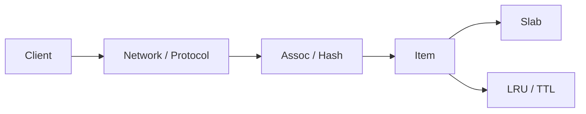

# 第 002 题 · 为什么说 Memcached 是 Cache，而不是 Database？

> **必刷题** · **P0** · ★★★★★ · 基础架构与设计哲学  
> 本文是 PDF 对应题目的扩展版：保留原答案，并补充源码、复杂度、并发不变量、生产实践与实验。

## 题目

**为什么说 Memcached 是 Cache，而不是 Database？**

## 面试官在考什么

这道题用于判断候选人是否真正理解 **架构边界、KV 语义与“为什么做减法”**。

面试官通常不会满足于“术语定义”，而会沿着 `为什么说 Memcached 是 Cache，而不是 Database？` 继续追问到：**状态如何变化、哪个模块拥有这份状态、并发下怎样保持不变量、生产中用什么指标证明判断**。优秀回答应先给 30 秒结论，再主动给出一个反例或故障场景。

## 30-90 秒标准回答

> 它保存的是可重建数据的临时副本，而不是权威事实；数据可能因 TTL、eviction、重启或节点故障而消失。

面试时建议先讲上面这句话，再根据追问选择展开源码或生产侧影响，不要一开始就陷入函数细节。

## 心智模型

**系统边界：** 把 Memcached 看成“网络接口 + 本地 KV 内核”。关键不是 API 多，而是主动缩小问题：完整 key 精确查找、数据可丢、价值可重建。



## 深度机制

### 1. 应用必须把 MISS 设计成正常路径。

单个 MISS 很便宜，集中 MISS 会把缓存层吸收掉的请求重新暴露给 origin；因此生产设计必须把 miss amplification 当成核心容量约束。
### 2. 没有 WAL/fsync/事务持久性保证。

从“系统边界”看，这一结论的重点不是记住术语，而是明确职责边界和失败方式。把 Memcached 看成“网络接口 + 本地 KV 内核”。关键不是 API 多，而是主动缩小问题：完整 key 精确查找、数据可丢、价值可重建。
### 3. 把 session、计费余额等不可丢数据只存在 Memcached 是架构风险。

从“系统边界”看，这一结论的重点不是记住术语，而是明确职责边界和失败方式。把 Memcached 看成“网络接口 + 本地 KV 内核”。关键不是 API 多，而是主动缩小问题：完整 key 精确查找、数据可丢、价值可重建。

## 系统不变量

- **不变量 1：** Cache 数据必须可重建；MISS 不是异常。
- **不变量 2：** Key 是服务端唯一主要查询入口；value 对服务端近似 opaque bytes。

这些不变量比记忆具体函数名更稳定。版本升级可能调整代码组织，但破坏这些约束通常意味着正确性或生命周期出现问题。

## 复杂度与性能分析

- 单次操作通常很便宜，生产尾延迟更多由网络 RTT、序列化、锁等待和 miss 路径决定。
- 面试回答要把“算法复杂度”和“系统成本模型”分开。

进一步分析时要区分三个层面：**算法复杂度**（如 Hash 平均 O(1)）、**微架构成本**（cache miss、pointer chasing、cache-line bouncing）和 **系统成本**（RTT、序列化、回源）。高水平回答会主动指出这三者不是一回事。

## 源码导航

> PDF 源码锚点：`memcached.h` 的 `struct item`，以及官方首页对 in-memory KV cache 的定义。

建议优先阅读以下 Memcached 1.6.45 文件：

- [`memcached.h`](https://github.com/memcached/memcached/blob/1.6.45/memcached.h)
- [`memcached.c`](https://github.com/memcached/memcached/blob/1.6.45/memcached.c)

源码阅读方法：先定位入口函数，再跟踪 **Item 指针如何变化、何时加锁、何时 publication/unlink、何时释放引用**。不要按文件从第一行顺序阅读。

## 工程与生产实践

1. **先确认语义边界：** 本题讨论的是 架构边界、KV 语义与“为什么做减法”，先区分 server 内部机制、客户端路由和应用回源三层，避免跨层归因。
2. **把关键路径画出来：** 对 `为什么说 Memcached 是 Cache，而不是 Database？` 至少能指出输入、关键状态、输出以及失败路径；如果涉及 Item，要明确 Hash/LRU/Slab/refcount 中哪些会变化。
3. **用指标证伪：** 用 RTO/RPO 思维反问：缓存全部丢失后多久恢复到目标命中率？origin 能承受多大的冷启动 QPS？
4. **准备一个故障反例：** 如果缓存命中率 99.9% 但 MISS 回源是一个 2 秒重查询，剩余 0.1% 仍可能主导 P99；“可重建”必须同时考虑回源成本。
5. **版本意识：** 本仓库源码锚定 Memcached `1.6.45`；默认参数与现代特性应以该版本官方源码/文档为准。

## 常见易错点

> “在内存里”不是 Cache 与 Database 的核心区别，核心是可靠性语义。

再补充两个通用陷阱：

- 把“默认值”说成“协议永远固定值”；例如 item size、线程数等都应区分默认配置与不可变约束。
- 把“当前实现细节”说成“KV cache 必然原理”；面试中应先讲不变量，再讲 Memcached 的具体实现。

## 高频追问

### 追问 1：TTL=0 是否意味着永不丢失？

**回答提示：** 只表示不因 TTL 自然过期；仍可能 eviction、flush、重启或节点故障而丢失。
### 追问 2：Warm Restart 是否等于持久化？

**回答提示：** 它降低进程重启后的冷缓存冲击，但不是 WAL/复制意义上的持久化保证。

## 动手验证

```bash
# 启动本地实例后，用基础文本协议观察行为
printf "set foo 0 5 3\r\nbar\r\nget foo\r\n" | nc 127.0.0.1 11211
```

观察 `STORED`、`VALUE`、TTL 到期后的 `END`；把“协议语义”和“应用 Cache Aside”明确分开。

完成实验后，至少记录：**预期 → 实际 → 为什么 → 对生产设计有什么影响**。只跑通命令而没有解释，不算真正掌握。

## 面试表达模板

> **第一句给结论：** 它保存的是可重建数据的临时副本，而不是权威事实；数据可能因 TTL、eviction、重启或节点故障而消失。  
> **第二层讲机制：** 用 1 张状态/调用链图说明“谁维护什么状态、何时改变”。  
> **第三层讲边界：** 把 TTL 设为 0 并不会把 Memcached 变成数据库；no-expire 只取消时间到期，不取消 eviction、进程退出和节点故障。  
> **第四层落生产：** 给出一个指标或算式，例如：用 RTO/RPO 思维反问：缓存全部丢失后多久恢复到目标命中率？origin 能承受多大的冷启动 QPS？

## 专家级展开（V2）

### A. 从第一性原理推导

Cache 与 Database 的边界应从“权威性”和“恢复语义”判断，而不是从“是否在内存”判断。Memcached 的核心假设是对象可丢失、可重建，因此允许用 eviction 换容量效率。

这道题建议使用“**状态 → 所有者 → 转移条件 → 失败后果**”四步法推导，而不是背结论。先确定哪份状态是核心，再问由哪个模块维护，随后说明状态何时迁移，最后指出违反不变量会表现为什么 bug 或性能问题。

### B. 关键源码符号与阅读顺序

- `item_unlink`
- `item_remove`
- `slabs_free`
- `flush_all`

建议在 `memcached-1.6.45` 源码树中用下面的方式定位，而不是按文件顺序从头读：

```bash
git grep -n "\bitem_unlink\b" -- memcached.c assoc.c items.c
git grep -n "\bitem_remove\b" -- memcached.c assoc.c items.c
git grep -n "\bslabs_free\b" -- memcached.c assoc.c items.c
git grep -n "\bflush_all\b" -- memcached.c assoc.c items.c
```

阅读函数时至少记录 5 个问题：**入参中的 key/hash/item 是谁创建的、当前持有哪些锁、item 是否已 `ITEM_LINKED`、refcount 谁持有、失败路径最终由谁释放资源**。

### C. 边界条件与反例

把 TTL 设为 0 并不会把 Memcached 变成数据库；no-expire 只取消时间到期，不取消 eviction、进程退出和节点故障。

面试中主动讲边界条件很加分，因为它能证明你区分了“默认实现”“协议语义”“架构经验”和“数学近似”。尤其要避免把平均 O(1)、默认 1MB、client-side hashing 等表述成无条件真理。

### D. 生产故障推演

如果缓存命中率 99.9% 但 MISS 回源是一个 2 秒重查询，剩余 0.1% 仍可能主导 P99；“可重建”必须同时考虑回源成本。

遇到这类问题时，建议把故障链写成：

```text
触发条件 → Memcached 内部状态变化 → HIT/MISS/P99 变化 → origin/网络/CPU 后果 → 保护或恢复动作
```

这样回答能自然从源码层过渡到生产系统，而不是把“源码题”和“系统设计题”割裂开。

### E. 定量分析 / 可验证指标

用 RTO/RPO 思维反问：缓存全部丢失后多久恢复到目标命中率？origin 能承受多大的冷启动 QPS？

工程上至少给出一个可以**测量或计算**的量。没有数字的“性能更好”“内存更省”“更稳定”通常无法指导容量规划，也很难在故障现场验证。

## 关联题目

- [001. Memcached 是什么？为什么它能够作为 KV 存储？](../01-architecture-design/001.md)
- [003. Memcached 为什么快？](../01-architecture-design/003.md)
- [004. Memcached 与 Redis 最根本的区别是什么？](../01-architecture-design/004.md)

## 官方参考

- **S1** [Memcached 官方首页 / Downloads](https://www.memcached.org/) — 项目定位、下载与版本入口。
- **S2** [Basic Text Protocol](https://docs.memcached.org/protocols/basic/) — 基础文本协议与命令语义。
- **S4** [Protocols Overview](https://docs.memcached.org/protocols/) — 当前协议状态；Binary Protocol 已 deprecated。

---

[← 上一题](../01-architecture-design/001.md) | [本章目录](README.md) | [下一题 →](../01-architecture-design/003.md)
