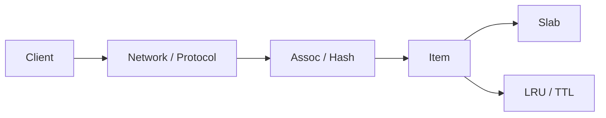

# 第 1 章 · 基础架构与设计哲学

> **本章模型：系统边界**  
> 把 Memcached 看成“网络接口 + 本地 KV 内核”。关键不是 API 多，而是主动缩小问题：完整 key 精确查找、数据可丢、价值可重建。

## V2 本章深挖目标

**核心能力：架构与边界。** 先把 Memcached 看成“网络化内存 HashMap + 生命周期管理”，重点区分 Cache/Database、server/client 责任和功能做减法带来的性能。

- **源码锚点：** `memcached.c / assoc.c / items.c`
- **面试要求：** 每题至少准备一个“反例/边界条件”和一个“可量化指标”。
- **源码要求：** 遇到函数名要能回答它的输入、持有的锁、Item linked/refcount 状态以及失败路径。
- **生产要求：** 能把内部状态变化连接到 `hit/miss → P99 → origin/CPU/network` 的故障链。

> 完成本章后，不应只会定义术语；应能够解释“为什么这么设计、哪种 workload 下会退化、如何用实验或指标证明”。

## 本章 10 题

| 题目 | 难度 | 重要度 | 必刷 |
|---|---:|---:|:---:|
| [001. Memcached 是什么？为什么它能够作为 KV 存储？](001.md) | P0 | ★★★★★ | ⭐ |
| [002. 为什么说 Memcached 是 Cache，而不是 Database？](002.md) | P0 | ★★★★★ | ⭐ |
| [003. Memcached 为什么快？](003.md) | P0 | ★★★★★ | ⭐ |
| [004. Memcached 与 Redis 最根本的区别是什么？](004.md) | P0 | ★★★★☆ |  |
| [005. Memcached 是不是一个分布式系统？](005.md) | P0 | ★★★★★ | ⭐ |
| [006. Memcached 的分布式逻辑到底在哪里？](006.md) | P0 | ★★★★☆ |  |
| [007. Memcached 存进去的对象到底是什么？](007.md) | P0 | ★★★★☆ |  |
| [008. 为什么 Memcached 不支持 SQL、范围查询和 JOIN？](008.md) | P0 | ★★★★☆ |  |
| [009. set、add、replace 的语义差异是什么？](009.md) | P0 | ★★★★☆ |  |
| [010. Cache miss 后 Memcached 会自动查数据库吗？](010.md) | P0 | ★★★★☆ |  |

## 阅读建议

1. 先在不看答案的情况下，用 60-90 秒口述结论。
2. 再看“深度机制”和“源码导航”，把术语落到数据结构/函数。
3. 最后完成“动手验证”，并回答追问。
4. 能白板画出本章 Mermaid 图，并解释每条边的职责，才算真正掌握。
