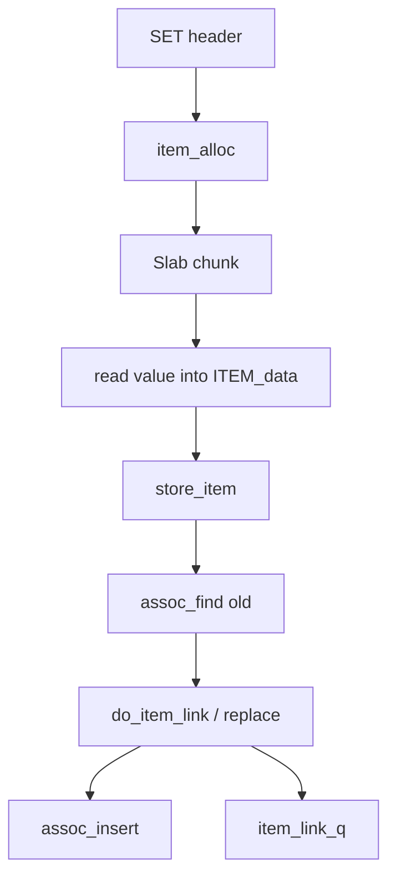

# 第 014 题 · 新 Item 在什么时候真正对 GET 可见？

> **必刷题** · **P0** · ★★★★★ · Item 与 SET/GET 源码链路  
> 本文是 PDF 对应题目的扩展版：保留原答案，并补充源码、复杂度、并发不变量、生产实践与实验。

## 题目

**新 Item 在什么时候真正对 GET 可见？**

## 面试官在考什么

这道题用于判断候选人是否真正理解 **Item 生命周期、publication、refcount 与源码热路径**。

面试官通常不会满足于“术语定义”，而会沿着 `新 Item 在什么时候真正对 GET 可见？` 继续追问到：**状态如何变化、哪个模块拥有这份状态、并发下怎样保持不变量、生产中用什么指标证明判断**。优秀回答应先给 30 秒结论，再主动给出一个反例或故障场景。

## 30-90 秒标准回答

> 在成功 do_item_link/replace 并插入 assoc 后才可由新 GET 找到；此前虽有物理内存，但仍是 private object。

面试时建议先讲上面这句话，再根据追问选择展开源码或生产侧影响，不要一开始就陷入函数细节。

## 心智模型

**对象生命周期：** 核心不变量是 construct-before-publish 与 unlink-before-free。Item 把 Hash 索引、LRU 生命周期、Slab 物理内存和并发引用连接起来。



## 深度机制

### 1. 构造阶段：Slab=YES, Hash=NO, LRU=NO。

Slab 的设计核心是 size class + page + fixed-size chunk。它通过复用 chunk 避免在请求热路径频繁进入通用 allocator，但也意味着对象尺寸分布会直接决定内存利用率。
### 2. 发布阶段：ITEM_LINKED + assoc_insert + item_link_q。

从“对象生命周期”看，这一结论的重点不是记住术语，而是明确职责边界和失败方式。核心不变量是 construct-before-publish 与 unlink-before-free。Item 把 Hash 索引、LRU 生命周期、Slab 物理内存和并发引用连接起来。
### 3. 同一 key 的 store 决策在 item lock 范围内完成。

从“对象生命周期”看，这一结论的重点不是记住术语，而是明确职责边界和失败方式。核心不变量是 construct-before-publish 与 unlink-before-free。Item 把 Hash 索引、LRU 生命周期、Slab 物理内存和并发引用连接起来。

## 系统不变量

- **不变量 1：** 未完整构造的 Item 不能被 Hash 发布。
- **不变量 2：** 逻辑 unlink 后，只要 refcount 未归零就不能物理复用 chunk。

这些不变量比记忆具体函数名更稳定。版本升级可能调整代码组织，但破坏这些约束通常意味着正确性或生命周期出现问题。

## 复杂度与性能分析

- 单次操作通常很便宜，生产尾延迟更多由网络 RTT、序列化、锁等待和 miss 路径决定。
- 面试回答要把“算法复杂度”和“系统成本模型”分开。

进一步分析时要区分三个层面：**算法复杂度**（如 Hash 平均 O(1)）、**微架构成本**（cache miss、pointer chasing、cache-line bouncing）和 **系统成本**（RTT、序列化、回源）。高水平回答会主动指出这三者不是一回事。

## 源码导航

> PDF 源码锚点：`proto_text.c` / `proto_parser.c` → `items.c` → `slabs.c` → `assoc.c`。

建议优先阅读以下 Memcached 1.6.45 文件：

- [`memcached.h`](https://github.com/memcached/memcached/blob/1.6.45/memcached.h)
- [`proto_text.c`](https://github.com/memcached/memcached/blob/1.6.45/proto_text.c)
- [`proto_parser.c`](https://github.com/memcached/memcached/blob/1.6.45/proto_parser.c)
- [`items.c`](https://github.com/memcached/memcached/blob/1.6.45/items.c)
- [`assoc.c`](https://github.com/memcached/memcached/blob/1.6.45/assoc.c)
- [`slabs.c`](https://github.com/memcached/memcached/blob/1.6.45/slabs.c)
- [`thread.c`](https://github.com/memcached/memcached/blob/1.6.45/thread.c)

源码阅读方法：先定位入口函数，再跟踪 **Item 指针如何变化、何时加锁、何时 publication/unlink、何时释放引用**。不要按文件从第一行顺序阅读。

## 工程与生产实践

1. **先确认语义边界：** 本题讨论的是 Item 生命周期、publication、refcount 与源码热路径，先区分 server 内部机制、客户端路由和应用回源三层，避免跨层归因。
2. **把关键路径画出来：** 对 `新 Item 在什么时候真正对 GET 可见？` 至少能指出输入、关键状态、输出以及失败路径；如果涉及 Item，要明确 Hash/LRU/Slab/refcount 中哪些会变化。
3. **用指标证伪：** 用并发 GET 在 SET body 分片延迟发送期间持续读取，验证 link 前始终 MISS/旧值，完成后才切换。
4. **准备一个故障反例：** 若错误地在 value 完成前 assoc_insert，另一个线程可能读到未完成对象；construct-before-publish 正是防止这种读写撕裂。
5. **版本意识：** 本仓库源码锚定 Memcached `1.6.45`；默认参数与现代特性应以该版本官方源码/文档为准。

## 常见易错点

> 不要把“拿到 slab chunk”误认为“已经写入缓存”。

再补充两个通用陷阱：

- 把“默认值”说成“协议永远固定值”；例如 item size、线程数等都应区分默认配置与不可变约束。
- 把“当前实现细节”说成“KV cache 必然原理”；面试中应先讲不变量，再讲 Memcached 的具体实现。

## 高频追问

### 追问 1：为什么这是类似“提交点”的概念？

**回答提示：** 先复述边界，再用本题核心机制回答：在成功 do_item_link/replace 并插入 assoc 后才可由新 GET 找到；此前虽有物理内存，但仍是 private object。 最后补充一个生产后果或失败场景，避免只给术语。
### 追问 2：Hash 先插还是 LRU 先插有什么影响？

**回答提示：** 先复述边界，再用本题核心机制回答：在成功 do_item_link/replace 并插入 assoc 后才可由新 GET 找到；此前虽有物理内存，但仍是 private object。 最后补充一个生产后果或失败场景，避免只给术语。

## 动手验证

```bash
# 在 Memcached 源码目录定位主调用链
git grep -n "process_update_command"
git grep -n "do_item_alloc"
git grep -n "do_item_link"
git grep -n "assoc_insert"
git grep -n "item_link_q"
```

建议用调试构建在这些函数打断点，对一次 `set foo` 记录 item 指针、refcount、`h_next/next/prev` 的变化。

完成实验后，至少记录：**预期 → 实际 → 为什么 → 对生产设计有什么影响**。只跑通命令而没有解释，不算真正掌握。

## 面试表达模板

> **第一句给结论：** 在成功 do_item_link/replace 并插入 assoc 后才可由新 GET 找到；此前虽有物理内存，但仍是 private object。  
> **第二层讲机制：** 用 1 张状态/调用链图说明“谁维护什么状态、何时改变”。  
> **第三层讲边界：** publication 不是数据库事务提交：Memcached 不提供跨 key 原子性，也不对数据库状态做一致性承诺。  
> **第四层落生产：** 给出一个指标或算式，例如：用并发 GET 在 SET body 分片延迟发送期间持续读取，验证 link 前始终 MISS/旧值，完成后才切换。

## 专家级展开（V2）

### A. 从第一性原理推导

新 Item 对 GET 可见的关键是进入 assoc，而不是“内存已写完”。do_item_link 把构造完成的对象发布到 Hash，并把它接入 LRU；这是逻辑可见性边界。

这道题建议使用“**状态 → 所有者 → 转移条件 → 失败后果**”四步法推导，而不是背结论。先确定哪份状态是核心，再问由哪个模块维护，随后说明状态何时迁移，最后指出违反不变量会表现为什么 bug 或性能问题。

### B. 关键源码符号与阅读顺序

- `do_item_link`
- `ITEM_LINKED`
- `assoc_insert`
- `item_link_q`
- `refcount_incr`

建议在 `memcached-1.6.45` 源码树中用下面的方式定位，而不是按文件顺序从头读：

```bash
git grep -n "\bdo_item_link\b" -- proto_text.c proto_parser.c items.c thread.c assoc.c slabs.c
git grep -n "\bITEM_LINKED\b" -- proto_text.c proto_parser.c items.c thread.c assoc.c slabs.c
git grep -n "\bassoc_insert\b" -- proto_text.c proto_parser.c items.c thread.c assoc.c slabs.c
git grep -n "\bitem_link_q\b" -- proto_text.c proto_parser.c items.c thread.c assoc.c slabs.c
git grep -n "\brefcount_incr\b" -- proto_text.c proto_parser.c items.c thread.c assoc.c slabs.c
```

阅读函数时至少记录 5 个问题：**入参中的 key/hash/item 是谁创建的、当前持有哪些锁、item 是否已 `ITEM_LINKED`、refcount 谁持有、失败路径最终由谁释放资源**。

### C. 边界条件与反例

publication 不是数据库事务提交：Memcached 不提供跨 key 原子性，也不对数据库状态做一致性承诺。

面试中主动讲边界条件很加分，因为它能证明你区分了“默认实现”“协议语义”“架构经验”和“数学近似”。尤其要避免把平均 O(1)、默认 1MB、client-side hashing 等表述成无条件真理。

### D. 生产故障推演

若错误地在 value 完成前 assoc_insert，另一个线程可能读到未完成对象；construct-before-publish 正是防止这种读写撕裂。

遇到这类问题时，建议把故障链写成：

```text
触发条件 → Memcached 内部状态变化 → HIT/MISS/P99 变化 → origin/网络/CPU 后果 → 保护或恢复动作
```

这样回答能自然从源码层过渡到生产系统，而不是把“源码题”和“系统设计题”割裂开。

### E. 定量分析 / 可验证指标

用并发 GET 在 SET body 分片延迟发送期间持续读取，验证 link 前始终 MISS/旧值，完成后才切换。

工程上至少给出一个可以**测量或计算**的量。没有数字的“性能更好”“内存更省”“更稳定”通常无法指导容量规划，也很难在故障现场验证。

## 关联题目

- [012. 从 set foo bar 开始，说出核心源码调用链。](../02-item-set-get-source/012.md)
- [013. 为什么 Memcached 先分配 Item，再读取 value？](../02-item-set-get-source/013.md)
- [015. Item 为什么需要 refcount？](../02-item-set-get-source/015.md)
- [016. 第二次 set foo newValue 是直接覆盖旧内存吗？](../02-item-set-get-source/016.md)

## 官方参考

- **S5** [memcached.h @ 1.6.45](https://github.com/memcached/memcached/blob/1.6.45/memcached.h) — struct item、conn、flags、配置结构。
- **S6** [items.c @ 1.6.45](https://github.com/memcached/memcached/blob/1.6.45/items.c) — Item alloc/link/unlink、LRU 与生命周期。
- **S7** [assoc.c @ 1.6.45](https://github.com/memcached/memcached/blob/1.6.45/assoc.c) — 本地 HashTable、find/insert/delete、rehash。
- **S8** [slabs.c @ 1.6.45](https://github.com/memcached/memcached/blob/1.6.45/slabs.c) — Slab class、page、chunk、freelist 与 reassign。
- **S9** [thread.c @ 1.6.45](https://github.com/memcached/memcached/blob/1.6.45/thread.c) — Worker、item locks、LRU locks 与线程调度。

---

[← 上一题](../02-item-set-get-source/013.md) | [本章目录](README.md) | [下一题 →](../02-item-set-get-source/015.md)
