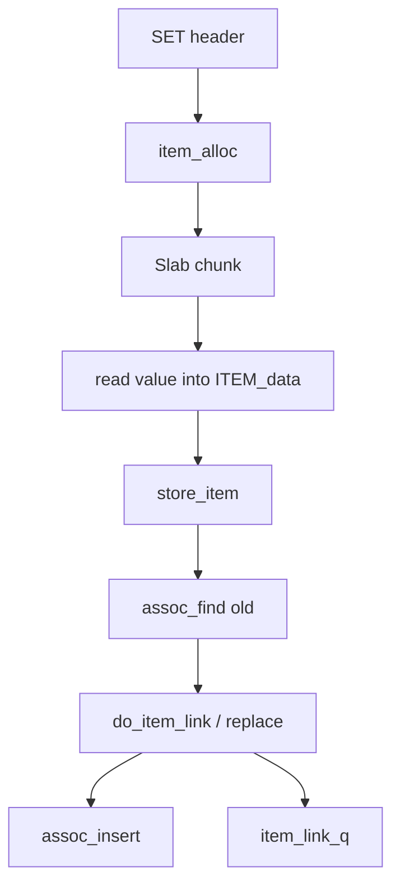

# 第 2 章 · Item 与 SET/GET 源码链路

> **本章模型：对象生命周期**  
> 核心不变量是 construct-before-publish 与 unlink-before-free。Item 把 Hash 索引、LRU 生命周期、Slab 物理内存和并发引用连接起来。

## V2 本章深挖目标

**核心能力：Item 与请求生命周期。** 本章要求能白板画出 SET/GET/DELETE 的对象生命周期，特别掌握 construct-before-publish、unlink-before-free、refcount 与 replace。

- **源码锚点：** `proto_text.c / proto_parser.c / items.c / thread.c`
- **面试要求：** 每题至少准备一个“反例/边界条件”和一个“可量化指标”。
- **源码要求：** 遇到函数名要能回答它的输入、持有的锁、Item linked/refcount 状态以及失败路径。
- **生产要求：** 能把内部状态变化连接到 `hit/miss → P99 → origin/CPU/network` 的故障链。

> 完成本章后，不应只会定义术语；应能够解释“为什么这么设计、哪种 workload 下会退化、如何用实验或指标证明”。

## 本章 10 题

| 题目 | 难度 | 重要度 | 必刷 |
|---|---:|---:|:---:|
| [011. 为什么 struct item 是 Memcached 最核心的数据结构？](011.md) | P0 | ★★★★★ | ⭐ |
| [012. 从 set foo bar 开始，说出核心源码调用链。](012.md) | P0 | ★★★★★ | ⭐ |
| [013. 为什么 Memcached 先分配 Item，再读取 value？](013.md) | P1 | ★★★☆☆ |  |
| [014. 新 Item 在什么时候真正对 GET 可见？](014.md) | P0 | ★★★★★ | ⭐ |
| [015. Item 为什么需要 refcount？](015.md) | P0 | ★★★★★ | ⭐ |
| [016. 第二次 set foo newValue 是直接覆盖旧内存吗？](016.md) | P1 | ★★★☆☆ |  |
| [017. delete foo 在内部发生什么？](017.md) | P1 | ★★★☆☆ |  |
| [018. get foo 的源码逻辑如何走？](018.md) | P1 | ★★★☆☆ |  |
| [019. append/prepend 为什么比普通 set 更复杂？](019.md) | P1 | ★★★☆☆ |  |
| [020. Memcached 的 CAS 是怎么工作的？](020.md) | P0 | ★★★★☆ |  |

## 阅读建议

1. 先在不看答案的情况下，用 60-90 秒口述结论。
2. 再看“深度机制”和“源码导航”，把术语落到数据结构/函数。
3. 最后完成“动手验证”，并回答追问。
4. 能白板画出本章 Mermaid 图，并解释每条边的职责，才算真正掌握。
