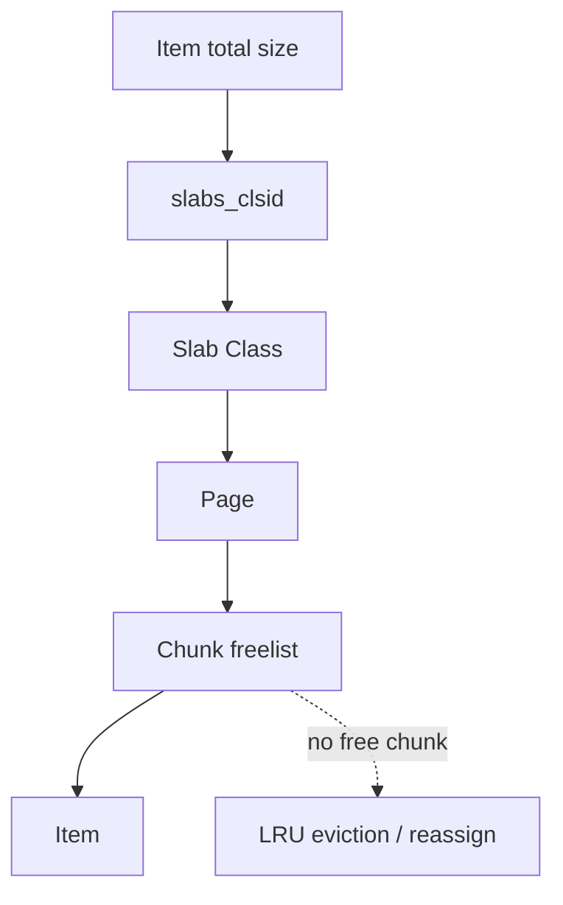

# 第 023 题 · Slab Class 为什么需要 Growth Factor？

> **P1** · ★★★☆☆ · Slab Allocator 与内存管理  
> 本文是 PDF 对应题目的扩展版：保留原答案，并补充源码、复杂度、并发不变量、生产实践与实验。

## 题目

**Slab Class 为什么需要 Growth Factor？**

## 面试官在考什么

这道题用于判断候选人是否真正理解 **Slab 内存池、碎片、容量错配与 page 迁移**。

面试官通常不会满足于“术语定义”，而会沿着 `Slab Class 为什么需要 Growth Factor？` 继续追问到：**状态如何变化、哪个模块拥有这份状态、并发下怎样保持不变量、生产中用什么指标证明判断**。优秀回答应先给 30 秒结论，再主动给出一个反例或故障场景。

## 30-90 秒标准回答

> 不可能为每个字节大小建立一个 class，因此按倍率递增 chunk size，在 class 数量和内部碎片之间折中；默认常见因子为 1.25。

面试时建议先讲上面这句话，再根据追问选择展开源码或生产侧影响，不要一开始就陷入函数细节。

## 心智模型

**内存池模型：** Slab 通过 size class 把不可控的通用分配问题转换为可控的 page/chunk/freelist 管理；优化对象分配稳定性，同时接受内部碎片。



## 深度机制

### 1. 因子小：碎片低但 class 多。

从“内存池模型”看，这一结论的重点不是记住术语，而是明确职责边界和失败方式。Slab 通过 size class 把不可控的通用分配问题转换为可控的 page/chunk/freelist 管理；优化对象分配稳定性，同时接受内部碎片。
### 2. 因子大：class 少但浪费增加。

从“内存池模型”看，这一结论的重点不是记住术语，而是明确职责边界和失败方式。Slab 通过 size class 把不可控的通用分配问题转换为可控的 page/chunk/freelist 管理；优化对象分配稳定性，同时接受内部碎片。
### 3. 对象大小分布决定最优参数。

从“内存池模型”看，这一结论的重点不是记住术语，而是明确职责边界和失败方式。Slab 通过 size class 把不可控的通用分配问题转换为可控的 page/chunk/freelist 管理；优化对象分配稳定性，同时接受内部碎片。

## 系统不变量

- **不变量 1：** 一个 Item 必须落入能够容纳其总尺寸的 class/chunk。
- **不变量 2：** 被重新放回 freelist 的 chunk 不能仍被 Hash/LRU/活跃引用访问。

这些不变量比记忆具体函数名更稳定。版本升级可能调整代码组织，但破坏这些约束通常意味着正确性或生命周期出现问题。

## 复杂度与性能分析

- chunk 申请/归还的目标是接近 O(1) freelist 操作。
- 容量效率取决于对象尺寸分布、growth factor、page 分配和内部碎片。

进一步分析时要区分三个层面：**算法复杂度**（如 Hash 平均 O(1)）、**微架构成本**（cache miss、pointer chasing、cache-line bouncing）和 **系统成本**（RTT、序列化、回源）。高水平回答会主动指出这三者不是一回事。

## 源码导航


建议优先阅读以下 Memcached 1.6.45 文件：

- [`memcached.h`](https://github.com/memcached/memcached/blob/1.6.45/memcached.h)
- [`items.c`](https://github.com/memcached/memcached/blob/1.6.45/items.c)
- [`slabs.c`](https://github.com/memcached/memcached/blob/1.6.45/slabs.c)
- [`slabs.h`](https://github.com/memcached/memcached/blob/1.6.45/slabs.h)

源码阅读方法：先定位入口函数，再跟踪 **Item 指针如何变化、何时加锁、何时 publication/unlink、何时释放引用**。不要按文件从第一行顺序阅读。

## 工程与生产实践

1. **先确认语义边界：** 本题讨论的是 Slab 内存池、碎片、容量错配与 page 迁移，先区分 server 内部机制、客户端路由和应用回源三层，避免跨层归因。
2. **把关键路径画出来：** 对 `Slab Class 为什么需要 Growth Factor？` 至少能指出输入、关键状态、输出以及失败路径；如果涉及 Item，要明确 Hash/LRU/Slab/refcount 中哪些会变化。
3. **用指标证伪：** 对尺寸样本 s，计算 allocated(s)=min(class_size>=s)，再求 Σallocated/Σactual 得到 slab 放大倍数。
4. **准备一个故障反例：** 若大量对象恰好略高于某个 chunk size，会全部被提升到下一 class，形成明显内存放大。
5. **版本意识：** 本仓库源码锚定 Memcached `1.6.45`；默认参数与现代特性应以该版本官方源码/文档为准。

## 常见易错点

> 不能脱离 workload 讨论“最佳 growth factor”。

再补充两个通用陷阱：

- 把“默认值”说成“协议永远固定值”；例如 item size、线程数等都应区分默认配置与不可变约束。
- 把“当前实现细节”说成“KV cache 必然原理”；面试中应先讲不变量，再讲 Memcached 的具体实现。

## 高频追问

### 追问 1：业务对象集中在 500B 附近时怎样调优？

**回答提示：** 先复述边界，再用本题核心机制回答：不可能为每个字节大小建立一个 class，因此按倍率递增 chunk size，在 class 数量和内部碎片之间折中；默认常见因子为 1.25。 最后补充一个生产后果或失败场景，避免只给术语。
### 追问 2：为什么改变 factor 要压测？

**回答提示：** 先复述边界，再用本题核心机制回答：不可能为每个字节大小建立一个 class，因此按倍率递增 chunk size，在 class 数量和内部碎片之间折中；默认常见因子为 1.25。 最后补充一个生产后果或失败场景，避免只给术语。

## 动手验证

```bash
printf "stats settings\r\nstats slabs\r\n" | nc 127.0.0.1 11211
```

重点记录 `growth_factor`、`item_size_max`、各 class 的 chunk/page 信息；再用不同 value 大小写入，观察对象尺寸跨 class 时的变化。

完成实验后，至少记录：**预期 → 实际 → 为什么 → 对生产设计有什么影响**。只跑通命令而没有解释，不算真正掌握。

## 面试表达模板

> **第一句给结论：** 不可能为每个字节大小建立一个 class，因此按倍率递增 chunk size，在 class 数量和内部碎片之间折中；默认常见因子为 1.25。  
> **第二层讲机制：** 用 1 张状态/调用链图说明“谁维护什么状态、何时改变”。  
> **第三层讲边界：** factor 不能脱离对象尺寸分布优化；对天然聚集在若干固定尺寸的 workload，自定义 slab sizes 可能比默认几何序列更合理。  
> **第四层落生产：** 给出一个指标或算式，例如：对尺寸样本 s，计算 allocated(s)=min(class_size>=s)，再求 Σallocated/Σactual 得到 slab 放大倍数。

## 专家级展开（V2）

### A. 从第一性原理推导

Growth Factor 决定 size class 几何级数，控制两个相反目标：factor 小→class 多、内部浪费小；factor 大→class 少、管理简单但平均浪费增大。

这道题建议使用“**状态 → 所有者 → 转移条件 → 失败后果**”四步法推导，而不是背结论。先确定哪份状态是核心，再问由哪个模块维护，随后说明状态何时迁移，最后指出违反不变量会表现为什么 bug 或性能问题。

### B. 关键源码符号与阅读顺序

- `settings.factor`
- `slabs_init`
- `slabclass[].size`

建议在 `memcached-1.6.45` 源码树中用下面的方式定位，而不是按文件顺序从头读：

```bash
git grep -n "\bsettings\b" -- items.c slabs.c slabs.h slabs_mover.c
git grep -n "\bslabs_init\b" -- items.c slabs.c slabs.h slabs_mover.c
git grep -n "\bslabclass\b" -- items.c slabs.c slabs.h slabs_mover.c
```

阅读函数时至少记录 5 个问题：**入参中的 key/hash/item 是谁创建的、当前持有哪些锁、item 是否已 `ITEM_LINKED`、refcount 谁持有、失败路径最终由谁释放资源**。

### C. 边界条件与反例

factor 不能脱离对象尺寸分布优化；对天然聚集在若干固定尺寸的 workload，自定义 slab sizes 可能比默认几何序列更合理。

面试中主动讲边界条件很加分，因为它能证明你区分了“默认实现”“协议语义”“架构经验”和“数学近似”。尤其要避免把平均 O(1)、默认 1MB、client-side hashing 等表述成无条件真理。

### D. 生产故障推演

若大量对象恰好略高于某个 chunk size，会全部被提升到下一 class，形成明显内存放大。

遇到这类问题时，建议把故障链写成：

```text
触发条件 → Memcached 内部状态变化 → HIT/MISS/P99 变化 → origin/网络/CPU 后果 → 保护或恢复动作
```

这样回答能自然从源码层过渡到生产系统，而不是把“源码题”和“系统设计题”割裂开。

### E. 定量分析 / 可验证指标

对尺寸样本 s，计算 allocated(s)=min(class_size>=s)，再求 Σallocated/Σactual 得到 slab 放大倍数。

工程上至少给出一个可以**测量或计算**的量。没有数字的“性能更好”“内存更省”“更稳定”通常无法指导容量规划，也很难在故障现场验证。

## 关联题目

- [021. Memcached 为什么不用普通 malloc/free 管理所有 Item？](../03-slab-memory/021.md)
- [022. Page、Slab Class、Chunk、Item 的关系是什么？](../03-slab-memory/022.md)
- [024. Slab 解决了什么碎片，又引入了什么碎片？](../03-slab-memory/024.md)
- [025. 如何根据 Item 大小选择 Slab Class？](../03-slab-memory/025.md)

## 官方参考

- **S5** [memcached.h @ 1.6.45](https://github.com/memcached/memcached/blob/1.6.45/memcached.h) — struct item、conn、flags、配置结构。
- **S8** [slabs.c @ 1.6.45](https://github.com/memcached/memcached/blob/1.6.45/slabs.c) — Slab class、page、chunk、freelist 与 reassign。
- **S10** [Memcached 1.5.0 Release Notes](https://docs.memcached.org/releasenotes/releasenotes150/) — Segmented LRU、crawler、automove 的重要历史节点。
- **S12** [Server Configuring](https://docs.memcached.org/serverguide/configuring/) — 内存、连接、线程、item size、运行配置。
- **S17** [Performance and Efficiency](https://docs.memcached.org/serverguide/performance/) — 内存占用、回收与性能行为。

---

[← 上一题](../03-slab-memory/022.md) | [本章目录](README.md) | [下一题 →](../03-slab-memory/024.md)
