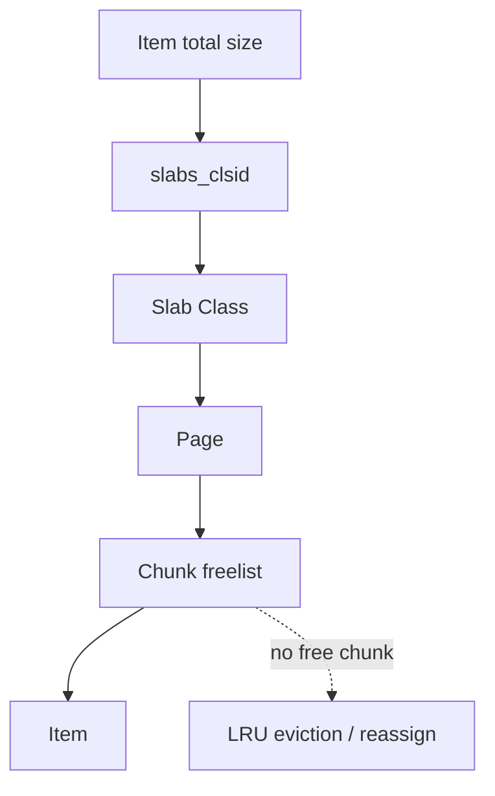

# 第 3 章 · Slab Allocator 与内存管理

> **本章模型：内存池模型**  
> Slab 通过 size class 把不可控的通用分配问题转换为可控的 page/chunk/freelist 管理；优化对象分配稳定性，同时接受内部碎片。

## V2 本章深挖目标

**核心能力：Slab 与容量效率。** 从 item_total_size 推到 class/page/chunk，再解释内部碎片、class imbalance、automove 和容器 RSS 预算。

- **源码锚点：** `items.c / slabs.c / slabs_mover.c`
- **面试要求：** 每题至少准备一个“反例/边界条件”和一个“可量化指标”。
- **源码要求：** 遇到函数名要能回答它的输入、持有的锁、Item linked/refcount 状态以及失败路径。
- **生产要求：** 能把内部状态变化连接到 `hit/miss → P99 → origin/CPU/network` 的故障链。

> 完成本章后，不应只会定义术语；应能够解释“为什么这么设计、哪种 workload 下会退化、如何用实验或指标证明”。

## 本章 10 题

| 题目 | 难度 | 重要度 | 必刷 |
|---|---:|---:|:---:|
| [021. Memcached 为什么不用普通 malloc/free 管理所有 Item？](021.md) | P0 | ★★★★★ | ⭐ |
| [022. Page、Slab Class、Chunk、Item 的关系是什么？](022.md) | P0 | ★★★★★ | ⭐ |
| [023. Slab Class 为什么需要 Growth Factor？](023.md) | P1 | ★★★☆☆ |  |
| [024. Slab 解决了什么碎片，又引入了什么碎片？](024.md) | P0 | ★★★★★ | ⭐ |
| [025. 如何根据 Item 大小选择 Slab Class？](025.md) | P1 | ★★★☆☆ |  |
| [026. 为什么明明还有内存，一个 SET 仍可能发生 eviction？](026.md) | P1 | ★★★★★ | ⭐ |
| [027. Slab Reassign / Automove 是什么？](027.md) | P1 | ★★★☆☆ |  |
| [028. Memcached 如何处理很大的 Item？](028.md) | P2 | ★★★☆☆ |  |
| [029. -m 4G 是否表示进程 RSS 绝对不会超过 4GB？](029.md) | P1 | ★★★☆☆ |  |
| [030. Memcached 最大 Item 是不是固定 1MB？](030.md) | P0 | ★★★★☆ |  |

## 阅读建议

1. 先在不看答案的情况下，用 60-90 秒口述结论。
2. 再看“深度机制”和“源码导航”，把术语落到数据结构/函数。
3. 最后完成“动手验证”，并回答追问。
4. 能白板画出本章 Mermaid 图，并解释每条边的职责，才算真正掌握。
