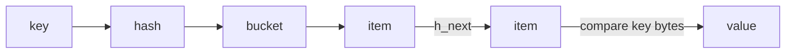

# 第 031 题 · assoc 模块干什么？

> **必刷题** · **P0** · ★★★★★ · Assoc / Hash Table  
> 本文是 PDF 对应题目的扩展版：保留原答案，并补充源码、复杂度、并发不变量、生产实践与实验。

## 题目

**assoc 模块干什么？**

## 面试官在考什么

这道题用于判断候选人是否真正理解 **本地 Hash 索引、碰撞、扩容与多索引不变量**。

面试官通常不会满足于“术语定义”，而会沿着 `assoc 模块干什么？` 继续追问到：**状态如何变化、哪个模块拥有这份状态、并发下怎样保持不变量、生产中用什么指标证明判断**。优秀回答应先给 30 秒结论，再主动给出一个反例或故障场景。

## 30-90 秒标准回答

> Assoc 维护 key → item* 的逻辑寻址，是服务器本地 HashTable；它不拥有业务 value 的独立副本。

面试时建议先讲上面这句话，再根据追问选择展开源码或生产侧影响，不要一开始就陷入函数细节。

## 心智模型

**逻辑寻址：** Assoc 只回答“给定 key 如何找到 item*”。它与 Slab 的“对象放在哪里”、LRU 的“谁先被淘汰”是正交职责。



## 深度机制

### 1. assoc_find/insert/delete 是主要操作。

从“逻辑寻址”看，这一结论的重点不是记住术语，而是明确职责边界和失败方式。Assoc 只回答“给定 key 如何找到 item*”。它与 Slab 的“对象放在哪里”、LRU 的“谁先被淘汰”是正交职责。
### 2. HashTable 与 Slab 的“位置”概念不同：一个是逻辑索引，一个是物理内存。

Slab 的设计核心是 size class + page + fixed-size chunk。它通过复用 chunk 避免在请求热路径频繁进入通用 allocator，但也意味着对象尺寸分布会直接决定内存利用率。
### 3. 同一 item 通过指针被多个结构引用。

从“逻辑寻址”看，这一结论的重点不是记住术语，而是明确职责边界和失败方式。Assoc 只回答“给定 key 如何找到 item*”。它与 Slab 的“对象放在哪里”、LRU 的“谁先被淘汰”是正交职责。
### 4. 逻辑位置 vs 物理位置

从“逻辑寻址”看，这一结论的重点不是记住术语，而是明确职责边界和失败方式。Assoc 只回答“给定 key 如何找到 item*”。它与 Slab 的“对象放在哪里”、LRU 的“谁先被淘汰”是正交职责。
### 5. Assoc 回答“给定 foo，哪个 item* 是它”；Slab 回答“这个 item* 占 RAM 的哪块 chunk”。两套位置相互正交。HashTable resize 可以改变逻辑 bucket，但无需移动 item payload 的物理地址。

Slab 的设计核心是 size class + page + fixed-size chunk。它通过复用 chunk 避免在请求热路径频繁进入通用 allocator，但也意味着对象尺寸分布会直接决定内存利用率。
### 6. 这也是为什么 HashTable 只存指针：多个索引围绕一个对象协作，而不是复制数据。

哈希层需要同时考虑分布质量、计算成本、冲突链和扩容；“能正确 hash”只是第一层要求，生产性能更依赖均匀性与访问局部性。

## 系统不变量

- **不变量 1：** Hash 中同一逻辑 key 的可见对象必须符合 store 命令语义。
- **不变量 2：** 删除 Hash 索引时必须维护其他生命周期结构的一致性。

这些不变量比记忆具体函数名更稳定。版本升级可能调整代码组织，但破坏这些约束通常意味着正确性或生命周期出现问题。

## 复杂度与性能分析

- 平均精确查找可视为 O(1)，碰撞链使最坏情况退化。
- CPU 成本之外还要考虑指针追踪造成的 cache miss，以及扩容期间的额外工作。

进一步分析时要区分三个层面：**算法复杂度**（如 Hash 平均 O(1)）、**微架构成本**（cache miss、pointer chasing、cache-line bouncing）和 **系统成本**（RTT、序列化、回源）。高水平回答会主动指出这三者不是一回事。

## 源码导航

> PDF 源码锚点：`assoc.c` 的 find/insert/delete 与 `item.h_next`。

建议优先阅读以下 Memcached 1.6.45 文件：

- [`assoc.c`](https://github.com/memcached/memcached/blob/1.6.45/assoc.c)
- [`assoc.h`](https://github.com/memcached/memcached/blob/1.6.45/assoc.h)
- [`hash.c`](https://github.com/memcached/memcached/blob/1.6.45/hash.c)
- [`hash.h`](https://github.com/memcached/memcached/blob/1.6.45/hash.h)
- [`memcached.h`](https://github.com/memcached/memcached/blob/1.6.45/memcached.h)

源码阅读方法：先定位入口函数，再跟踪 **Item 指针如何变化、何时加锁、何时 publication/unlink、何时释放引用**。不要按文件从第一行顺序阅读。

## 工程与生产实践

1. **先确认语义边界：** 本题讨论的是 本地 Hash 索引、碰撞、扩容与多索引不变量，先区分 server 内部机制、客户端路由和应用回源三层，避免跨层归因。
2. **把关键路径画出来：** 对 `assoc 模块干什么？` 至少能指出输入、关键状态、输出以及失败路径；如果涉及 Item，要明确 Hash/LRU/Slab/refcount 中哪些会变化。
3. **用指标证伪：** 观察 hashpower、hash_bytes/hash_is_expanding（若版本 stats 暴露）并结合 CPU/latency 判断。
4. **准备一个故障反例：** HashTable 扩容期间 GET P99 上升时，应区分 hash expansion 开销与 slab eviction；两套指标和源码路径不同。
5. **版本意识：** 本仓库源码锚定 Memcached `1.6.45`；默认参数与现代特性应以该版本官方源码/文档为准。

## 常见易错点

> Assoc 是理解 KV 查找路径的核心。

再补充两个通用陷阱：

- 把“默认值”说成“协议永远固定值”；例如 item size、线程数等都应区分默认配置与不可变约束。
- 把“当前实现细节”说成“KV cache 必然原理”；面试中应先讲不变量，再讲 Memcached 的具体实现。

## 高频追问

### 追问 1：为什么不直接把 value 放 bucket？

**回答提示：** 先复述边界，再用本题核心机制回答：Assoc 维护 key → item* 的逻辑寻址，是服务器本地 HashTable；它不拥有业务 value 的独立副本。 最后补充一个生产后果或失败场景，避免只给术语。
### 追问 2：HashTable resize 时 item 会搬内存吗？

**回答提示：** 先复述边界，再用本题核心机制回答：Assoc 维护 key → item* 的逻辑寻址，是服务器本地 HashTable；它不拥有业务 value 的独立副本。 最后补充一个生产后果或失败场景，避免只给术语。

## 动手验证

```bash
# 源码定位本地哈希表路径
git grep -n "assoc_find"
git grep -n "assoc_insert"
git grep -n "assoc_delete"
```

画出一个 bucket 下 3 个冲突 item 的 `h_next` 链，再单独画同一批 item 的 LRU `next/prev` 链，确保不会把两套指针混为一谈。

完成实验后，至少记录：**预期 → 实际 → 为什么 → 对生产设计有什么影响**。只跑通命令而没有解释，不算真正掌握。

## 面试表达模板

> **第一句给结论：** Assoc 维护 key → item* 的逻辑寻址，是服务器本地 HashTable；它不拥有业务 value 的独立副本。  
> **第二层讲机制：** 用 1 张状态/调用链图说明“谁维护什么状态、何时改变”。  
> **第三层讲边界：** 把 assoc 与 Slab 混淆会导致错误推理：Hash 空间足够并不意味着 item 内存足够，Slab 有空闲也不意味着 key 可寻址。  
> **第四层落生产：** 给出一个指标或算式，例如：观察 hashpower、hash_bytes/hash_is_expanding（若版本 stats 暴露）并结合 CPU/latency 判断。

## 专家级展开（V2）

### A. 从第一性原理推导

assoc 是 Memcached 的本地地址索引层，只负责 key→item* 的查找、插入、删除和扩容；它不拥有 value 内存，也不决定 eviction。

这道题建议使用“**状态 → 所有者 → 转移条件 → 失败后果**”四步法推导，而不是背结论。先确定哪份状态是核心，再问由哪个模块维护，随后说明状态何时迁移，最后指出违反不变量会表现为什么 bug 或性能问题。

### B. 关键源码符号与阅读顺序

- `assoc_init`
- `assoc_find`
- `assoc_insert`
- `assoc_delete`
- `primary_hashtable`

建议在 `memcached-1.6.45` 源码树中用下面的方式定位，而不是按文件顺序从头读：

```bash
git grep -n "\bassoc_init\b" -- assoc.c items.c memcached.h
git grep -n "\bassoc_find\b" -- assoc.c items.c memcached.h
git grep -n "\bassoc_insert\b" -- assoc.c items.c memcached.h
git grep -n "\bassoc_delete\b" -- assoc.c items.c memcached.h
git grep -n "\bprimary_hashtable\b" -- assoc.c items.c memcached.h
```

阅读函数时至少记录 5 个问题：**入参中的 key/hash/item 是谁创建的、当前持有哪些锁、item 是否已 `ITEM_LINKED`、refcount 谁持有、失败路径最终由谁释放资源**。

### C. 边界条件与反例

把 assoc 与 Slab 混淆会导致错误推理：Hash 空间足够并不意味着 item 内存足够，Slab 有空闲也不意味着 key 可寻址。

面试中主动讲边界条件很加分，因为它能证明你区分了“默认实现”“协议语义”“架构经验”和“数学近似”。尤其要避免把平均 O(1)、默认 1MB、client-side hashing 等表述成无条件真理。

### D. 生产故障推演

HashTable 扩容期间 GET P99 上升时，应区分 hash expansion 开销与 slab eviction；两套指标和源码路径不同。

遇到这类问题时，建议把故障链写成：

```text
触发条件 → Memcached 内部状态变化 → HIT/MISS/P99 变化 → origin/网络/CPU 后果 → 保护或恢复动作
```

这样回答能自然从源码层过渡到生产系统，而不是把“源码题”和“系统设计题”割裂开。

### E. 定量分析 / 可验证指标

观察 hashpower、hash_bytes/hash_is_expanding（若版本 stats 暴露）并结合 CPU/latency 判断。

工程上至少给出一个可以**测量或计算**的量。没有数字的“性能更好”“内存更省”“更稳定”通常无法指导容量规划，也很难在故障现场验证。

## 关联题目

- [029. -m 4G 是否表示进程 RSS 绝对不会超过 4GB？](../03-slab-memory/029.md)
- [030. Memcached 最大 Item 是不是固定 1MB？](../03-slab-memory/030.md)
- [032. h_next 和 next/prev 有什么区别？](../04-assoc-hashtable/032.md)
- [033. Memcached 怎么处理 Hash Collision？](../04-assoc-hashtable/033.md)

## 官方参考

- **S5** [memcached.h @ 1.6.45](https://github.com/memcached/memcached/blob/1.6.45/memcached.h) — struct item、conn、flags、配置结构。
- **S7** [assoc.c @ 1.6.45](https://github.com/memcached/memcached/blob/1.6.45/assoc.c) — 本地 HashTable、find/insert/delete、rehash。

---

[← 上一题](../03-slab-memory/030.md) | [本章目录](README.md) | [下一题 →](../04-assoc-hashtable/032.md)
