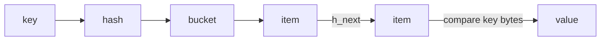

# 第 039 题 · 为什么删除 Item 时必须同时处理 Assoc 与 LRU？

> **P1** · ★★★☆☆ · Assoc / Hash Table  
> 本文是 PDF 对应题目的扩展版：保留原答案，并补充源码、复杂度、并发不变量、生产实践与实验。

## 题目

**为什么删除 Item 时必须同时处理 Assoc 与 LRU？**

## 面试官在考什么

这道题用于判断候选人是否真正理解 **本地 Hash 索引、碰撞、扩容与多索引不变量**。

面试官通常不会满足于“术语定义”，而会沿着 `为什么删除 Item 时必须同时处理 Assoc 与 LRU？` 继续追问到：**状态如何变化、哪个模块拥有这份状态、并发下怎样保持不变量、生产中用什么指标证明判断**。优秀回答应先给 30 秒结论，再主动给出一个反例或故障场景。

## 30-90 秒标准回答

> 一个是可寻址性，一个是淘汰队列成员关系；只修改其中一边会留下 zombie node 或让已“删除”的对象仍可 GET。

面试时建议先讲上面这句话，再根据追问选择展开源码或生产侧影响，不要一开始就陷入函数细节。

## 心智模型

**逻辑寻址：** Assoc 只回答“给定 key 如何找到 item*”。它与 Slab 的“对象放在哪里”、LRU 的“谁先被淘汰”是正交职责。



## 深度机制

### 1. 多索引结构需要共同维护 invariant。

从“逻辑寻址”看，这一结论的重点不是记住术语，而是明确职责边界和失败方式。Assoc 只回答“给定 key 如何找到 item*”。它与 Slab 的“对象放在哪里”、LRU 的“谁先被淘汰”是正交职责。
### 2. refcount 负责第三层物理生命周期。

refcount 解决的是对象“仍被谁使用”的问题。一个 item 可以已经从 Hash/LRU 逻辑删除，但只要其他线程还持有引用，就不能把底层 chunk 重新分配。
### 3. do_item_unlink 是观察这些关系的关键入口。

从“逻辑寻址”看，这一结论的重点不是记住术语，而是明确职责边界和失败方式。Assoc 只回答“给定 key 如何找到 item*”。它与 Slab 的“对象放在哪里”、LRU 的“谁先被淘汰”是正交职责。

## 系统不变量

- **不变量 1：** Hash 中同一逻辑 key 的可见对象必须符合 store 命令语义。
- **不变量 2：** 删除 Hash 索引时必须维护其他生命周期结构的一致性。

这些不变量比记忆具体函数名更稳定。版本升级可能调整代码组织，但破坏这些约束通常意味着正确性或生命周期出现问题。

## 复杂度与性能分析

- 理论淘汰策略的“精确度”不是唯一目标；高 QPS 下链表更新和锁竞争会主导成本。
- 评估应同时看命中率、P99、LRU lock 竞争与每 class eviction。

进一步分析时要区分三个层面：**算法复杂度**（如 Hash 平均 O(1)）、**微架构成本**（cache miss、pointer chasing、cache-line bouncing）和 **系统成本**（RTT、序列化、回源）。高水平回答会主动指出这三者不是一回事。

## 源码导航


建议优先阅读以下 Memcached 1.6.45 文件：

- [`assoc.c`](https://github.com/memcached/memcached/blob/1.6.45/assoc.c)
- [`assoc.h`](https://github.com/memcached/memcached/blob/1.6.45/assoc.h)
- [`hash.c`](https://github.com/memcached/memcached/blob/1.6.45/hash.c)
- [`hash.h`](https://github.com/memcached/memcached/blob/1.6.45/hash.h)
- [`memcached.h`](https://github.com/memcached/memcached/blob/1.6.45/memcached.h)

源码阅读方法：先定位入口函数，再跟踪 **Item 指针如何变化、何时加锁、何时 publication/unlink、何时释放引用**。不要按文件从第一行顺序阅读。

## 工程与生产实践

1. **先确认语义边界：** 本题讨论的是 本地 Hash 索引、碰撞、扩容与多索引不变量，先区分 server 内部机制、客户端路由和应用回源三层，避免跨层归因。
2. **把关键路径画出来：** 对 `为什么删除 Item 时必须同时处理 Assoc 与 LRU？` 至少能指出输入、关键状态、输出以及失败路径；如果涉及 Item，要明确 Hash/LRU/Slab/refcount 中哪些会变化。
3. **用指标证伪：** 在 debug build 加结构一致性检查：所有 ITEM_LINKED item 必须同时可由 Assoc 和对应 LRU 发现。
4. **准备一个故障反例：** 若 LRU 残留 dangling pointer，后台 maintainer/crawler 可能在未来才崩溃，使 bug 与原始 DELETE 相隔很久，排查困难。
5. **版本意识：** 本仓库源码锚定 Memcached `1.6.45`；默认参数与现代特性应以该版本官方源码/文档为准。

## 常见易错点

> 系统代码的难点往往是“不变量”，不是单个算法。

再补充两个通用陷阱：

- 把“默认值”说成“协议永远固定值”；例如 item size、线程数等都应区分默认配置与不可变约束。
- 把“当前实现细节”说成“KV cache 必然原理”；面试中应先讲不变量，再讲 Memcached 的具体实现。

## 高频追问

### 追问 1：如何设计锁顺序避免死锁？

**回答提示：** 先复述边界，再用本题核心机制回答：一个是可寻址性，一个是淘汰队列成员关系；只修改其中一边会留下 zombie node 或让已“删除”的对象仍可 GET。 最后补充一个生产后果或失败场景，避免只给术语。
### 追问 2：异常路径如何保证不会漏 unlink？

**回答提示：** 先复述边界，再用本题核心机制回答：一个是可寻址性，一个是淘汰队列成员关系；只修改其中一边会留下 zombie node 或让已“删除”的对象仍可 GET。 最后补充一个生产后果或失败场景，避免只给术语。

## 动手验证

```bash
# 源码定位本地哈希表路径
git grep -n "assoc_find"
git grep -n "assoc_insert"
git grep -n "assoc_delete"
```

画出一个 bucket 下 3 个冲突 item 的 `h_next` 链，再单独画同一批 item 的 LRU `next/prev` 链，确保不会把两套指针混为一谈。

完成实验后，至少记录：**预期 → 实际 → 为什么 → 对生产设计有什么影响**。只跑通命令而没有解释，不算真正掌握。

## 面试表达模板

> **第一句给结论：** 一个是可寻址性，一个是淘汰队列成员关系；只修改其中一边会留下 zombie node 或让已“删除”的对象仍可 GET。  
> **第二层讲机制：** 用 1 张状态/调用链图说明“谁维护什么状态、何时改变”。  
> **第三层讲边界：** “从 Hash 删除”只解决可寻址性，不自动解决 LRU 节点和活跃 reader；任何单结构删除都不完整。  
> **第四层落生产：** 给出一个指标或算式，例如：在 debug build 加结构一致性检查：所有 ITEM_LINKED item 必须同时可由 Assoc 和对应 LRU 发现。

## 专家级展开（V2）

### A. 从第一性原理推导

Item 同时属于 Assoc 与 LRU，因此删除必须保持多索引一致性：未来 key lookup 不再发现它，LRU 维护也不能再遍历到已释放对象；最后由 refcount 控制 free。

这道题建议使用“**状态 → 所有者 → 转移条件 → 失败后果**”四步法推导，而不是背结论。先确定哪份状态是核心，再问由哪个模块维护，随后说明状态何时迁移，最后指出违反不变量会表现为什么 bug 或性能问题。

### B. 关键源码符号与阅读顺序

- `do_item_unlink`
- `assoc_delete`
- `do_item_unlink_q`
- `do_item_remove`

建议在 `memcached-1.6.45` 源码树中用下面的方式定位，而不是按文件顺序从头读：

```bash
git grep -n "\bdo_item_unlink\b" -- assoc.c items.c memcached.h
git grep -n "\bassoc_delete\b" -- assoc.c items.c memcached.h
git grep -n "\bdo_item_unlink_q\b" -- assoc.c items.c memcached.h
git grep -n "\bdo_item_remove\b" -- assoc.c items.c memcached.h
```

阅读函数时至少记录 5 个问题：**入参中的 key/hash/item 是谁创建的、当前持有哪些锁、item 是否已 `ITEM_LINKED`、refcount 谁持有、失败路径最终由谁释放资源**。

### C. 边界条件与反例

“从 Hash 删除”只解决可寻址性，不自动解决 LRU 节点和活跃 reader；任何单结构删除都不完整。

面试中主动讲边界条件很加分，因为它能证明你区分了“默认实现”“协议语义”“架构经验”和“数学近似”。尤其要避免把平均 O(1)、默认 1MB、client-side hashing 等表述成无条件真理。

### D. 生产故障推演

若 LRU 残留 dangling pointer，后台 maintainer/crawler 可能在未来才崩溃，使 bug 与原始 DELETE 相隔很久，排查困难。

遇到这类问题时，建议把故障链写成：

```text
触发条件 → Memcached 内部状态变化 → HIT/MISS/P99 变化 → origin/网络/CPU 后果 → 保护或恢复动作
```

这样回答能自然从源码层过渡到生产系统，而不是把“源码题”和“系统设计题”割裂开。

### E. 定量分析 / 可验证指标

在 debug build 加结构一致性检查：所有 ITEM_LINKED item 必须同时可由 Assoc 和对应 LRU 发现。

工程上至少给出一个可以**测量或计算**的量。没有数字的“性能更好”“内存更省”“更稳定”通常无法指导容量规划，也很难在故障现场验证。

## 关联题目

- [037. 如果 Hash 函数分布不好会怎样？](../04-assoc-hashtable/037.md)
- [038. 为什么 HashTable 存 item* 而不是复制 Value？](../04-assoc-hashtable/038.md)
- [040. 现场实现一个 Mini-Memcached HashTable 怎么做？](../04-assoc-hashtable/040.md)
- [041. Memcached 当前还是最简单的一根 LRU 链吗？](../05-lru-ttl-eviction/041.md)

## 官方参考

- **S5** [memcached.h @ 1.6.45](https://github.com/memcached/memcached/blob/1.6.45/memcached.h) — struct item、conn、flags、配置结构。
- **S7** [assoc.c @ 1.6.45](https://github.com/memcached/memcached/blob/1.6.45/assoc.c) — 本地 HashTable、find/insert/delete、rehash。

---

[← 上一题](../04-assoc-hashtable/038.md) | [本章目录](README.md) | [下一题 →](../04-assoc-hashtable/040.md)
