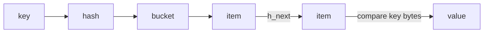

# 第 4 章 · Assoc / Hash Table

> **本章模型：逻辑寻址**  
> Assoc 只回答“给定 key 如何找到 item*”。它与 Slab 的“对象放在哪里”、LRU 的“谁先被淘汰”是正交职责。

## V2 本章深挖目标

**核心能力：Assoc 与本地寻址。** 把 local hash 与 cluster routing 分开；理解 collision chain、load factor、渐进扩容和 Hash/LRU 多索引一致性。

- **源码锚点：** `assoc.c / memcached.h / items.c`
- **面试要求：** 每题至少准备一个“反例/边界条件”和一个“可量化指标”。
- **源码要求：** 遇到函数名要能回答它的输入、持有的锁、Item linked/refcount 状态以及失败路径。
- **生产要求：** 能把内部状态变化连接到 `hit/miss → P99 → origin/CPU/network` 的故障链。

> 完成本章后，不应只会定义术语；应能够解释“为什么这么设计、哪种 workload 下会退化、如何用实验或指标证明”。

## 本章 10 题

| 题目 | 难度 | 重要度 | 必刷 |
|---|---:|---:|:---:|
| [031. assoc 模块干什么？](031.md) | P0 | ★★★★★ | ⭐ |
| [032. h_next 和 next/prev 有什么区别？](032.md) | P0 | ★★★★★ | ⭐ |
| [033. Memcached 怎么处理 Hash Collision？](033.md) | P0 | ★★★★☆ |  |
| [034. HashTable 为什么不能无限小？](034.md) | P1 | ★★★☆☆ |  |
| [035. Rehash 为什么可能成为性能问题？](035.md) | P2 | ★★★☆☆ |  |
| [036. Internal Hash 与 Consistent Hash 是同一个东西吗？](036.md) | P0 | ★★★★☆ |  |
| [037. 如果 Hash 函数分布不好会怎样？](037.md) | P1 | ★★★☆☆ |  |
| [038. 为什么 HashTable 存 item* 而不是复制 Value？](038.md) | P1 | ★★★☆☆ |  |
| [039. 为什么删除 Item 时必须同时处理 Assoc 与 LRU？](039.md) | P1 | ★★★☆☆ |  |
| [040. 现场实现一个 Mini-Memcached HashTable 怎么做？](040.md) | P1 | ★★★☆☆ |  |

## 阅读建议

1. 先在不看答案的情况下，用 60-90 秒口述结论。
2. 再看“深度机制”和“源码导航”，把术语落到数据结构/函数。
3. 最后完成“动手验证”，并回答追问。
4. 能白板画出本章 Mermaid 图，并解释每条边的职责，才算真正掌握。
