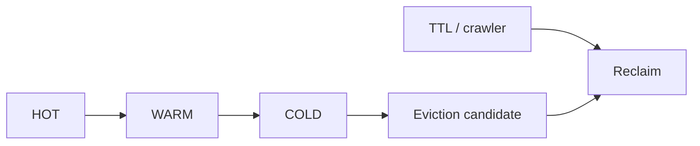

# 第 043 题 · 为什么不在每一次 GET 时同步移动 LRU 节点？

> **必刷题** · **P2** · ★★★★★ · LRU、TTL 与 Eviction  
> 本文是 PDF 对应题目的扩展版：保留原答案，并补充源码、复杂度、并发不变量、生产实践与实验。

## 题目

**为什么不在每一次 GET 时同步移动 LRU 节点？**

## 面试官在考什么

这道题用于判断候选人是否真正理解 **segmented LRU、TTL、crawler 与淘汰工程**。

面试官通常不会满足于“术语定义”，而会沿着 `为什么不在每一次 GET 时同步移动 LRU 节点？` 继续追问到：**状态如何变化、哪个模块拥有这份状态、并发下怎样保持不变量、生产中用什么指标证明判断**。优秀回答应先给 30 秒结论，再主动给出一个反例或故障场景。

## 30-90 秒标准回答

> 严格 LRU 每 GET 都要修改共享双向链并加锁，在百万 QPS 下会成为严重写热点；Memcached 采用访问标记/限频 bump/后台维护降低争用。

面试时建议先讲上面这句话，再根据追问选择展开源码或生产侧影响，不要一开始就陷入函数细节。

## 心智模型

**生命周期与近似淘汰：** 现代 Memcached 不追求每次访问都精确维护 strict LRU，而是以 segmented LRU、后台 maintainer/crawler 降低共享写和锁争用。



## 深度机制

### 1. GET 逻辑上是读，但 LRU touch 让它变成共享状态写。

高并发下 strict LRU 会把每个读请求变成共享链表写操作。Memcached 通过分段和后台维护，在“淘汰质量”和“锁/缓存一致性开销”之间做工程折中。
### 2. ITEM_UPDATE_INTERVAL 等机制抑制频繁重排。

从“生命周期与近似淘汰”看，这一结论的重点不是记住术语，而是明确职责边界和失败方式。现代 Memcached 不追求每次访问都精确维护 strict LRU，而是以 segmented LRU、后台 maintainer/crawler 降低共享写和锁争用。
### 3. 近似 LRU 常比严格 LRU 的实际吞吐更好。

高并发下 strict LRU 会把每个读请求变成共享链表写操作。Memcached 通过分段和后台维护，在“淘汰质量”和“锁/缓存一致性开销”之间做工程折中。

## 系统不变量

- **不变量 1：** 逻辑过期的 Item 不能作为 fresh hit 返回。
- **不变量 2：** Eviction 选择与物理释放必须尊重引用计数和锁。

这些不变量比记忆具体函数名更稳定。版本升级可能调整代码组织，但破坏这些约束通常意味着正确性或生命周期出现问题。

## 复杂度与性能分析

- 理论淘汰策略的“精确度”不是唯一目标；高 QPS 下链表更新和锁竞争会主导成本。
- 评估应同时看命中率、P99、LRU lock 竞争与每 class eviction。

进一步分析时要区分三个层面：**算法复杂度**（如 Hash 平均 O(1)）、**微架构成本**（cache miss、pointer chasing、cache-line bouncing）和 **系统成本**（RTT、序列化、回源）。高水平回答会主动指出这三者不是一回事。

## 源码导航

> PDF 源码锚点：`items.c` 的 link/unlink、LRU maintainer/crawler；1.5.0 release notes。

建议优先阅读以下 Memcached 1.6.45 文件：

- [`items.c`](https://github.com/memcached/memcached/blob/1.6.45/items.c)
- [`items.h`](https://github.com/memcached/memcached/blob/1.6.45/items.h)
- [`crawler.c`](https://github.com/memcached/memcached/blob/1.6.45/crawler.c)
- [`crawler.h`](https://github.com/memcached/memcached/blob/1.6.45/crawler.h)
- [`memcached.h`](https://github.com/memcached/memcached/blob/1.6.45/memcached.h)

源码阅读方法：先定位入口函数，再跟踪 **Item 指针如何变化、何时加锁、何时 publication/unlink、何时释放引用**。不要按文件从第一行顺序阅读。

## 工程与生产实践

1. **先确认语义边界：** 本题讨论的是 segmented LRU、TTL、crawler 与淘汰工程，先区分 server 内部机制、客户端路由和应用回源三层，避免跨层归因。
2. **把关键路径画出来：** 对 `为什么不在每一次 GET 时同步移动 LRU 节点？` 至少能指出输入、关键状态、输出以及失败路径；如果涉及 Item，要明确 Hash/LRU/Slab/refcount 中哪些会变化。
3. **用指标证伪：** 比较“每 GET move-to-head”自实现版本与 deferred update 版本的吞吐、mutex wait 和 P99。
4. **准备一个故障反例：** 64 线程打同一 LRU class 时 strict LRU 的链表头会成为写热点，即使 key 本身分散。
5. **版本意识：** 本仓库源码锚定 Memcached `1.6.45`；默认参数与现代特性应以该版本官方源码/文档为准。

## 常见易错点

> 高性能系统要警惕“为了完美策略付出过高维护成本”。

再补充两个通用陷阱：

- 把“默认值”说成“协议永远固定值”；例如 item size、线程数等都应区分默认配置与不可变约束。
- 把“当前实现细节”说成“KV cache 必然原理”；面试中应先讲不变量，再讲 Memcached 的具体实现。

## 高频追问

### 追问 1：这和 CPU cache coherence 有什么关系？

**回答提示：** 先复述边界，再用本题核心机制回答：严格 LRU 每 GET 都要修改共享双向链并加锁，在百万 QPS 下会成为严重写热点；Memcached 采用访问标记/限频 bump/后台维护降低争用。 最后补充一个生产后果或失败场景，避免只给术语。
### 追问 2：为什么 TinyLFU 等算法也常采用近似统计？

**回答提示：** 先复述边界，再用本题核心机制回答：严格 LRU 每 GET 都要修改共享双向链并加锁，在百万 QPS 下会成为严重写热点；Memcached 采用访问标记/限频 bump/后台维护降低争用。 最后补充一个生产后果或失败场景，避免只给术语。

## 动手验证

```bash
# 观察 items/slabs 统计并制造短 TTL
printf "set ttlkey 0 2 3\r\nabc\r\n" | nc 127.0.0.1 11211
sleep 3
printf "get ttlkey\r\nstats items\r\n" | nc 127.0.0.1 11211
```

比较“逻辑过期”“被访问发现过期”“后台 crawler 回收”三个时间点。

完成实验后，至少记录：**预期 → 实际 → 为什么 → 对生产设计有什么影响**。只跑通命令而没有解释，不算真正掌握。

## 面试表达模板

> **第一句给结论：** 严格 LRU 每 GET 都要修改共享双向链并加锁，在百万 QPS 下会成为严重写热点；Memcached 采用访问标记/限频 bump/后台维护降低争用。  
> **第二层讲机制：** 用 1 张状态/调用链图说明“谁维护什么状态、何时改变”。  
> **第三层讲边界：** 减少同步更新意味着淘汰顺序不是绝对严格，可能牺牲少量理论 hit ratio 来换高并发吞吐和更稳定 P99。  
> **第四层落生产：** 给出一个指标或算式，例如：比较“每 GET move-to-head”自实现版本与 deferred update 版本的吞吐、mutex wait 和 P99。

## 专家级展开（V2）

### A. 从第一性原理推导

每 GET 都同步移动 LRU 会把读请求变成共享链表写操作，造成 lru_lock 竞争和 cache-line bouncing；现代设计用标记+后台维护把 recency 更新从热路径移走。

这道题建议使用“**状态 → 所有者 → 转移条件 → 失败后果**”四步法推导，而不是背结论。先确定哪份状态是核心，再问由哪个模块维护，随后说明状态何时迁移，最后指出违反不变量会表现为什么 bug 或性能问题。

### B. 关键源码符号与阅读顺序

- `ITEM_ACTIVE`
- `item_update`
- `lru_maintainer_thread`
- `lru_locks`

建议在 `memcached-1.6.45` 源码树中用下面的方式定位，而不是按文件顺序从头读：

```bash
git grep -n "\bITEM_ACTIVE\b" -- items.c crawler.c memcached.h
git grep -n "\bitem_update\b" -- items.c crawler.c memcached.h
git grep -n "\blru_maintainer_thread\b" -- items.c crawler.c memcached.h
git grep -n "\blru_locks\b" -- items.c crawler.c memcached.h
```

阅读函数时至少记录 5 个问题：**入参中的 key/hash/item 是谁创建的、当前持有哪些锁、item 是否已 `ITEM_LINKED`、refcount 谁持有、失败路径最终由谁释放资源**。

### C. 边界条件与反例

减少同步更新意味着淘汰顺序不是绝对严格，可能牺牲少量理论 hit ratio 来换高并发吞吐和更稳定 P99。

面试中主动讲边界条件很加分，因为它能证明你区分了“默认实现”“协议语义”“架构经验”和“数学近似”。尤其要避免把平均 O(1)、默认 1MB、client-side hashing 等表述成无条件真理。

### D. 生产故障推演

64 线程打同一 LRU class 时 strict LRU 的链表头会成为写热点，即使 key 本身分散。

遇到这类问题时，建议把故障链写成：

```text
触发条件 → Memcached 内部状态变化 → HIT/MISS/P99 变化 → origin/网络/CPU 后果 → 保护或恢复动作
```

这样回答能自然从源码层过渡到生产系统，而不是把“源码题”和“系统设计题”割裂开。

### E. 定量分析 / 可验证指标

比较“每 GET move-to-head”自实现版本与 deferred update 版本的吞吐、mutex wait 和 P99。

工程上至少给出一个可以**测量或计算**的量。没有数字的“性能更好”“内存更省”“更稳定”通常无法指导容量规划，也很难在故障现场验证。

## 关联题目

- [041. Memcached 当前还是最简单的一根 LRU 链吗？](../05-lru-ttl-eviction/041.md)
- [042. HOT/WARM/COLD 分别解决什么问题？](../05-lru-ttl-eviction/042.md)
- [044. TTL 到了以后 Item 会在那一秒立刻被物理删除吗？](../05-lru-ttl-eviction/044.md)
- [045. LRU Crawler 是干什么的？](../05-lru-ttl-eviction/045.md)

## 官方参考

- **S5** [memcached.h @ 1.6.45](https://github.com/memcached/memcached/blob/1.6.45/memcached.h) — struct item、conn、flags、配置结构。
- **S6** [items.c @ 1.6.45](https://github.com/memcached/memcached/blob/1.6.45/items.c) — Item alloc/link/unlink、LRU 与生命周期。
- **S10** [Memcached 1.5.0 Release Notes](https://docs.memcached.org/releasenotes/releasenotes150/) — Segmented LRU、crawler、automove 的重要历史节点。
- **S11** [Server Maintenance](https://docs.memcached.org/serverguide/maintenance/) — hit rate、eviction、slab 监控与维护。

---

[← 上一题](../05-lru-ttl-eviction/042.md) | [本章目录](README.md) | [下一题 →](../05-lru-ttl-eviction/044.md)
