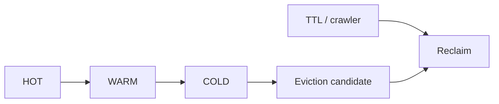

# 第 5 章 · LRU、TTL 与 Eviction

> **本章模型：生命周期与近似淘汰**  
> 现代 Memcached 不追求每次访问都精确维护 strict LRU，而是以 segmented LRU、后台 maintainer/crawler 降低共享写和锁争用。

## V2 本章深挖目标

**核心能力：LRU/TTL 与回收。** 现代 Memcached 是 segmented LRU；需要理解 HOT/WARM/COLD、deferred recency、lazy expiration、crawler 与 eviction 的边界。

- **源码锚点：** `items.c / crawler.c`
- **面试要求：** 每题至少准备一个“反例/边界条件”和一个“可量化指标”。
- **源码要求：** 遇到函数名要能回答它的输入、持有的锁、Item linked/refcount 状态以及失败路径。
- **生产要求：** 能把内部状态变化连接到 `hit/miss → P99 → origin/CPU/network` 的故障链。

> 完成本章后，不应只会定义术语；应能够解释“为什么这么设计、哪种 workload 下会退化、如何用实验或指标证明”。

## 本章 10 题

| 题目 | 难度 | 重要度 | 必刷 |
|---|---:|---:|:---:|
| [041. Memcached 当前还是最简单的一根 LRU 链吗？](041.md) | P0 | ★★★★★ | ⭐ |
| [042. HOT/WARM/COLD 分别解决什么问题？](042.md) | P1 | ★★★☆☆ |  |
| [043. 为什么不在每一次 GET 时同步移动 LRU 节点？](043.md) | P2 | ★★★★★ | ⭐ |
| [044. TTL 到了以后 Item 会在那一秒立刻被物理删除吗？](044.md) | P0 | ★★★★★ | ⭐ |
| [045. LRU Crawler 是干什么的？](045.md) | P1 | ★★★☆☆ |  |
| [046. 经典“30 天 TTL 陷阱”是什么？](046.md) | P0 | ★★★★★ | ⭐ |
| [047. Expiration 和 Eviction 有什么区别？](047.md) | P0 | ★★★★★ | ⭐ |
| [048. 刚被 GET 的 Item 会不会同时被另一个线程 Evict？](048.md) | P2 | ★★★☆☆ |  |
| [049. 什么叫 noeviction？有什么风险？](049.md) | P1 | ★★★☆☆ |  |
| [050. 为什么要看每个 slab class 的 eviction，而不只看全局？](050.md) | P1 | ★★★☆☆ |  |

## 阅读建议

1. 先在不看答案的情况下，用 60-90 秒口述结论。
2. 再看“深度机制”和“源码导航”，把术语落到数据结构/函数。
3. 最后完成“动手验证”，并回答追问。
4. 能白板画出本章 Mermaid 图，并解释每条边的职责，才算真正掌握。
