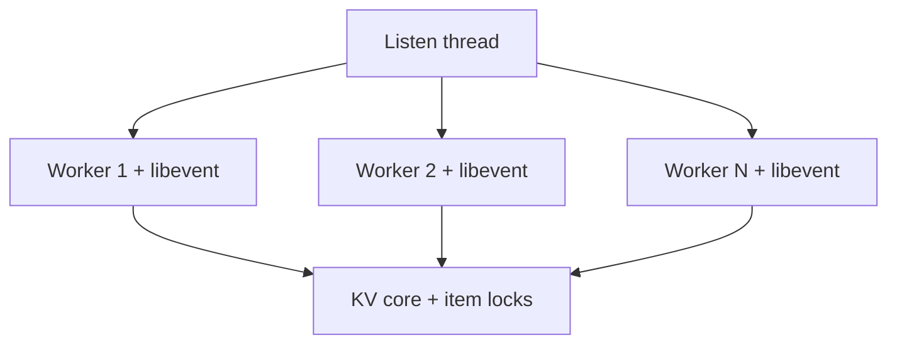

# 第 055 题 · Memcached 内部有哪些典型 Lock？

> **必刷题** · **P1** · ★★★★★ · 线程、锁、Libevent 与协议  
> 本文是 PDF 对应题目的扩展版：保留原答案，并补充源码、复杂度、并发不变量、生产实践与实验。

## 题目

**Memcached 内部有哪些典型 Lock？**

## 面试官在考什么

这道题用于判断候选人是否真正理解 **事件驱动网络、线程分工、锁粒度与协议演进**。

面试官通常不会满足于“术语定义”，而会沿着 `Memcached 内部有哪些典型 Lock？` 继续追问到：**状态如何变化、哪个模块拥有这份状态、并发下怎样保持不变量、生产中用什么指标证明判断**。优秀回答应先给 30 秒结论，再主动给出一个反例或故障场景。

## 30-90 秒标准回答

> 主要包括 item locks、LRU locks、slabs lock 及连接/统计等同步结构；不同字段明确由不同锁保护。

面试时建议先讲上面这句话，再根据追问选择展开源码或生产侧影响，不要一开始就陷入函数细节。

## 心智模型

**I/O 与并发：** 一个 worker 可以借助 libevent 管理很多连接；性能的关键是减少共享锁、系统调用和 cache-line bouncing，而不是无限增加线程。



## 深度机制

### 1. item lock 常按 hash 分片。

哈希层需要同时考虑分布质量、计算成本、冲突链和扩容；“能正确 hash”只是第一层要求，生产性能更依赖均匀性与访问局部性。
### 2. LRU lock 保护 next/prev 等队列关系。

高并发下 strict LRU 会把每个读请求变成共享链表写操作。Memcached 通过分段和后台维护，在“淘汰质量”和“锁/缓存一致性开销”之间做工程折中。
### 3. slabs lock 保护 freelist/page 管理。

Slab 的设计核心是 size class + page + fixed-size chunk。它通过复用 chunk 避免在请求热路径频繁进入通用 allocator，但也意味着对象尺寸分布会直接决定内存利用率。

## 系统不变量

- **不变量 1：** 修改共享 Item/Hash/LRU 状态必须处在正确锁边界内。
- **不变量 2：** 连接数量不应直接决定线程数量；worker 通过事件循环复用连接。

这些不变量比记忆具体函数名更稳定。版本升级可能调整代码组织，但破坏这些约束通常意味着正确性或生命周期出现问题。

## 复杂度与性能分析

- 网络热路径通常由 socket readiness、parser、hash、少量共享锁和响应写出组成。
- 线程扩展最终受 CPU、锁、内存带宽和网络 IRQ/系统调用共同限制。

进一步分析时要区分三个层面：**算法复杂度**（如 Hash 平均 O(1)）、**微架构成本**（cache miss、pointer chasing、cache-line bouncing）和 **系统成本**（RTT、序列化、回源）。高水平回答会主动指出这三者不是一回事。

## 源码导航

> PDF 源码锚点：`thread.c`、`conn` 状态机与 Protocol 文档。

建议优先阅读以下 Memcached 1.6.45 文件：

- [`thread.c`](https://github.com/memcached/memcached/blob/1.6.45/thread.c)
- [`memcached.c`](https://github.com/memcached/memcached/blob/1.6.45/memcached.c)
- [`proto_text.c`](https://github.com/memcached/memcached/blob/1.6.45/proto_text.c)
- [`proto_parser.c`](https://github.com/memcached/memcached/blob/1.6.45/proto_parser.c)
- [`memcached.h`](https://github.com/memcached/memcached/blob/1.6.45/memcached.h)

源码阅读方法：先定位入口函数，再跟踪 **Item 指针如何变化、何时加锁、何时 publication/unlink、何时释放引用**。不要按文件从第一行顺序阅读。

## 工程与生产实践

1. **先确认语义边界：** 本题讨论的是 事件驱动网络、线程分工、锁粒度与协议演进，先区分 server 内部机制、客户端路由和应用回源三层，避免跨层归因。
2. **把关键路径画出来：** 对 `Memcached 内部有哪些典型 Lock？` 至少能指出输入、关键状态、输出以及失败路径；如果涉及 Item，要明确 Hash/LRU/Slab/refcount 中哪些会变化。
3. **用指标证伪：** 用 perf lock / mutex profiling（平台支持时）找 wait 时间最高锁，再映射到 key/slab class/workload。
4. **准备一个故障反例：** 某维护函数持有 lru_lock 再调用可能重新获取 lru_lock 的 helper，会形成 self-deadlock；这类 bug 往往只在罕见维护路径暴露。
5. **版本意识：** 本仓库源码锚定 Memcached `1.6.45`；默认参数与现代特性应以该版本官方源码/文档为准。

## 常见易错点

> 能说出“字段由哪把锁保护”是源码级答案。

再补充两个通用陷阱：

- 把“默认值”说成“协议永远固定值”；例如 item size、线程数等都应区分默认配置与不可变约束。
- 把“当前实现细节”说成“KV cache 必然原理”；面试中应先讲不变量，再讲 Memcached 的具体实现。

## 高频追问

### 追问 1：锁顺序不一致会怎样？

**回答提示：** 先复述边界，再用本题核心机制回答：主要包括 item locks、LRU locks、slabs lock 及连接/统计等同步结构；不同字段明确由不同锁保护。 最后补充一个生产后果或失败场景，避免只给术语。
### 追问 2：为什么 per-thread stats 能减少争用？

**回答提示：** 先看 CPU 核数与锁竞争；线程过多会增加上下文切换和 cache-line bouncing，吞吐可能下降。

## 动手验证

```bash
printf "stats settings\r\nstats\r\n" | nc 127.0.0.1 11211
```

关注 `num_threads`、`curr_connections`、`listen_disabled_num`。压测时一次只改变线程数，记录吞吐和 P99，而不是只看平均延迟。

完成实验后，至少记录：**预期 → 实际 → 为什么 → 对生产设计有什么影响**。只跑通命令而没有解释，不算真正掌握。

## 面试表达模板

> **第一句给结论：** 主要包括 item locks、LRU locks、slabs lock 及连接/统计等同步结构；不同字段明确由不同锁保护。  
> **第二层讲机制：** 用 1 张状态/调用链图说明“谁维护什么状态、何时改变”。  
> **第三层讲边界：** 锁粒度不同意味着不能任意嵌套；错误锁序或重复获取非递归 mutex 会死锁，源码审查要关注调用链是否隐式再入同锁域。  
> **第四层落生产：** 给出一个指标或算式，例如：用 perf lock / mutex profiling（平台支持时）找 wait 时间最高锁，再映射到 key/slab class/workload。

## 专家级展开（V2）

### A. 从第一性原理推导

典型锁域包括 item locks（按 hash 分片保护 item/assoc 操作）、LRU locks（保护链表/segment）、slabs_lock（保护 allocator 元数据）以及线程/连接维护锁；理解锁序比死记名称更重要。

这道题建议使用“**状态 → 所有者 → 转移条件 → 失败后果**”四步法推导，而不是背结论。先确定哪份状态是核心，再问由哪个模块维护，随后说明状态何时迁移，最后指出违反不变量会表现为什么 bug 或性能问题。

### B. 关键源码符号与阅读顺序

- `item_lock`
- `item_unlock`
- `item_locks`
- `lru_locks`
- `slabs_lock`

建议在 `memcached-1.6.45` 源码树中用下面的方式定位，而不是按文件顺序从头读：

```bash
git grep -n "\bitem_lock\b" -- memcached.c thread.c proto_text.c proto_parser.c
git grep -n "\bitem_unlock\b" -- memcached.c thread.c proto_text.c proto_parser.c
git grep -n "\bitem_locks\b" -- memcached.c thread.c proto_text.c proto_parser.c
git grep -n "\blru_locks\b" -- memcached.c thread.c proto_text.c proto_parser.c
git grep -n "\bslabs_lock\b" -- memcached.c thread.c proto_text.c proto_parser.c
```

阅读函数时至少记录 5 个问题：**入参中的 key/hash/item 是谁创建的、当前持有哪些锁、item 是否已 `ITEM_LINKED`、refcount 谁持有、失败路径最终由谁释放资源**。

### C. 边界条件与反例

锁粒度不同意味着不能任意嵌套；错误锁序或重复获取非递归 mutex 会死锁，源码审查要关注调用链是否隐式再入同锁域。

面试中主动讲边界条件很加分，因为它能证明你区分了“默认实现”“协议语义”“架构经验”和“数学近似”。尤其要避免把平均 O(1)、默认 1MB、client-side hashing 等表述成无条件真理。

### D. 生产故障推演

某维护函数持有 lru_lock 再调用可能重新获取 lru_lock 的 helper，会形成 self-deadlock；这类 bug 往往只在罕见维护路径暴露。

遇到这类问题时，建议把故障链写成：

```text
触发条件 → Memcached 内部状态变化 → HIT/MISS/P99 变化 → origin/网络/CPU 后果 → 保护或恢复动作
```

这样回答能自然从源码层过渡到生产系统，而不是把“源码题”和“系统设计题”割裂开。

### E. 定量分析 / 可验证指标

用 perf lock / mutex profiling（平台支持时）找 wait 时间最高锁，再映射到 key/slab class/workload。

工程上至少给出一个可以**测量或计算**的量。没有数字的“性能更好”“内存更省”“更稳定”通常无法指导容量规划，也很难在故障现场验证。

## 关联题目

- [053. 新连接是怎么交给 Worker 的？](../06-thread-lock-libevent-protocol/053.md)
- [054. 为什么 Memcached 不是线程越多越快？](../06-thread-lock-libevent-protocol/054.md)
- [056. 为什么不能只用一个 Global Mutex？](../06-thread-lock-libevent-protocol/056.md)
- [057. Memcached 现在有哪些协议？](../06-thread-lock-libevent-protocol/057.md)

## 官方参考

- **S4** [Protocols Overview](https://docs.memcached.org/protocols/) — 当前协议状态；Binary Protocol 已 deprecated。
- **S5** [memcached.h @ 1.6.45](https://github.com/memcached/memcached/blob/1.6.45/memcached.h) — struct item、conn、flags、配置结构。
- **S9** [thread.c @ 1.6.45](https://github.com/memcached/memcached/blob/1.6.45/thread.c) — Worker、item locks、LRU locks 与线程调度。
- **S12** [Server Configuring](https://docs.memcached.org/serverguide/configuring/) — 内存、连接、线程、item size、运行配置。

---

[← 上一题](../06-thread-lock-libevent-protocol/054.md) | [本章目录](README.md) | [下一题 →](../06-thread-lock-libevent-protocol/056.md)
