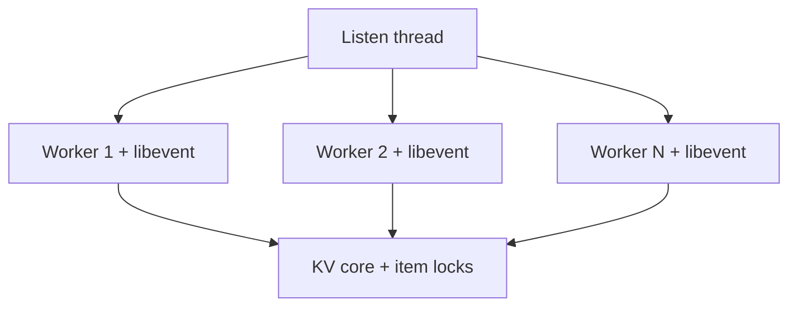

# 第 059 题 · Meta Protocol 解决了什么传统 GET/SET 难表达的问题？

> **P2** · ★★★☆☆ · 线程、锁、Libevent 与协议  
> 本文是 PDF 对应题目的扩展版：保留原答案，并补充源码、复杂度、并发不变量、生产实践与实验。

## 题目

**Meta Protocol 解决了什么传统 GET/SET 难表达的问题？**

## 面试官在考什么

这道题用于判断候选人是否真正理解 **事件驱动网络、线程分工、锁粒度与协议演进**。

面试官通常不会满足于“术语定义”，而会沿着 `Meta Protocol 解决了什么传统 GET/SET 难表达的问题？` 继续追问到：**状态如何变化、哪个模块拥有这份状态、并发下怎样保持不变量、生产中用什么指标证明判断**。优秀回答应先给 30 秒结论，再主动给出一个反例或故障场景。

## 30-90 秒标准回答

> 它把 CAS、TTL metadata、stale、anti-dogpiling、stale-while-revalidate、opaque token、binary key 等能力编码为可组合 flags，减少多轮请求。

面试时建议先讲上面这句话，再根据追问选择展开源码或生产侧影响，不要一开始就陷入函数细节。

## 心智模型

**I/O 与并发：** 一个 worker 可以借助 libevent 管理很多连接；性能的关键是减少共享锁、系统调用和 cache-line bouncing，而不是无限增加线程。



## 深度机制

### 1. mg/ms/md/ma 等小命令集覆盖主要操作。

从“I/O 与并发”看，这一结论的重点不是记住术语，而是明确职责边界和失败方式。一个 worker 可以借助 libevent 管理很多连接；性能的关键是减少共享锁、系统调用和 cache-line bouncing，而不是无限增加线程。
### 2. 客户端只请求需要返回的 metadata，降低 wire bytes。

Meta Protocol 的价值在于用可扩展 flag/token 在一次往返中表达更多缓存状态，特别适合 anti-dogpiling、stale 和版本控制。
### 3. 特别适合高级缓存一致性模式。

从“I/O 与并发”看，这一结论的重点不是记住术语，而是明确职责边界和失败方式。一个 worker 可以借助 libevent 管理很多连接；性能的关键是减少共享锁、系统调用和 cache-line bouncing，而不是无限增加线程。

## 系统不变量

- **不变量 1：** 修改共享 Item/Hash/LRU 状态必须处在正确锁边界内。
- **不变量 2：** 连接数量不应直接决定线程数量；worker 通过事件循环复用连接。

这些不变量比记忆具体函数名更稳定。版本升级可能调整代码组织，但破坏这些约束通常意味着正确性或生命周期出现问题。

## 复杂度与性能分析

- 网络热路径通常由 socket readiness、parser、hash、少量共享锁和响应写出组成。
- 线程扩展最终受 CPU、锁、内存带宽和网络 IRQ/系统调用共同限制。

进一步分析时要区分三个层面：**算法复杂度**（如 Hash 平均 O(1)）、**微架构成本**（cache miss、pointer chasing、cache-line bouncing）和 **系统成本**（RTT、序列化、回源）。高水平回答会主动指出这三者不是一回事。

## 源码导航


建议优先阅读以下 Memcached 1.6.45 文件：

- [`thread.c`](https://github.com/memcached/memcached/blob/1.6.45/thread.c)
- [`memcached.c`](https://github.com/memcached/memcached/blob/1.6.45/memcached.c)
- [`proto_text.c`](https://github.com/memcached/memcached/blob/1.6.45/proto_text.c)
- [`proto_parser.c`](https://github.com/memcached/memcached/blob/1.6.45/proto_parser.c)
- [`memcached.h`](https://github.com/memcached/memcached/blob/1.6.45/memcached.h)

源码阅读方法：先定位入口函数，再跟踪 **Item 指针如何变化、何时加锁、何时 publication/unlink、何时释放引用**。不要按文件从第一行顺序阅读。

## 工程与生产实践

1. **先确认语义边界：** 本题讨论的是 事件驱动网络、线程分工、锁粒度与协议演进，先区分 server 内部机制、客户端路由和应用回源三层，避免跨层归因。
2. **把关键路径画出来：** 对 `Meta Protocol 解决了什么传统 GET/SET 难表达的问题？` 至少能指出输入、关键状态、输出以及失败路径；如果涉及 Item，要明确 Hash/LRU/Slab/refcount 中哪些会变化。
3. **用指标证伪：** 比较传统 GET+ADD/GETS/CAS 多 RTT 方案与 Meta 单/少 RTT 方案的 origin requests 和 network round trips。
4. **准备一个故障反例：** 热门 key 过期时，Meta 可以让一个请求成为 revalidator，其他请求暂时消费 stale，减少数据库并发重建。
5. **版本意识：** 本仓库源码锚定 Memcached `1.6.45`；默认参数与现代特性应以该版本官方源码/文档为准。

## 常见易错点

> Meta 是现代 Memcached 高阶面试的区分度题。

再补充两个通用陷阱：

- 把“默认值”说成“协议永远固定值”；例如 item size、线程数等都应区分默认配置与不可变约束。
- 把“当前实现细节”说成“KV cache 必然原理”；面试中应先讲不变量，再讲 Memcached 的具体实现。

## 高频追问

### 追问 1：如何用 Meta 做 lease？

**回答提示：** 先复述边界，再用本题核心机制回答：它把 CAS、TTL metadata、stale、anti-dogpiling、stale-while-revalidate、opaque token、binary key 等能力编码为可组合 flags，减少多轮请求。 最后补充一个生产后果或失败场景，避免只给术语。
### 追问 2：为什么 stale-while-revalidate 能减 stampede？

**回答提示：** 只适合允许短时间旧数据的业务；必须明确 stale window、刷新失败和最大陈旧度。

## 动手验证

```bash
printf "stats settings\r\nstats\r\n" | nc 127.0.0.1 11211
```

关注 `num_threads`、`curr_connections`、`listen_disabled_num`。压测时一次只改变线程数，记录吞吐和 P99，而不是只看平均延迟。

完成实验后，至少记录：**预期 → 实际 → 为什么 → 对生产设计有什么影响**。只跑通命令而没有解释，不算真正掌握。

## 面试表达模板

> **第一句给结论：** 它把 CAS、TTL metadata、stale、anti-dogpiling、stale-while-revalidate、opaque token、binary key 等能力编码为可组合 flags，减少多轮请求。  
> **第二层讲机制：** 用 1 张状态/调用链图说明“谁维护什么状态、何时改变”。  
> **第三层讲边界：** Meta 提供协调原语，不自动替你实现完整业务一致性；客户端必须正确处理 winner/stale/token 语义。  
> **第四层落生产：** 给出一个指标或算式，例如：比较传统 GET+ADD/GETS/CAS 多 RTT 方案与 Meta 单/少 RTT 方案的 origin requests 和 network round trips。

## 专家级展开（V2）

### A. 从第一性原理推导

Meta Protocol 的价值是把客户端常用的 cache coordination 语义变成一次请求可表达的 flags，例如 TTL inspection、CAS、stale、anti-dogpiling、opaque token 等。

这道题建议使用“**状态 → 所有者 → 转移条件 → 失败后果**”四步法推导，而不是背结论。先确定哪份状态是核心，再问由哪个模块维护，随后说明状态何时迁移，最后指出违反不变量会表现为什么 bug 或性能问题。

### B. 关键源码符号与阅读顺序

- `mg`
- `ms`
- `md`
- `ma`
- `meta flags N/R/T/W/X/Z 等（以官方协议为准）`

建议在 `memcached-1.6.45` 源码树中用下面的方式定位，而不是按文件顺序从头读：

```bash
git grep -n "\bmg\b" -- memcached.c thread.c proto_text.c proto_parser.c
git grep -n "\bms\b" -- memcached.c thread.c proto_text.c proto_parser.c
git grep -n "\bmd\b" -- memcached.c thread.c proto_text.c proto_parser.c
git grep -n "\bma\b" -- memcached.c thread.c proto_text.c proto_parser.c
git grep -n "\bmeta\b" -- memcached.c thread.c proto_text.c proto_parser.c
```

阅读函数时至少记录 5 个问题：**入参中的 key/hash/item 是谁创建的、当前持有哪些锁、item 是否已 `ITEM_LINKED`、refcount 谁持有、失败路径最终由谁释放资源**。

### C. 边界条件与反例

Meta 提供协调原语，不自动替你实现完整业务一致性；客户端必须正确处理 winner/stale/token 语义。

面试中主动讲边界条件很加分，因为它能证明你区分了“默认实现”“协议语义”“架构经验”和“数学近似”。尤其要避免把平均 O(1)、默认 1MB、client-side hashing 等表述成无条件真理。

### D. 生产故障推演

热门 key 过期时，Meta 可以让一个请求成为 revalidator，其他请求暂时消费 stale，减少数据库并发重建。

遇到这类问题时，建议把故障链写成：

```text
触发条件 → Memcached 内部状态变化 → HIT/MISS/P99 变化 → origin/网络/CPU 后果 → 保护或恢复动作
```

这样回答能自然从源码层过渡到生产系统，而不是把“源码题”和“系统设计题”割裂开。

### E. 定量分析 / 可验证指标

比较传统 GET+ADD/GETS/CAS 多 RTT 方案与 Meta 单/少 RTT 方案的 origin requests 和 network round trips。

工程上至少给出一个可以**测量或计算**的量。没有数字的“性能更好”“内存更省”“更稳定”通常无法指导容量规划，也很难在故障现场验证。

## 关联题目

- [057. Memcached 现在有哪些协议？](../06-thread-lock-libevent-protocol/057.md)
- [058. 为什么 Binary Protocol 被 Deprecated？](../06-thread-lock-libevent-protocol/058.md)
- [060. 为什么 Multi-get 通常比循环 get() 好？](../06-thread-lock-libevent-protocol/060.md)
- [061. 为什么不能简单使用 hash(key) % N？](../07-consistent-hashing-distributed/061.md)

## 官方参考

- **S4** [Protocols Overview](https://docs.memcached.org/protocols/) — 当前协议状态；Binary Protocol 已 deprecated。
- **S5** [memcached.h @ 1.6.45](https://github.com/memcached/memcached/blob/1.6.45/memcached.h) — struct item、conn、flags、配置结构。
- **S9** [thread.c @ 1.6.45](https://github.com/memcached/memcached/blob/1.6.45/thread.c) — Worker、item locks、LRU locks 与线程调度。
- **S12** [Server Configuring](https://docs.memcached.org/serverguide/configuring/) — 内存、连接、线程、item size、运行配置。

---

[← 上一题](../06-thread-lock-libevent-protocol/058.md) | [本章目录](README.md) | [下一题 →](../06-thread-lock-libevent-protocol/060.md)
