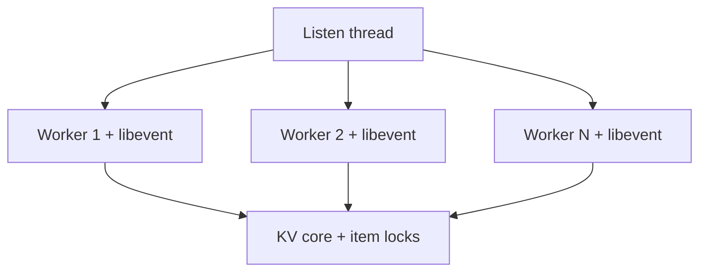

# 第 6 章 · 线程、锁、Libevent 与协议

> **本章模型：I/O 与并发**  
> 一个 worker 可以借助 libevent 管理很多连接；性能的关键是减少共享锁、系统调用和 cache-line bouncing，而不是无限增加线程。

## V2 本章深挖目标

**核心能力：并发与网络。** 从 accept→worker→event loop→connection state machine 追请求，同时解释 item/LRU/slab locks 为什么不能退化为 global mutex。

- **源码锚点：** `memcached.c / thread.c / proto_text.c`
- **面试要求：** 每题至少准备一个“反例/边界条件”和一个“可量化指标”。
- **源码要求：** 遇到函数名要能回答它的输入、持有的锁、Item linked/refcount 状态以及失败路径。
- **生产要求：** 能把内部状态变化连接到 `hit/miss → P99 → origin/CPU/network` 的故障链。

> 完成本章后，不应只会定义术语；应能够解释“为什么这么设计、哪种 workload 下会退化、如何用实验或指标证明”。

## 本章 10 题

| 题目 | 难度 | 重要度 | 必刷 |
|---|---:|---:|:---:|
| [051. Memcached 是“一连接一线程”吗？](051.md) | P0 | ★★★★★ | ⭐ |
| [052. Libevent 在 Memcached 中解决什么问题？](052.md) | P0 | ★★★★☆ |  |
| [053. 新连接是怎么交给 Worker 的？](053.md) | P1 | ★★★☆☆ |  |
| [054. 为什么 Memcached 不是线程越多越快？](054.md) | P0 | ★★★★☆ |  |
| [055. Memcached 内部有哪些典型 Lock？](055.md) | P1 | ★★★★★ | ⭐ |
| [056. 为什么不能只用一个 Global Mutex？](056.md) | P0 | ★★★★☆ |  |
| [057. Memcached 现在有哪些协议？](057.md) | P1 | ★★★★★ | ⭐ |
| [058. 为什么 Binary Protocol 被 Deprecated？](058.md) | P1 | ★★★☆☆ |  |
| [059. Meta Protocol 解决了什么传统 GET/SET 难表达的问题？](059.md) | P2 | ★★★☆☆ |  |
| [060. 为什么 Multi-get 通常比循环 get() 好？](060.md) | P0 | ★★★★☆ |  |

## 阅读建议

1. 先在不看答案的情况下，用 60-90 秒口述结论。
2. 再看“深度机制”和“源码导航”，把术语落到数据结构/函数。
3. 最后完成“动手验证”，并回答追问。
4. 能白板画出本章 Mermaid 图，并解释每条边的职责，才算真正掌握。
