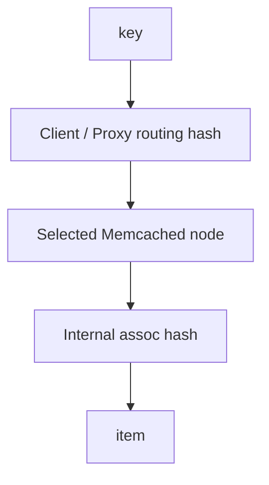

# 第 061 题 · 为什么不能简单使用 hash(key) % N？

> **必刷题** · **P0** · ★★★★★ · 一致性哈希与分布式 Memcached  
> 本文是 PDF 对应题目的扩展版：保留原答案，并补充源码、复杂度、并发不变量、生产实践与实验。

## 题目

**为什么不能简单使用 hash(key) % N？**

## 面试官在考什么

这道题用于判断候选人是否真正理解 **客户端/代理路由、一致性哈希、节点故障与控制面**。

面试官通常不会满足于“术语定义”，而会沿着 `为什么不能简单使用 hash(key) % N？` 继续追问到：**状态如何变化、哪个模块拥有这份状态、并发下怎样保持不变量、生产中用什么指标证明判断**。优秀回答应先给 30 秒结论，再主动给出一个反例或故障场景。

## 30-90 秒标准回答

> 节点数 N 改变时模数变化会重映射绝大多数 key，造成缓存整体失温和数据库回源风暴。

面试时建议先讲上面这句话，再根据追问选择展开源码或生产侧影响，不要一开始就陷入函数细节。

## 心智模型

**路由与节点自治：** 传统 Memcached 把集群路由放到客户端：节点内部只管理自己的 KV。节点成员变化首先是“路由变化”，然后表现为缓存命中变化，而非数据库式数据迁移。



## 深度机制

### 1. %N 只适合节点集合稳定或可接受全量 remap 的场景。

从“路由与节点自治”看，这一结论的重点不是记住术语，而是明确职责边界和失败方式。传统 Memcached 把集群路由放到客户端：节点内部只管理自己的 KV。节点成员变化首先是“路由变化”，然后表现为缓存命中变化，而非数据库式数据迁移。
### 2. 缓存扩缩容是常态，因此需要更稳定路由。

从“路由与节点自治”看，这一结论的重点不是记住术语，而是明确职责边界和失败方式。传统 Memcached 把集群路由放到客户端：节点内部只管理自己的 KV。节点成员变化首先是“路由变化”，然后表现为缓存命中变化，而非数据库式数据迁移。
### 3. 同一客户端配置必须一致。

从“路由与节点自治”看，这一结论的重点不是记住术语，而是明确职责边界和失败方式。传统 Memcached 把集群路由放到客户端：节点内部只管理自己的 KV。节点成员变化首先是“路由变化”，然后表现为缓存命中变化，而非数据库式数据迁移。
### 4. 为什么 %N 会雪崩

从“路由与节点自治”看，这一结论的重点不是记住术语，而是明确职责边界和失败方式。传统 Memcached 把集群路由放到客户端：节点内部只管理自己的 KV。节点成员变化首先是“路由变化”，然后表现为缓存命中变化，而非数据库式数据迁移。
### 5. 如果 N 改为 N+1，`hash % N` 的余数空间整体变化，大多数 key 会被映射到新节点；这些 key 在新节点都没有缓存，于是“扩容”反而瞬间制造海量 MISS。

哈希层需要同时考虑分布质量、计算成本、冲突链和扩容；“能正确 hash”只是第一层要求，生产性能更依赖均匀性与访问局部性。
### 6. 一致性哈希的真正价值是控制 membership change 的扰动范围；它解决的是路由稳定性而非数据强一致。

从“路由与节点自治”看，这一结论的重点不是记住术语，而是明确职责边界和失败方式。传统 Memcached 把集群路由放到客户端：节点内部只管理自己的 KV。节点成员变化首先是“路由变化”，然后表现为缓存命中变化，而非数据库式数据迁移。

## 系统不变量

- **不变量 1：** 同一 routing 配置下，同一个 key 应稳定映射到同一 owner。
- **不变量 2：** 节点成员变化不能假设存在自动数据迁移或复制。

这些不变量比记忆具体函数名更稳定。版本升级可能调整代码组织，但破坏这些约束通常意味着正确性或生命周期出现问题。

## 复杂度与性能分析

- 关注 membership 变化时的 remapping 比例、负载偏斜和单节点故障后的 miss 增量。
- 一致性哈希降低搬迁范围，但不自动降低 Hot Key 的单点压力。

进一步分析时要区分三个层面：**算法复杂度**（如 Hash 平均 O(1)）、**微架构成本**（cache miss、pointer chasing、cache-line bouncing）和 **系统成本**（RTT、序列化、回源）。高水平回答会主动指出这三者不是一回事。

## 源码导航

> PDF 源码锚点：官方 Architecture/Proxy 文档；客户端 consistent hashing 语义。

建议优先阅读以下 Memcached 1.6.45 文件：

- [`proxy_ring_hash.c`](https://github.com/memcached/memcached/blob/1.6.45/proxy_ring_hash.c)
- [`proxy_jump_hash.c`](https://github.com/memcached/memcached/blob/1.6.45/proxy_jump_hash.c)
- [`proto_proxy.c`](https://github.com/memcached/memcached/blob/1.6.45/proto_proxy.c)
- [`proxy_config.c`](https://github.com/memcached/memcached/blob/1.6.45/proxy_config.c)

源码阅读方法：先定位入口函数，再跟踪 **Item 指针如何变化、何时加锁、何时 publication/unlink、何时释放引用**。不要按文件从第一行顺序阅读。

## 工程与生产实践

1. **先确认语义边界：** 本题讨论的是 客户端/代理路由、一致性哈希、节点故障与控制面，先区分 server 内部机制、客户端路由和应用回源三层，避免跨层归因。
2. **把关键路径画出来：** 对 `为什么不能简单使用 hash(key) % N？` 至少能指出输入、关键状态、输出以及失败路径；如果涉及 Item，要明确 Hash/LRU/Slab/refcount 中哪些会变化。
3. **用指标证伪：** 对固定 100万 keys 比较 N→N+1 时 modulo 与 consistent/rendezvous 的 remap ratio。
4. **准备一个故障反例：** 10→11 节点用 modulo 会让大量 key 改路由，hit rate 突降；数据库可能先于缓存完成 warmup 前过载。
5. **版本意识：** 本仓库源码锚定 Memcached `1.6.45`；默认参数与现代特性应以该版本官方源码/文档为准。

## 常见易错点

> 核心问题是 membership change 的迁移比例。

再补充两个通用陷阱：

- 把“默认值”说成“协议永远固定值”；例如 item size、线程数等都应区分默认配置与不可变约束。
- 把“当前实现细节”说成“KV cache 必然原理”；面试中应先讲不变量，再讲 Memcached 的具体实现。

## 高频追问

### 追问 1：N 从 100 到 101 大概会影响多少 key？

**回答提示：** 先复述边界，再用本题核心机制回答：节点数 N 改变时模数变化会重映射绝大多数 key，造成缓存整体失温和数据库回源风暴。 最后补充一个生产后果或失败场景，避免只给术语。
### 追问 2：如果使用 rendezvous hashing 呢？

**回答提示：** 先复述边界，再用本题核心机制回答：节点数 N 改变时模数变化会重映射绝大多数 key，造成缓存整体失温和数据库回源风暴。 最后补充一个生产后果或失败场景，避免只给术语。

## 动手验证

```text
实验建议：写一个 50 行脚本，对 100,000 个 key 分别使用 hash(key)%N 与一致性哈希；
从 10 个节点扩到 11 个节点，统计 key remap 比例和每节点 key 数方差。
```

然后模拟删除一个节点，计算由此新增的 cache miss QPS。

完成实验后，至少记录：**预期 → 实际 → 为什么 → 对生产设计有什么影响**。只跑通命令而没有解释，不算真正掌握。

## 面试表达模板

> **第一句给结论：** 节点数 N 改变时模数变化会重映射绝大多数 key，造成缓存整体失温和数据库回源风暴。  
> **第二层讲机制：** 用 1 张状态/调用链图说明“谁维护什么状态、何时改变”。  
> **第三层讲边界：** 如果节点权重、虚拟点或 hash 算法本身变化，仍可能产生大量 remapping；“一致性”依赖 ring 配置稳定。  
> **第四层落生产：** 给出一个指标或算式，例如：对固定 100万 keys 比较 N→N+1 时 modulo 与 consistent/rendezvous 的 remap ratio。

## 专家级展开（V2）

### A. 从第一性原理推导

hash(key)%N 把 N 写进映射函数，N 变化会重算几乎所有 key 的目标节点；一致性哈希把 membership change 的影响局部化，减少冷缓存风暴。

这道题建议使用“**状态 → 所有者 → 转移条件 → 失败后果**”四步法推导，而不是背结论。先确定哪份状态是核心，再问由哪个模块维护，随后说明状态何时迁移，最后指出违反不变量会表现为什么 bug 或性能问题。

### B. 关键源码符号与阅读顺序

- `client routing layer; not assoc hash`

建议在 `memcached-1.6.45` 源码树中用下面的方式定位，而不是按文件顺序从头读：

```bash
git grep -n "\bclient\b" -- proto_proxy.c proxy_config.c
```

阅读函数时至少记录 5 个问题：**入参中的 key/hash/item 是谁创建的、当前持有哪些锁、item 是否已 `ITEM_LINKED`、refcount 谁持有、失败路径最终由谁释放资源**。

### C. 边界条件与反例

如果节点权重、虚拟点或 hash 算法本身变化，仍可能产生大量 remapping；“一致性”依赖 ring 配置稳定。

面试中主动讲边界条件很加分，因为它能证明你区分了“默认实现”“协议语义”“架构经验”和“数学近似”。尤其要避免把平均 O(1)、默认 1MB、client-side hashing 等表述成无条件真理。

### D. 生产故障推演

10→11 节点用 modulo 会让大量 key 改路由，hit rate 突降；数据库可能先于缓存完成 warmup 前过载。

遇到这类问题时，建议把故障链写成：

```text
触发条件 → Memcached 内部状态变化 → HIT/MISS/P99 变化 → origin/网络/CPU 后果 → 保护或恢复动作
```

这样回答能自然从源码层过渡到生产系统，而不是把“源码题”和“系统设计题”割裂开。

### E. 定量分析 / 可验证指标

对固定 100万 keys 比较 N→N+1 时 modulo 与 consistent/rendezvous 的 remap ratio。

工程上至少给出一个可以**测量或计算**的量。没有数字的“性能更好”“内存更省”“更稳定”通常无法指导容量规划，也很难在故障现场验证。

## 关联题目

- [059. Meta Protocol 解决了什么传统 GET/SET 难表达的问题？](../06-thread-lock-libevent-protocol/059.md)
- [060. 为什么 Multi-get 通常比循环 get() 好？](../06-thread-lock-libevent-protocol/060.md)
- [062. 一致性哈希解决什么？](../07-consistent-hashing-distributed/062.md)
- [063. Virtual Node 是干什么的？](../07-consistent-hashing-distributed/063.md)

## 官方参考

- **S1** [Memcached 官方首页 / Downloads](https://www.memcached.org/) — 项目定位、下载与版本入口。
- **S14** [Built-in Proxy](https://docs.memcached.org/features/proxy/) — 1.6.23+ 内置代理、pool、route 与一致性路由。
- **S15** [FAQ](https://docs.memcached.org/userguide/faq/) — 缓存语义、持久性、复制等常见问题。

---

[← 上一题](../06-thread-lock-libevent-protocol/060.md) | [本章目录](README.md) | [下一题 →](../07-consistent-hashing-distributed/062.md)
